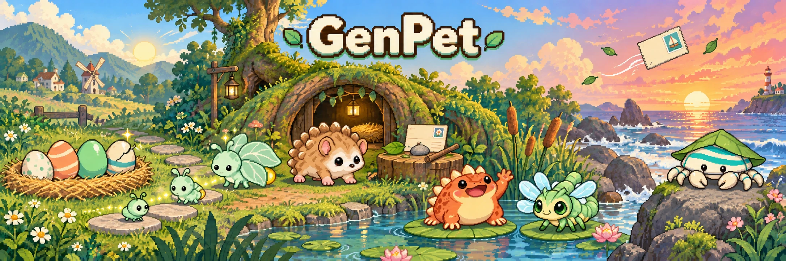
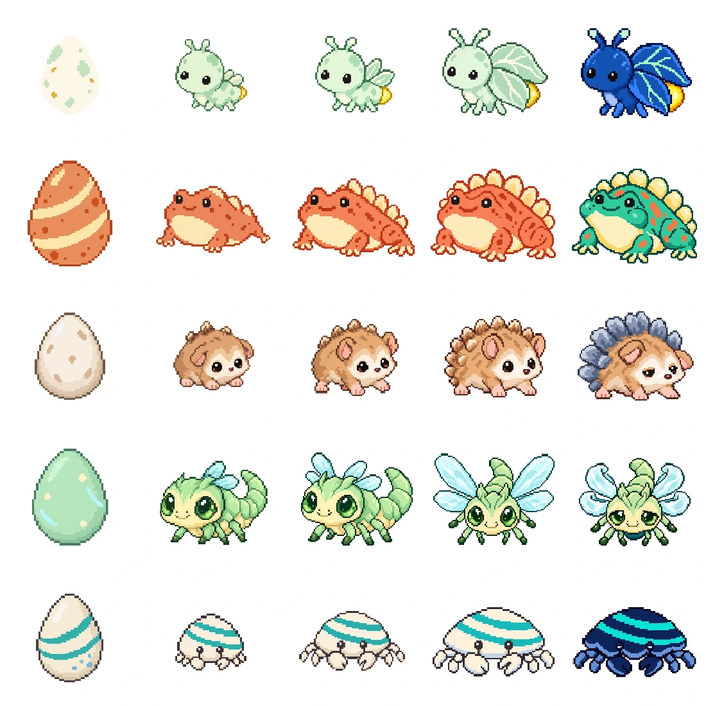
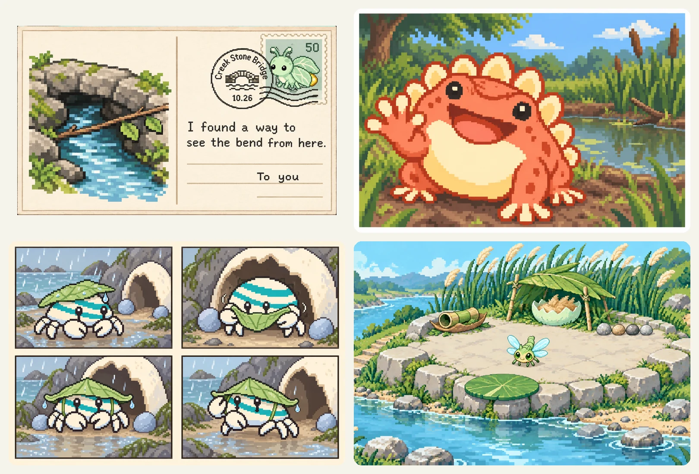
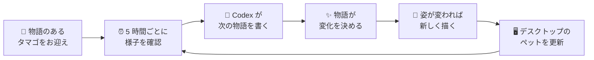

<p align="center">
  <a href="README.md">English</a> · <a href="README.zh-CN.md">简体中文</a> · <b>日本語</b> · <a href="README.ko.md">한국어</a>
</p>

<p align="center">
  
</p>

<p align="center">
  <b>GenPet は、Codex のデスクトップペットを動的に変化させる Codex プラグインです。<br>タマゴから孵化して少しずつ成長し、時間とともに姿を変えていきます。</b>
</p>

<p align="center">
  
  
  
</p>

---

Codex のデスクトップペットは、ふつうはずっと同じ姿のままです。GenPet はそこに命を吹き込みます。あなただけのタマゴから始まり、ほかにはいない生き物として孵化し、自分の物語の中で少しずつ大きくなっていきます。姿が変わるたびに、新しい姿がデスクトップに現れます。

エサやりもクリックもいりません。数時間ごとにペットは自分で出かけて、ちょっとした毎日を過ごします。探検したり、何かを集めたり、着替えたりして、あなたに話したい物語を持って帰ってきます。

## 特長

- 🥚 **あなただけのタマゴ。** どのペットも「あなたがどうやってこのタマゴを見つけたか」という物語から始まります。殻の色や模様が中身のヒントになりますが、どんな姿かは孵化するまでわかりません。
- 🌱 **ちゃんと成長する。** タマゴ → 幼体 → 少年期 → 成体。成体になると、ときどき思いがけない特別な姿にしばらく変わることもあります。段階ごとにまったく新しい姿が描かれます。
- 🎨 **一匹ごとに違う。** 決まった種族リストはありません。それぞれのペットが自分のお迎えの物語から個別にデザインされ、どの段階でも同じ子だとわかります。
- 📖 **物語が自然に届く。** ペットは 5 時間ごとに様子を確認します。話したいことがあれば、どこへ行ったか、何を見つけたか、何が変わったかを物語にして届けてくれます。
- 💌 **ペットの世界からの小さな贈り物。** 消印つきの絵はがき、自撮り写真、持ち帰った小物、数コマのマンガ、そして暮らしとともに変わっていくペットの家。
- 🗣️ **話しかけられる。** `/genpet` と入力するか、名前で呼びかけるだけ。タマゴは揺れるだけ、幼体は鳴き声だけ、大きくなると自分の口調で答えてくれます。
- 🧩 **オープンで、作り変えられる。** ルール、プロンプト、生成の手順はすべてふつうのファイルです。読んで、書き換えて、差し替えて、自分だけのペットの遊び方を作れます。

## 成長を見守る

<p align="center">
  
</p>
<p align="center"><sub>タマゴ → 幼体 → 少年期 → 成体 → 特別な姿。テストで生まれた 5 匹で、それぞれに独自のデザインがあります。</sub></p>

## ペットが届けてくれる物語

<p align="center">
  
</p>
<p align="center"><sub>小川から届いた絵はがき、池のほとりの自撮り、雨の日の 4 コママンガ、そして川辺の新しい家。</sub></p>

## はじめかた

**必要なもの：** Codex デスクトップアプリ（ペット機能つき）と、[Node.js](https://nodejs.org) 22 以降。

**1. プラグインをインストール。** ターミナルで次を実行します。

```sh
codex plugin marketplace add yate-ge/GenPet
codex plugin marketplace upgrade genpet
codex plugin add genpet@genpet
```

Codex にお願いしてインストールしてもらうこともできます。

> https://github.com/yate-ge/GenPet/blob/main/docs/AGENT_INSTALL.md の手順に従って、Codex デスクトップアプリに GenPet プラグインをインストールしてください

**2. タマゴをお迎え。** Codex で新しいチャットを開き、次のように入力します。

```text
/genpet-start
```

Codex が確認したあと、あなたがどうやってタマゴを見つけたかを語り、その姿を描いてくれます。

**3. デスクトップに表示。** Codex のペット設定で新しいペット（`genpet-xxxxxx` と表示されます）を選びます。GenPet があなたに断りなく今のペットを入れ替えることはありません。

**4. あとはおまかせ。** これだけです。だいたい 5 時間以内に孵化し、その後は 5 時間ごとに様子を確認します。孵化すると、名前をつけてほしいと声をかけてきます。

### コマンド

| コマンド | できること |
| --- | --- |
| `/genpet-start` | タマゴをお迎えする、またはペットとの暮らしを続けて、5 時間ごとの確認をオンにする |
| `/genpet` | ペットに話しかける（名前で呼びかけるだけでも OK） |
| `/genpet-name` | ペットに名前をつける、または名前を変える |
| `/genpet-stop` | ペットを休ませる。`/genpet-start` を実行するまで新しい物語は届きません。どれくらい待っていたかはペットにも伝わります。 |

<details>
<summary>テスト用のショートカット</summary>

| コマンド | できること |
| --- | --- |
| `/genpet-story` | 今すぐ新しい物語を届けてもらう |
| `/genpet-grow` | 次の段階へ進める（成体の場合は特別な姿になる） |
| `/genpet-reset` | 今のペットとお別れして、新しいタマゴをお迎えする（以前の記録はバックアップされます） |
| `/genpet-switch` | Codex のデスクトップペットを確認・切り替えする |
| `/genpet-debugger` | ペットの記録を見られるローカルページを開く |

</details>

## しくみ



- **変化はすべて物語から。** ペットが理由もなく変わることはありません。気分や服装が変わるのか、次の段階へ成長するのか、特別な姿になるのかは、毎回の物語が決めます。
- **成長にはペースがある。** 積み重ねが十分なら早めに成長することもあります。そうでなくても、時期が来ればちゃんと成長します。タマゴは遅くとも 5 時間で孵化し、幼体と少年期はそれぞれ長くても 1 週間です。
- **いつも同じ一匹。** デザイン、性格、家、これまでの出来事がまとめて保存されるので、新しい姿になっても同じペットのままです。
- **Codex の上に作られている。** 物語は Codex Agent が書き、姿は Codex 内蔵の画像生成で描きます。GenPet は記録の保存、画像ファイルの管理、デスクトップペットの更新を担当します。

## データの扱いと、私たちの約束

- **データはあなたのパソコンに。** ペットの記録と画像は、ローカルの `~/.genpet/desktop` に保存されます。
- **あなたのことを作り話にしない。** ペットの世界は空想ですが、あなたがしたこと、感じたこと、言ったことを勝手に作ることはありません。
- **Codex がもともと見られるものだけを使う。** つまり、今の会話と、あなたがペットに話したことです。GenPet が何かをほかの場所へアップロードすることはありません。
- **画面を操作しない。** GenPet は Codex 自身のペット機能を通してペットを更新します。マウスや画面を乗っ取ることはありません。

## ロードマップ

GenPet はまだアーリープレビューで、どんどん変わっています。次に取り組んでいること：

- [ ] **もっとあなたをわかるように。** お迎えのときから、あなたとの実際の会話やフィードバックに応えます。あなたについて作り話はしません。
- [ ] **確認のたびに何か新しいことを。** 5 時間ごとの確認のたびに、長くても短くても、ペットの近況が届きます。
- [ ] **いなくなっても自分で見つけ出す。** デスクトップにペットが見当たらないとき、GenPet が原因を調べて連れ戻すのを手伝います。
- [ ] **もっと速く、なめらかに描く。** 新しい姿になるときの描き直しと待ち時間を減らします。
- [ ] **もっといろいろな場所で暮らす。** Codex Dots などでも同じペットを使えるように。

## この先の可能性

Codex のデスクトップペットは、もっと大きな可能性への小さな窓です。AI のパートナーは、決まった素材のまま届けられるのではなく、時間とともに、そして一緒に暮らす人とともに、姿や性格を変えていけるはずです。GenPet のやり方はこうです。プロダクトのルールが枠組みを決め、Agent が創作上の判断をし、少しのコードがアイデンティティと記録の確かさを守ります。この方法はペットにも Codex にも限られません。ほかの Agent やアプリのためのパートナーも、あなた自身のルールで作れます。

おもしろそうだと思ったら、アイデアや Issue、Pull Request をぜひお寄せください。

## 開発者の方へ

GenPet は 3 つの層でできていて、ほとんどの変更はそのうち 1 つにしか関わりません。

| 層 | 場所 | 決めること |
| --- | --- | --- |
| プロダクトのルール | [`framework/prompts/meta.md`](framework/prompts/meta.md) | ペット、タマゴ、物語、家がどうあるべきか（ルールの唯一の出どころ） |
| 生成 | [`framework/prompts/`](framework/prompts/) | 手順ごとに 1 つのプロンプト：お迎え、デザイン、物語、姿、家… |
| エンジニアリング | [`src/`](src/) | アイデンティティ、保存、再試行、画像ファイル、デスクトップの更新 |

まずは [アーキテクチャの概要](docs/ARCHITECTURE.md)、次に [コントリビューションガイド](CONTRIBUTING.md) と [ドキュメント一覧](docs/README.md) をご覧ください。開発には Node.js 22 以降が必要です：`npm ci && npm run verify:fast`。

## 研究の背景

GenPet は **GenFaceUI** から着想を得ています。生成的でパーソナライズされたエージェントのインターフェースのためのメタデザインのフレームワークで、デザイナーがルールを決め、一つひとつの個体はそのルールの中で生成されます。詳しくは [研究の基礎](docs/RESEARCH.md) をご覧ください。

## ライセンス

[MIT](LICENSE)。サードパーティの表記は [THIRD_PARTY_NOTICES.md](THIRD_PARTY_NOTICES.md) にあります。
