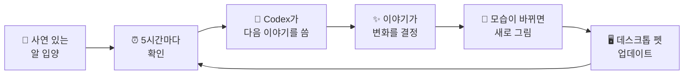

<p align="center">
  <a href="README.md">English</a> · <a href="README.zh-CN.md">简体中文</a> · <a href="README.ja.md">日本語</a> · <b>한국어</b>
</p>

<p align="center">
  
</p>

<p align="center">
  <b>GenPet은 Codex 데스크톱 펫이 동적으로 변하게 해 주는 Codex 플러그인입니다.<br>알에서 깨어나 조금씩 자라고, 시간이 지나면서 계속 모습이 바뀝니다.</b>
</p>

<p align="center">
  
  
  
</p>

---

Codex 데스크톱 펫은 원래 늘 같은 모습입니다. GenPet은 펫에게 삶을 줍니다. 오직 당신만을 위한 알에서 시작해, 세상에 하나뿐인 생명체로 깨어나고, 자기만의 이야기 속에서 조금씩 자랍니다. 모습이 바뀔 때마다 새 모습이 데스크톱에 나타납니다.

밥을 줄 필요도, 클릭할 필요도 없습니다. 몇 시간마다 펫은 스스로 밖에 나가 소소한 하루를 보냅니다. 탐험하고, 물건을 모으고, 옷을 갈아입고, 당신에게 들려줄 이야기를 가지고 돌아옵니다.

## 특징

- 🥚 **나만의 알.** 모든 펫은 "당신이 이 알을 어떻게 발견했는지"에 대한 이야기로 시작합니다. 껍데기의 색과 무늬가 힌트를 주지만, 어떤 모습일지는 깨어나야 알 수 있습니다.
- 🌱 **정말로 자랍니다.** 알 → 유년기 → 소년기 → 성체. 성체가 되면 가끔 뜻밖의 특별한 모습으로 잠시 변하기도 합니다. 단계마다 완전히 새로운 모습을 그립니다.
- 🎨 **모두 다른 모습.** 정해진 종 목록이 없습니다. 펫마다 자기 입양 이야기를 바탕으로 따로 디자인되고, 어느 단계에서나 같은 아이라는 걸 알아볼 수 있습니다.
- 📖 **이야기가 저절로 찾아옵니다.** 펫은 5시간마다 한 번씩 확인합니다. 들려줄 일이 생기면 어디에 갔는지, 무엇을 찾았는지, 무엇이 바뀌었는지 이야기로 전해 줍니다.
- 💌 **펫의 세계에서 온 작은 선물.** 소인이 찍힌 엽서, 셀카, 가져온 작은 물건, 짧은 만화, 그리고 살아가면서 계속 바뀌는 펫의 집.
- 🗣️ **말을 걸 수 있어요.** `/genpet`을 입력하거나 이름을 부르기만 하면 됩니다. 알은 흔들리기만 하고, 유년기에는 울음소리만 내고, 자라면 자기만의 말투로 대답합니다.
- 🧩 **열려 있고, 고쳐 쓸 수 있어요.** 규칙, 프롬프트, 생성 단계가 모두 평범한 파일입니다. 읽고, 고치고, 바꿔서 나만의 펫 놀이를 만들 수 있습니다.

## 자라는 모습

<p align="center">
  
</p>
<p align="center"><sub>알 → 유년기 → 소년기 → 성체 → 특별한 모습. 테스트에서 태어난 다섯 마리로, 저마다 고유한 디자인을 가지고 있습니다.</sub></p>

## 펫이 전해 주는 이야기

<p align="center">
  
</p>
<p align="center"><sub>개울가에서 보낸 엽서, 연못가 셀카, 비 오는 날의 네 컷 만화, 그리고 강가의 새집.</sub></p>

## 빠른 시작

**준비물:** Codex 데스크톱 앱(펫 기능 포함)과 [Node.js](https://nodejs.org) 22 이상.

**1. 플러그인 설치.** 터미널에서 다음을 실행합니다.

```sh
codex plugin marketplace add yate-ge/GenPet
codex plugin marketplace upgrade genpet
codex plugin add genpet@genpet
```

Codex에게 설치를 부탁할 수도 있습니다.

> https://github.com/yate-ge/GenPet/blob/main/docs/AGENT_INSTALL.md 안내에 따라 Codex 데스크톱 앱에 GenPet 플러그인을 설치해 줘

**2. 알 입양하기.** Codex에서 새 대화를 열고 다음을 입력합니다.

```text
/genpet-start
```

Codex가 먼저 확인을 받은 뒤, 당신이 어떻게 이 알을 발견했는지 들려주고 알을 그려 줍니다.

**3. 데스크톱에 띄우기.** Codex의 펫 설정에서 새 펫(`genpet-xxxxxx`로 표시됨)을 선택합니다. GenPet은 묻지 않고 지금의 펫을 바꾸지 않습니다.

**4. 이제 맡겨 두세요.** 이게 전부입니다. 보통 5시간 안에 알에서 깨어나고, 그 뒤로는 5시간마다 확인합니다. 깨어나면 이름을 지어 달라고 부탁할 거예요.

### 명령어

| 명령어 | 하는 일 |
| --- | --- |
| `/genpet-start` | 알을 입양하거나 펫과의 생활을 이어 가고, 5시간마다 확인하기를 켭니다 |
| `/genpet` | 펫에게 말 걸기 (이름을 부르기만 해도 됩니다) |
| `/genpet-name` | 펫 이름 짓기 또는 바꾸기 |
| `/genpet-stop` | 펫을 쉬게 하기. `/genpet-start`를 다시 실행할 때까지 새 이야기가 오지 않습니다. 얼마나 기다렸는지는 펫도 알아챕니다. |

<details>
<summary>테스트용 단축 명령어</summary>

| 명령어 | 하는 일 |
| --- | --- |
| `/genpet-story` | 지금 바로 새 이야기 받기 |
| `/genpet-grow` | 다음 단계로 건너뛰기 (성체라면 특별한 모습으로) |
| `/genpet-reset` | 지금의 펫과 작별하고 새 알 입양하기 (이전 기록은 백업됩니다) |
| `/genpet-switch` | Codex 데스크톱 펫 목록 보기 또는 바꾸기 |
| `/genpet-debugger` | 펫의 기록을 볼 수 있는 로컬 페이지 열기 |

</details>

## 작동 방식



- **모든 변화는 이야기에서.** 펫은 이유 없이 바뀌지 않습니다. 기분이나 옷차림이 바뀌는지, 다음 단계로 자라는지, 특별한 모습이 되는지는 매번 이야기가 정합니다.
- **성장에는 속도가 있어요.** 쌓인 것이 충분하면 일찍 자랄 수도 있습니다. 그렇지 않더라도 때가 되면 꼭 자랍니다. 알은 늦어도 5시간 안에 깨어나고, 유년기와 소년기는 각각 길어야 일주일입니다.
- **언제나 같은 한 마리.** 디자인, 성격, 집, 지나온 일이 함께 저장되므로 새 모습이 되어도 여전히 같은 펫입니다.
- **Codex 위에서 만들어졌어요.** 이야기는 Codex Agent가 쓰고, 모습은 Codex에 내장된 이미지 생성으로 그립니다. GenPet은 기록 저장, 이미지 파일 관리, 데스크톱 펫 업데이트를 맡습니다.

## 데이터와 원칙

- **데이터는 당신의 컴퓨터에.** 펫의 기록과 이미지는 로컬의 `~/.genpet/desktop`에 저장됩니다.
- **당신에 대해 지어내지 않아요.** 펫의 세계는 상상이지만, 당신이 한 일이나 느낀 감정, 한 말을 지어내지는 않습니다.
- **Codex가 원래 볼 수 있는 것만 사용해요.** 지금의 대화와 당신이 펫에게 한 말이 전부입니다. GenPet이 무언가를 다른 곳에 업로드하지는 않습니다.
- **화면을 조작하지 않아요.** GenPet은 Codex 자체의 펫 기능으로 펫을 업데이트하며, 마우스나 화면을 대신 조작하지 않습니다.

## 로드맵

GenPet은 아직 초기 프리뷰 단계이며 빠르게 바뀌고 있습니다. 다음으로 준비하고 있는 것들:

- [ ] **당신을 더 잘 알아요.** 입양할 때부터 당신과의 실제 대화와 피드백에 반응합니다. 당신에 대해 지어내지는 않습니다.
- [ ] **확인할 때마다 새 소식.** 5시간마다 확인할 때마다 길든 짧든 펫의 근황이 찾아옵니다.
- [ ] **사라지면 스스로 찾아와요.** 데스크톱에서 펫이 보이지 않으면 GenPet이 원인을 찾아 다시 데려오도록 돕습니다.
- [ ] **더 빠르고 매끄러운 그림.** 새 모습을 그릴 때 다시 그리는 일과 기다리는 시간을 줄입니다.
- [ ] **더 많은 곳에서 살아요.** Codex Dots 등에서도 같은 펫을 쓸 수 있게 합니다.

## 앞으로의 가능성

Codex 데스크톱 펫은 더 큰 가능성으로 향하는 작은 창입니다. AI 동반자는 정해진 소재로 고정되어 나오는 대신, 시간이 흐르면서 그리고 함께 사는 사람에 따라 모습과 성격이 달라질 수 있습니다. GenPet의 방식은 이렇습니다. 제품 규칙이 경계를 정하고, Agent가 창작에 관한 결정을 내리며, 적은 양의 코드가 정체성과 기록을 믿을 수 있게 지킵니다. 이 방식은 펫이나 Codex에만 쓰이지 않습니다. 다른 Agent와 앱을 위한 동반자도 당신만의 규칙으로 만들 수 있습니다.

흥미롭다면 아이디어, Issue, Pull Request를 언제든 환영합니다.

## 개발자를 위해

GenPet은 세 개의 층으로 되어 있고, 대부분의 변경은 그중 하나만 건드립니다.

| 층 | 위치 | 정하는 것 |
| --- | --- | --- |
| 제품 규칙 | [`framework/prompts/meta.md`](framework/prompts/meta.md) | 펫, 알, 이야기, 집이 어때야 하는지 (규칙의 유일한 출처) |
| 생성 | [`framework/prompts/`](framework/prompts/) | 단계마다 하나의 프롬프트: 입양, 디자인, 이야기, 모습, 집… |
| 엔지니어링 | [`src/`](src/) | 정체성, 저장, 재시도, 이미지 파일, 데스크톱 업데이트 |

먼저 [아키텍처 개요](docs/ARCHITECTURE.md)를 보고, 이어서 [기여 가이드](CONTRIBUTING.md)와 [문서 목록](docs/README.md)을 확인하세요. 개발에는 Node.js 22 이상이 필요합니다: `npm ci && npm run verify:fast`.

## 연구 배경

GenPet은 **GenFaceUI**에서 영감을 받았습니다. 생성형·개인화 에이전트 인터페이스를 위한 메타디자인 프레임워크로, 디자이너가 규칙을 정하고 각 펫은 그 규칙 안에서 생성됩니다. 자세한 내용은 [연구 기반](docs/RESEARCH.md)을 참고하세요.

## 라이선스

[MIT](LICENSE). 서드파티 고지는 [THIRD_PARTY_NOTICES.md](THIRD_PARTY_NOTICES.md)에 있습니다.
