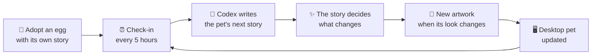

<p align="center">
  <b>English</b> · <a href="README.zh-CN.md">简体中文</a> · <a href="README.ja.md">日本語</a> · <a href="README.ko.md">한국어</a>
</p>

<p align="center">
  
</p>

<p align="center">
  <b>GenPet is a Codex plugin that makes your Codex desktop pet dynamic:<br>it hatches from an egg, grows up, and keeps changing over time.</b>
</p>

<p align="center">
  
  
  
</p>

---

A Codex desktop pet normally keeps the same look forever. GenPet gives it a life: your pet starts as an egg made just for you, hatches into a creature nobody else has, and grows up through its own stories. Every time it changes, the new look shows up on your desktop.

You don't need to feed it or click on it. Every few hours it goes off and lives a little: it explores, collects things, changes its outfit, and comes back with a story for you.

## Highlights

- 🥚 **An egg that's only yours.** Every pet begins with a story of how you found its egg. The shell's colors and patterns hint at what's inside, but you only find out when it hatches.
- 🌱 **It really grows up.** Egg → hatchling → juvenile → adult, and as an adult it sometimes slips into a surprising special form for a while. Each stage gets brand-new artwork.
- 🎨 **No two pets alike.** There's no fixed species list. Each pet is designed from its own adoption story, and stays recognizably itself from stage to stage.
- 📖 **New stories on their own.** Your pet checks in every 5 hours. When something worth telling happens, you get a story: where it went, what it found, what changed.
- 💌 **Little gifts from its world.** Postcards with stamps, selfies, things it brought back, short comics, and its home, which changes as it lives there.
- 🗣️ **Talk to it.** Use `/genpet` or just call it by name. An egg can only wobble, a hatchling only makes sounds, and older pets answer in their own voice.
- 🧩 **Open and hackable.** The rules, prompts and generation steps are plain files you can read, edit and swap to build your own kind of pet.

## Watch it grow

<p align="center">
  
</p>
<p align="center"><sub>Egg → Hatchling → Juvenile → Adult → Special form. Five pets from our test runs, each with its own design.</sub></p>

## Stories it brings you

<p align="center">
  
</p>
<p align="center"><sub>A postcard from a creek, a selfie by the pond, a rainy-day comic, and a new home by the river.</sub></p>

## Quick start

**You'll need** the Codex desktop app (with Pets) and [Node.js](https://nodejs.org) 22 or newer.

**1. Install the plugin.** Run this in your terminal:

```sh
codex plugin marketplace add yate-ge/GenPet
codex plugin marketplace upgrade genpet
codex plugin add genpet@genpet
```

Or ask Codex to do it for you:

> Install the GenPet plugin for the Codex desktop app by following https://github.com/yate-ge/GenPet/blob/main/docs/AGENT_INSTALL.md

**2. Adopt your egg.** Open a new Codex chat and type:

```text
/genpet-start
```

Codex asks you to confirm, then tells you how you found your egg and draws it.

**3. Show it on your desktop.** In Codex's pet settings, pick the new pet (listed as `genpet-xxxxxx`). GenPet doesn't change your current pet without asking.

**4. Let it live.** That's it. It hatches within about 5 hours, and checks in every 5 hours after that. Once it hatches, you'll be invited to give it a name.

### Commands

| Command | What it does |
| --- | --- |
| `/genpet-start` | Adopt an egg, or carry on with your pet, and turn on its 5-hour check-ins |
| `/genpet` | Talk to your pet (you can also just call it by name) |
| `/genpet-name` | Name or rename your pet |
| `/genpet-stop` | Let your pet rest: no new stories until `/genpet-start`. It will notice how long it was away. |

<details>
<summary>Testing shortcuts</summary>

| Command | What it does |
| --- | --- |
| `/genpet-story` | Get a new story right now |
| `/genpet-grow` | Skip ahead to the next stage (or a special form for adults) |
| `/genpet-reset` | Say goodbye and adopt a new egg (the old record is backed up) |
| `/genpet-switch` | List or switch the Codex desktop pet |
| `/genpet-debugger` | Open a local page to browse your pet's records |

</details>

## How it works



- **Stories drive every change.** A pet never changes "just because". Each story decides whether it gets a new mood or outfit, grows to the next stage, or enters a special form.
- **Growth has a pace.** Your pet can grow early when there's enough to show for it. If not, it still grows on time: an egg hatches within 5 hours, and the hatchling and juvenile stages each last up to a week.
- **One pet, one identity.** Its design, personality, home and history are saved together, so every new look is still the same pet.
- **Built on Codex.** The Codex Agent writes the stories and draws the art with its built-in image generation. GenPet handles the records, the artwork files and the desktop pet update.

## Your data and our principles

- **Stays on your computer.** Your pet's records and artwork are saved locally in `~/.genpet/desktop`.
- **Never makes things up about you.** Your pet's world is imaginary, but it won't invent what you did, felt or said.
- **Uses only what Codex can already see.** That means your current conversation and what you tell your pet. Nothing is uploaded anywhere else by GenPet.
- **No screen control.** GenPet updates your pet through Codex's own pet features and never takes over your mouse or screen.

## Roadmap

GenPet is in early preview and changing quickly. Here's what we're working on next:

- [ ] **Knows you better.** Responds to your real conversations and feedback right from adoption, without inventing anything about you.
- [ ] **Something new at every check-in.** Every 5-hour check-in brings a little news from your pet, short or long.
- [ ] **Finds itself when it's missing.** If your pet doesn't show up on your desktop, GenPet figures out why and helps bring it back.
- [ ] **Faster and smoother art.** Fewer retries and less waiting when your pet gets a new look.
- [ ] **More places to live.** Using the same pet in Codex Dots and beyond.

## Where this could go

The Codex desktop pet is one small window onto something bigger: AI companions whose look and personality change with time and with the person they live with, instead of shipping as fixed assets. GenPet's approach works like this. The product rules set the boundaries, an Agent makes the creative choices, and a small amount of code keeps identity and records reliable. That approach isn't tied to pets or to Codex. You could use it to build companions for other agents and apps, with your own rules.

If that sounds interesting, we'd love your ideas, issues and pull requests.

## For developers

GenPet has three layers, and most changes touch only one of them:

| Layer | Where | What it decides |
| --- | --- | --- |
| Product rules | [`framework/prompts/meta.md`](framework/prompts/meta.md) | What a pet, egg, story and home must be (the single source of rules) |
| Generation | [`framework/prompts/`](framework/prompts/) | One prompt per step: adoption, design, story, artwork, home… |
| Engineering | [`src/`](src/) | Identity, saving, retries, artwork files and desktop updates |

Start with the [architecture overview](docs/ARCHITECTURE.md), then see [contributing](CONTRIBUTING.md) and the [docs index](docs/README.md). Development needs Node.js 22+: `npm ci && npm run verify:fast`.

## Research background

GenPet takes inspiration from **GenFaceUI**, a meta-design framework for generative, personalized agent interfaces: designers set the rules, and each pet is generated within them. See [research foundation](docs/RESEARCH.md).

## License

[MIT](LICENSE). Third-party notices are in [THIRD_PARTY_NOTICES.md](THIRD_PARTY_NOTICES.md).
