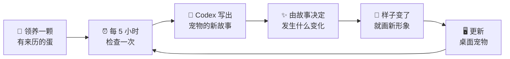

<p align="center">
  <a href="README.md">English</a> · <b>简体中文</b> · <a href="README.ja.md">日本語</a> · <a href="README.ko.md">한국어</a>
</p>

<p align="center">
  
</p>

<p align="center">
  <b>GenPet 是一个 Codex 插件，让 Codex 桌面宠物可以动态变化：<br>它从一颗蛋孵化、逐步长大，并随着时间不断改变样子。</b>
</p>

<p align="center">
  
  
  
</p>

---

Codex 的桌面宠物本来一直是同一个样子。GenPet 让它有了自己的生命：你的宠物从一颗专属于你的蛋开始，孵化成一只独一无二的小生物，在自己的故事里慢慢长大。每次变化，新的样子都会出现在你的桌面上。

不用喂食，也不用点它。每隔几个小时，它会自己出门过一段小日子：探险、收集东西、换身打扮，再带着一个故事回来讲给你听。

## 亮点

- 🥚 **只属于你的蛋。** 每只宠物都从一段"你是怎么得到这颗蛋的"故事开始。蛋壳的颜色和花纹透露了一点线索，但它到底长什么样，要等孵化才知道。
- 🌱 **真的会长大。** 蛋 → 幼年 → 少年 → 成年。成年后，它偶尔还会暂时变成一个出人意料的特殊形态。每个阶段都会画出全新的形象。
- 🎨 **每一只都不一样。** 没有固定的物种表。每只宠物都根据自己的领养故事单独设计，各个阶段都能认出是同一只。
- 📖 **自己会有新故事。** 宠物每 5 小时检查一次，有值得讲的事时，你就会收到一篇故事：它去了哪里、找到了什么、有了什么变化。
- 💌 **从它的世界寄来的小礼物。** 盖着邮戳的明信片、自拍照、带回来的小物件、几格小漫画，还有它的家，家会随着它的生活不断变化。
- 🗣️ **可以和它说话。** 输入 `/genpet`，或者直接叫它的名字。蛋只会晃一晃，幼年只会发出叫声，长大后会用自己的语气回答你。
- 🧩 **开放，可以改造。** 规则、提示词和生成步骤都是普通文件，你可以阅读、修改、替换，做出属于你自己的宠物玩法。

## 看它长大

<p align="center">
  
</p>
<p align="center"><sub>蛋 → 幼年 → 少年 → 成年 → 特殊形态。来自我们测试中的五只宠物，每只都有自己的设计。</sub></p>

## 它带给你的故事

<p align="center">
  
</p>
<p align="center"><sub>小溪边寄来的明信片、池塘边的自拍、下雨天的四格漫画，还有河边的新家。</sub></p>

## 快速开始

**需要准备：** Codex 桌面版（带宠物功能），以及 [Node.js](https://nodejs.org) 22 或更新版本。

**1. 安装插件。** 在终端里运行：

```sh
codex plugin marketplace add yate-ge/GenPet
codex plugin marketplace upgrade genpet
codex plugin add genpet@genpet
```

也可以直接让 Codex 帮你装：

> 请按照 https://github.com/yate-ge/GenPet/blob/main/docs/AGENT_INSTALL.md 为 Codex 桌面版安装 GenPet 插件

**2. 领养你的蛋。** 新开一个 Codex 对话，输入：

```text
/genpet-start
```

Codex 会先请你确认，然后讲你是怎么得到这颗蛋的，并把它画出来。

**3. 让它出现在桌面上。** 在 Codex 的宠物设置里选中新的宠物（名称显示为 `genpet-xxxxxx`）。GenPet 不会在没问过你的情况下换掉你当前的宠物。

**4. 剩下的交给它。** 就这样。它会在大约 5 小时内孵化，之后每 5 小时检查一次。孵化后，它会邀请你给它起个名字。

### 命令

| 命令 | 作用 |
| --- | --- |
| `/genpet-start` | 领养一颗蛋，或继续和你的宠物相处，并开启每 5 小时一次的检查 |
| `/genpet` | 和你的宠物说话（也可以直接叫它的名字） |
| `/genpet-name` | 给宠物起名或改名 |
| `/genpet-stop` | 让宠物休息：在你重新运行 `/genpet-start` 之前不会有新故事。它会察觉自己等了多久。 |

<details>
<summary>测试用的快捷命令</summary>

| 命令 | 作用 |
| --- | --- |
| `/genpet-story` | 立刻来一篇新故事 |
| `/genpet-grow` | 直接进入下一个阶段（成年宠物则进入特殊形态） |
| `/genpet-reset` | 和当前宠物告别，重新领养一颗蛋（旧记录会备份） |
| `/genpet-switch` | 查看或切换 Codex 桌面宠物 |
| `/genpet-debugger` | 打开本地页面，查看宠物的记录 |

</details>

## 它是怎么运作的


```mermaid
flowchart LR
  A["🥚 领养一颗<br>有来历的蛋"] --> B["⏰ 每 5 小时<br>检查一次"]
  B --> C["📖 Codex 写出<br>宠物的新故事"]
  C --> D["✨ 由故事决定<br>发生什么变化"]
  D --> E["🎨 样子变了<br>就画新形象"]
  E --> F["🖥️ 更新<br>桌面宠物"]
  F --> B
```

- **一切变化都来自故事。** 宠物不会无缘无故地变。每篇故事决定它这次是换了心情或打扮、长到下一个阶段，还是进入特殊形态。
- **成长有节奏。** 积累够了，它可以提前长大；就算没有，也会按时长大：蛋最晚 5 小时孵化，幼年和少年各最多持续一周。
- **始终是同一只。** 它的设计、性格、家和经历都保存在一起，所以每个新样子都还是它。
- **建立在 Codex 之上。** 故事由 Codex Agent 来写，形象用 Codex 自带的图像生成来画；GenPet 负责保存记录、管理图像文件和更新桌面宠物。

## 你的数据与我们的原则

- **数据留在你的电脑上。** 宠物的记录和图像都保存在本地的 `~/.genpet/desktop`。
- **不编造关于你的事。** 宠物的世界是想象出来的，但它不会编造你做过什么、有什么感受、说过什么。
- **只用 Codex 本来就能看到的内容。** 也就是你当前的对话，以及你对宠物说的话。GenPet 不会把任何东西上传到别处。
- **不控制你的屏幕。** GenPet 通过 Codex 自带的宠物功能来更新宠物，不会接管你的鼠标或屏幕。

## 路线图

GenPet 还在早期预览阶段，变化很快。接下来我们在做：

- [ ] **更懂你。** 从领养开始，就根据你真实的对话和反馈来回应，不编造任何关于你的事。
- [ ] **每次检查都有新内容。** 每 5 小时的检查都会带来宠物的一点近况，或长或短。
- [ ] **宠物不见了，能自己找回来。** 桌面上看不到宠物时，GenPet 会查明原因，帮你把它找回来。
- [ ] **画得更快更顺。** 换新形象时，更少重画，更少等待。
- [ ] **去更多地方生活。** 在 Codex Dots 等更多地方使用同一只宠物。

## 项目的潜力

Codex 桌面宠物只是一个小窗口，背后是更大的可能：AI 伙伴不再是一套固定的素材，它的样子和性格会随着时间、随着和它一起生活的人而变化。GenPet 的做法是这样的：产品规则划定边界，Agent 做创作上的决定，少量代码负责保证身份和记录可靠。这套做法并不局限于宠物或 Codex，你可以用它为其他 Agent 和应用打造伙伴，并写上你自己的规则。

如果你也觉得有意思，欢迎提出想法、Issue 和 Pull Request。

## 开发者

GenPet 分为三层，大多数改动只涉及其中一层：

| 层 | 位置 | 决定什么 |
| --- | --- | --- |
| 产品规则 | [`framework/prompts/meta.md`](framework/prompts/meta.md) | 宠物、蛋、故事和家必须是什么样（规则的唯一来源） |
| 生成 | [`framework/prompts/`](framework/prompts/) | 每个步骤一份提示词：领养、设计、故事、形象、家…… |
| 工程 | [`src/`](src/) | 身份、保存、重试、图像文件和桌面更新 |

先看 [架构说明](docs/ARCHITECTURE.zh-CN.md)，再看 [贡献指南](CONTRIBUTING.md) 和 [文档索引](docs/README.md)。开发需要 Node.js 22+：`npm ci && npm run verify:fast`。

## 研究背景

GenPet 的思路来自 **GenFaceUI**：一个面向生成式、个性化智能体界面的元设计框架。设计者制定规则，每个个体在规则之内生成。详见 [研究基础](docs/RESEARCH.md)。

## 许可证

[MIT](LICENSE)。第三方声明见 [THIRD_PARTY_NOTICES.md](THIRD_PARTY_NOTICES.md)。
