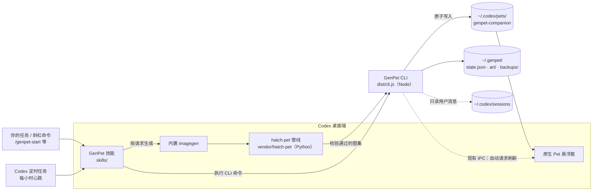

# GenPet

[English](README.md) | 简体中文

GenPet 是一只由图像生成的 **Codex 原生 Pet**：它从一颗看不出种类的蛋开始，孵化五小时后才确定自己是谁，之后随你日常在 Codex 里的活动一天天长大。

GenPet 直接使用 Codex 自带的 Pet 窗口和动画状态，在此之上加入本地生命周期引擎、自动读取活动情境、图像生成流程和原生精灵图安装。GenFaceUI 是其“有边界的个性化”思路的理论参考；本项目是一个新原型，不是对它的复现，也不是经过验证的长期干预研究。

## 安装

需要：

- 支持自定义 Pet 和插件的 **Codex 桌面端**；
- **Node.js 22+**，并且 `node` 在 `PATH` 中（插件用它运行内置 CLI）；
- 可用的 **git**（Codex 用它从 GitHub 拉取插件）。

不需要 clone 仓库、不需要 `npm install`、也不需要构建：本仓库本身就是一个 Codex 插件市场，`plugins/genpet/` 是已经构建好的插件。

### 方式一：在 Codex 桌面端图形界面安装

1. 打开 Codex 桌面端，点左侧边栏的「插件」。
2. 点「添加插件市场」（在插件页面的「添加」或右上角「页面操作」菜单中）。
3. 「来源」填 `yate-ge/GenPet`，「Git 引用」留空（跟随 main），点「添加插件市场」。
4. 在插件列表中找到 GenPet，点安装，并确认它已启用。
5. 新建一个 Codex 任务（新任务才会加载更新后的插件技能），输入 **`/genpet-start`**。

### 方式二：让 Codex Agent 帮你装

在任意 Codex 任务中只需发送下面这句。具体安装、更新和核验规则由链接中的 agent 安装文档维护，用户不需要把它们全部写进 prompt：

> 请安装或更新 GitHub 仓库 `yate-ge/GenPet` 的 GenPet Codex 插件。开始前先阅读并严格执行：
> https://github.com/yate-ge/GenPet/blob/main/docs/AGENT_INSTALL.md

装好后新建任务，输入 **`/genpet-start`**。

### 方式三：命令行

```sh
codex plugin marketplace add yate-ge/GenPet
codex plugin marketplace upgrade genpet
codex plugin add genpet@genpet
```

macOS 上如果终端里找不到 `codex`，它在桌面端应用内：`/Applications/ChatGPT.app/Contents/Resources/codex`。如果 `git` 提示需要同意 Xcode 许可协议，在「终端」App 里运行 `sudo xcodebuild -license accept`，或安装 Command Line Tools。

### 更新、固定版本与卸载

```sh
codex plugin marketplace upgrade genpet   # 更新到最新 main，之后新建的任务使用新版本
codex plugin remove genpet@genpet         # 卸载插件；~/.genpet/ 里的宠物状态会保留
```

想固定在某个发布版本而不是跟随 main，添加市场时加 `--ref <标签>`（图形界面里填「Git 引用」）。

如果之前用别的方式（例如本地 personal 市场）装过 GenPet，请先卸载旧的那个再安装，避免出现两个 GenPet 插件。宠物数据保存在 `~/.genpet/`，卸载和重装插件都不会影响它。

## 开始使用

在新任务中输入 **`/genpet-start`**（也可以用 `$genpet-start`，或直接说"开始我的 GenPet"）。它可以重复运行，不会重置已有宠物：

- **还没有宠物：** 读取本地活动、领养一颗蛋、生成蛋壳形象和动画图集、校验后安装到 `~/.codex/pets/genpet-companion/`，并创建一个每小时检查的定时成长任务。在 Codex 的 Pets 设置里选中 GenPet 一次即可。
- **已经有宠物：** 不重新领养，只检查并补全缺失的图像、原生 Pet 和定时任务，然后报告现状。重装插件或换电脑后运行一次即可恢复。
- **`/genpet-start manual`：** 同上，但不创建定时任务。

之后的孵化和成长都更新同一个 Pet。其他常用说法：**查看我的 GenPet 状态**、**更新我的 GenPet 成长与形象**。想重新开始一只新宠物，用 `/genpet-reset`。

安装插件本身不会领养宠物，也不会创建定时任务、启动器、LaunchAgent、轮询监控或任何常驻后台进程。

## 架构

GenPet 分成三层：**Codex 里的 Agent 负责调度和“画”，内置 Node CLI 负责本地状态，Codex 原生 Pet 负责“显示”。** 插件没有常驻进程；每条 CLI 命令完成一次操作后立即退出。


```mermaid
flowchart LR
  U["你的任务 / 斜杠命令<br>/genpet-start 等"] --> S
  H["Codex 定时任务<br>每小时心跳"] --> S
  subgraph CX["Codex 桌面端"]
    S["GenPet 技能<br>skills/"]
    IG["内置 imagegen"]
    HP["hatch-pet 管线<br>vendor/hatch-pet（Python）"]
    PW["原生 Pet 悬浮窗"]
  end
  S -- "按请求生成" --> IG --> HP
  HP -- "校验通过的图集" --> C
  S -- "执行 CLI 命令" --> C["GenPet CLI<br>dist/cli.js（Node）"]
  C --> ST[("~/.genpet/<br>state.json · art/ · backups/")]
  C -. "只读用户消息" .-> SE[("~/.codex/sessions")]
  C -- "原子写入" --> PET[("~/.codex/pets/<br>genpet-companion")]
  PET --> PW
  C -. "现有 IPC：自动请求刷新" .-> PW
```

| 模块 | 源码 | 职责 |
|---|---|---|
| 技能 | `plugins/genpet/skills/genpet*/` | 告诉 Agent 何时读状态、何时生成图像、如何质检和安装；`/genpet-start` 负责开始或恢复，另外三个是调试命令 |
| CLI | `src/cli.ts` | 用一个返回 JSON 的命令接口连接下面各模块与技能 |
| 生命周期引擎 | `src/core.ts` | 以领养时间为锚点计算孵化、五小时情境窗口、每日成长和离线补算；孵化时一次性确定出生身份 |
| 活动情境 | `src/context.ts` | 只读近期 Codex 用户消息，归类为 构建/研究/创作/学习/休息 标签，不保存原文 |
| 存储 | `src/store.ts` | `~/.genpet/state.json` 的事务读写、备份和幂等记录 |
| 图像与安装 | `src/art.ts`、`src/image.ts` | 为当前设计生成唯一的图像请求 ID；校验 PNG/WebP 图集；原子替换原生 Pet 的精灵图 |
| 原生刷新 | `src/native-refresh.ts` | 仅通过现有 IPC 请求刷新 |
| 调试 | `src/debug.ts` | reset/grow/state 的实现，带备份和 operationId 幂等 |
| 生成管线 | `plugins/genpet/vendor/hatch-pet/` | 官方 Hatch Pet 工具：逐行生成动作、提取帧、组装 8×11 V2 图集并质检 |

**一次成长更新的流程：** 定时心跳触发 GenPet 技能 → `status` 让引擎补算时间，得出当前阶段和道具 → `art-request` 给出这个设计的请求（已有图像就是 `ready`，不重复生成）→ Agent 用 imagegen 和 hatch-pet 生成并质检 → `accept-art` 保存到 `~/.genpet/art/` → `install-native` 原子写入 `genpet-companion` 并尝试刷新悬浮窗。任何一步失败都保留上一张通过质检的图像。

**分发：** 仓库根目录的 `.agents/plugins/marketplace.json` 让整个仓库成为一个 Codex 插件市场。`npm run build:plugin` 用 esbuild 把 `src/` 和全部 npm 依赖打包进 `plugins/genpet/dist/`，图像解码使用 WebAssembly，没有原生模块。Codex 从 GitHub 拉取后直接运行，不需要 npm。

## 功能与范围

- 原生风格像素画，由 Codex `imagegen` 生成，经 `hatch-pet` 流程组装。
- 蛋优先：只有带微弱线索的普通蛋壳，没有预先选定的生物；出生身份在孵化时根据孵化期活动和随机种子一次性确定。
- 五小时孵化与情境窗口、每日成长、离线补算、孵化后身份不变、情境记录可撤回。
- 自动从近期 Codex 用户消息提取本地活动标签；内置生成流程不需要问卷，也不需要 API key。
- 内置 Node CLI 和可分发的 Codex 插件。
- 宠物使用原生窗口；插件附带的 HTTP 调试页面默认关闭，仅在 /genpet-debugger 时启动。

**原生刷新：** 首次初始化和后续换图都会通过 Codex 已有的本地 IPC 通道请求刷新，普通启动即可，不需要调试参数、重启或后台监控。IPC 成功表示刷新通知已转发，显示哈希未测量时仍返回 `displayStatus=unconfirmed`。IPC 失败时报告错误并保留重试状态。此内部协议已通过用户实机观察验证，宿主升级后需复验。详见[原生刷新说明](plugins/genpet/docs/NATIVE_REFRESH.zh-CN.md)。

## 成长机制

领养时间是五小时孵化窗口和情境窗口的起点。蛋只有蛋壳特征，`hatchIdentity` 为空。到达孵化边界时，引擎根据完整的孵化期活动和随机种子确定一个有边界的出生身份，并生成第一张生物形象，只沿用蛋的微弱颜色和纹理线索。之后的活动不会重新抽取已经揭晓的个体。

孵化后每满 24 小时增加一个成长日，默认第 7 天进入幼年、第 21 天成年。体型变化有上限；日常活动只适度影响表情倾向，不决定能否成长。没有连续打卡、工作量比拼、健康下降或缺席惩罚。

最近一个已结束的五小时窗口决定活动道具：构建/工具、研究/书、创作/画笔、学习/探索、休息/枕头。稳定身份和运行时的任务动作相互独立。新领养的时间和默认值可在 `plugins/genpet/config/policy.json`（或 `GENPET_POLICY_FILE` 指定的文件）中修改，已有宠物保留自己保存的策略。更多细节见[蛋优先机制](docs/MECHANISM.zh-CN.md)和[自定义默认值](docs/CUSTOMIZATION.zh-CN.md)。

## 定时成长

成长检查和图像生成由 Codex 原生定时任务触发。插件内没有定时器、后台监控、LaunchAgent、cron 或网站；CLI 只在每次操作时运行，生命周期引擎根据保存的时间戳补算。

开启自动成长时，使用一个 Codex 原生线程心跳每小时检查一次。引擎判断五小时孵化/情境边界和 24 小时成长边界，同时发生的变化只产生一个当前设计；已就绪或已暂停的图像不会重复生成。定时任务可用性、生成耗时和原生刷新都可能让可见更新有所延迟。

## 隐私

情境只在本地从 Codex 的 JSONL 用户消息中读取，忽略系统/开发者消息和工具输出。GenPet 只保存固定的活动标签、计数、时间戳和去重哈希，不保存对话原文或文件路径。提取器有明确的文件数量和大小上限，覆盖不完整时会报告。这只是关键词分类，并不声称理解你或推断你的心理状态。你可以关闭情境读取，也可以清除已提取的记录。

图像生成提示词只包含宠物设计参数和活动道具，不包含私人聊天内容。提示词和参考图由 Codex 图像生成服务处理；生成结果保存在本地。

## CLI 命令

| 命令 | 用途 |
|---|---|
| `status` | 补算生命周期并读取本地活动标签 |
| `adopt` | 领养一颗蛋，不会覆盖已有宠物 |
| `art-request` | 读取当前有边界的图像生成请求 |
| `accept-art` | 质检后接收生成的头像或图集 |
| `install-native` | 原子地导出已批准的当前设计图集 |
| `configure` | 开关情境读取、冻结装扮、自动生图或改名 |
| `clear-context` | 清除已提取的标签，不删除原始对话 |
| `debug-reset` | 明确要求时备份旧生命并重新开始一颗蛋 |
| `debug-grow` | 推进逻辑年龄，保持已揭晓的身份 |
| `debug-state` | 测试用的道具覆盖，或恢复自动映射 |

从已安装插件根目录运行 `node dist/cli.js <命令>`。`accept-art` 需要请求 ID、绝对文件路径、类型和来源说明，绝不会伪造生成的图像。

## 调试斜杠命令

除了 `/genpet-start`，插件还包含 `genpet-reset`、`genpet-grow`、`genpet-state` 三个调试技能，可在 `/` 菜单中找到，或用 `$genpet-reset`、`$genpet-grow`、`$genpet-state` 调用。reset 备份后开始新的生命；grow 加速同一个身份的成长；state 修改道具或恢复自动映射。每个流程都会生成并校验缺失的图像，然后安装到同一个原生 Pet。参数见[调试命令说明](plugins/genpet/docs/DEBUG_COMMANDS.zh-CN.md)。定时维护任务从不调用这些调试命令。

## 开发

```sh
npm ci
npm run build
npm test
npm run build:plugin   # 重建 plugins/genpet/ 内的运行时生成文件
```

用户状态保存在仓库之外的 `~/.genpet/`；测试时可用 `GENPET_DATA_DIR` 覆盖。`CODEX_HOME` 控制读取的 Codex 目录和原生 Pet 的安装位置。

| 位置 | 用途 | 是否进入 `plugins/genpet/` |
|---|---|---|
| `.agents/plugins/marketplace.json` | 让仓库成为名为 `genpet` 的 Codex 插件市场 | — |
| `plugins/genpet/` | 用户实际安装的唯一插件源码包；静态文件直接在这里编辑 | — |
| `src/` | 运行时源码 | 连同所有 npm 依赖打包进 `dist/cli.js` 和 `dist/debugger-server.js` |
| `tests/`、`.github/` | 测试和 CI | 否 |
| `scripts/` | 仓库级构建、安装和验证工具 | 否 |
| `assets/` | 生成的示例和隔离测试夹具 | 否 |
| `docs/` | 研究、设计和验证文档 | 否 |
| `plugins/genpet/skills/`、`vendor/`、`config/` | 唯一的 Codex 工作流、官方图集工具和策略默认值 | 已位于插件内 |
| `plugins/genpet/dist/`、`package.json` | 生成的运行时包和元数据 | 由 `npm run build:plugin` 重建 |
| `output/` | 被忽略的本地构建和报告 | 否 |

- `npm run verify:fast`：源码改动后的快速检查。
- `npm run verify:release`：交付前运行。它会重建 `plugins/genpet/` 内的生成文件，通过仓库市场把该唯一插件包安装到临时 Codex 环境，确认安装副本不含 `node_modules`，并在副本上跑完整的 CLI 生命周期流程。CI 还会检查生成文件是否过期。两条命令都不会重置或安装真实的 Pet。

通过单元测试不能代替在 Codex 里实际选中并观察宠物。何时需要单独验证图像生成和原生显示，见[项目地图与验证工作流](docs/PROJECT_STATUS.zh-CN.md)；开发和发布流程见 [CONTRIBUTING](CONTRIBUTING.md)。

更多文档：[设计计划](docs/PLAN.zh-CN.md)、[验证记录与剩余限制](docs/VALIDATION.zh-CN.md)、[个性化与成长的受控检查](docs/PERSONALIZATION_GROWTH_VALIDATION.zh-CN.md)、[研究边界](docs/RESEARCH.md)、[第三方声明](THIRD_PARTY_NOTICES.md)。

## 许可

原创源码采用 MIT 许可；内置的 Hatch Pet 工具采用 Apache-2.0。生成素材的来源另行记录。GenPet 在孵化、成长和情境更新的全过程中只维护一个原生条目 `genpet-companion`；开发演示数据不能安装为原生 Pet。

### Release verification

Every published upgrade, including skill-only changes, requires a new semantic version. Keep source and generated manifests in sync, rebuild, and run `npm run verify:release` against a freshly fetched `origin/main`. See [release rules](https://github.com/yate-ge/GenPet/blob/main/AGENTS.md).

After installation, compare the actual installed directory with the refreshed marketplace package:

```sh
node <marketplace>/plugins/genpet/scripts/verify-install.mjs <installed-plugin> <marketplace>/plugins/genpet
```

This checks manifest versions and file hashes, including the delegation policy. Report the marketplace commit as well as the installed version and path. A successful check does not prove that an already-running chat reloaded its skills or that delegated image generation has been tested.

## 按需网页调试器

使用 `/genpet-debugger` 启动随插件附带的本地调试页面。默认不启动、不监听端口；重复调用复用服务。打开页面只读存档，真实伙伴与独立成长实验室分别操作。页面提供停止按钮，关闭标签页本身不会停止服务。CLI 为 `node dist/cli.js debugger`，链接 CLI 后可用 `genpet debugger`。
