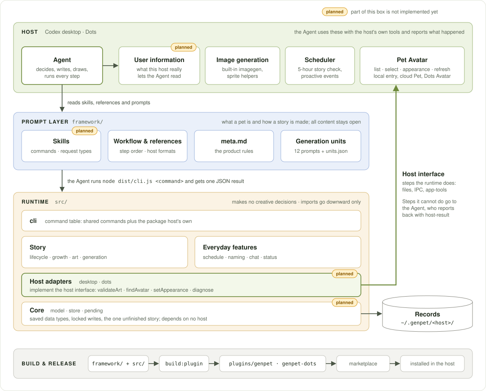
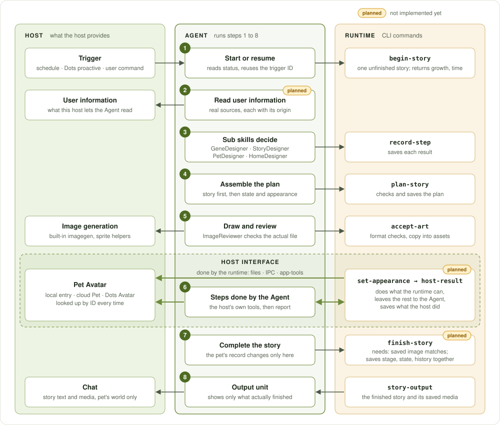
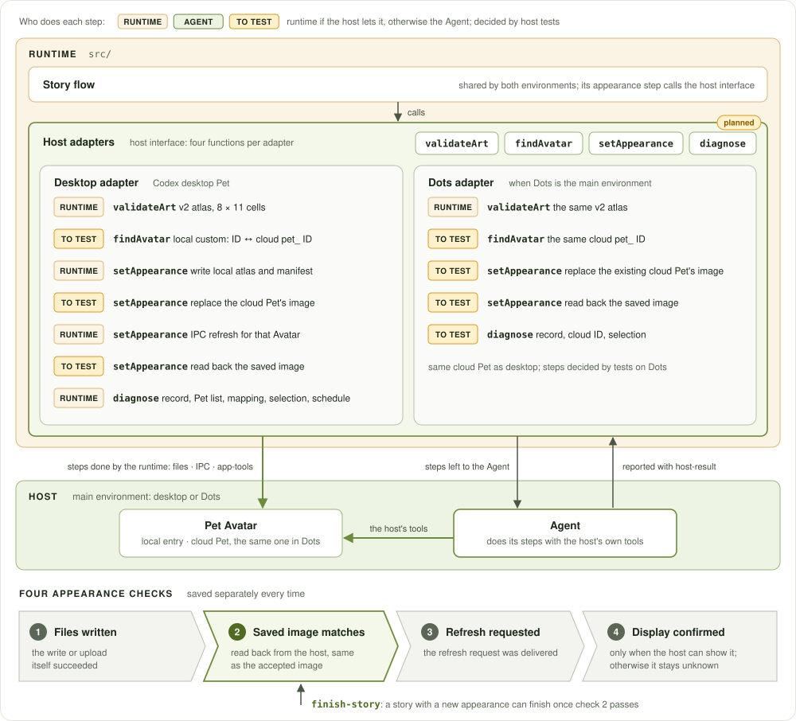

# Architecture

[中文](ARCHITECTURE.zh-CN.md)

This is the target architecture, agreed on 2026-10-10. Most of it is how GenPet 0.9.4 already works; the parts that are not built yet are marked **planned** in the diagrams and listed under [Implementation status](#implementation-status). Development follows this document, so edit the status table when a planned part is built.

## Principles

1. **The Agent decides, the runtime records.** Creative content and decisions live in the prompt layer. `src/` handles identity, saved records, retries and putting a new appearance on the Pet Avatar.
2. **The host is a layer.** User information, image generation, scheduling and the Pet Avatar are things the host provides. Each one is either called by the runtime, or used by the Agent with the host's own tools and reported back. Both paths follow the same steps.
3. **A new appearance is checked in four separate ways.** Files written, saved image matches, refresh requested, display confirmed. Each is saved and judged on its own.
4. **Each rule is written once.** A rule lives in one file; other files link to it.
5. **Imports go one way.** Upper parts import lower ones: commands → story flow and everyday features → host adapters → core.

## Layers



| Layer | Where | Decides |
| --- | --- | --- |
| Host | Codex desktop, Dots | Provides the Agent and what it uses: user information, image generation, scheduling, the Pet Avatar. |
| Prompt layer | `framework/` | What a pet, story, egg and Avatar must be, and how one story is made. Content stays open; the Agent decides it at runtime. |
| Runtime | `src/` | Identity, saved records, retries, artwork files and putting a new appearance on the Pet Avatar. |

Inside the host, the Agent is the center. The user's commands and talk reach it through chat, and the scheduler triggers it for the 5-hour check. The Agent reads user information, draws with image generation, and puts new appearances on the Pet Avatar, which is what the user sees. The runtime reaches the Pet Avatar too, through the host interface.

The three layers are connected through the Agent. The Agent reads the prompt layer to know what to do, and runs the runtime's commands to save and check each step. The runtime's host adapters reach the Pet Avatar through the host interface.

The **Pet Avatar** is the host's own entry that shows the pet: on the desktop, the Pet in Codex (the local entry under `CODEX_HOME/pets/`, or the cloud Pet it was migrated to); in Dots, the Avatar. The host also owns its list, selection and refresh. GenPet keeps the pet's record and artwork files under `~/.genpet/`.

## Prompt layer

Logically the prompt layer is skills: one main skill, a few sub skills, and a set of references. The Agent in the host reads and runs all of them.

The **main skill** handles the basics:

- Entries: `/genpet` and 6 commands (start, story, grow, name, reset, stop).
- Telling talk, a story and diagnosis apart; see [Three kinds of request](#three-kinds-of-request).
- The main workflow: read status → decide → draw and check → appearance → finish → tell the user.

It calls a sub skill only when one kind of thing has to be decided.

| Sub skill | Decides | Called |
| --- | --- | --- |
| GeneDesigner | Who the pet is: the encounter, genes and personality. | Adoption only |
| StoryDesigner | What happens and how it is told: the story, growth, the item the story gives the user (a postcard, a photo), and replies in chat. | Every story and chat |
| PetDesigner | What the pet looks like: the egg, each stage, a special form. | Every new appearance |
| HomeDesigner | The pet's home: layout, moving, the home view. | When the home changes |
| ImageReviewer | Whether an image that was actually drawn passes. | Every image, before it is accepted |

The four Designers decide; ImageReviewer checks the result. It looks at the actual generated file (full size and at the size the host shows it), against the product rules and what the Designer wrote the image must show, and the answer is accept or repair.

Sub skills are roles the same Agent plays in turn. They are called in two orders:

- **Adoption**: GeneDesigner → PetDesigner → ImageReviewer.
- **A later story**: StoryDesigner → PetDesigner (only for a new appearance) → HomeDesigner (only when the home changes) → ImageReviewer (every image).

**References** are the knowledge the main skill and the sub skills share: product rules, the record format, the story check schedule, naming, and the desktop and Dots formats. Whichever skill needs one refers to it, and each rule is written there once.

**Today.** 0.9.4 already has all three parts, with the files organized this way: the entries are 7 thin skills that share one workflow document, and the sub skills are 12 unit prompts under `framework/prompts/`. Each unit decides one thing and can be tested on its own with `unit-request` and `verify-unit`.

| Sub skill | Units today |
| --- | --- |
| GeneDesigner | `encounter`, `genes`, `personality` |
| StoryDesigner | `context`, `story`, `evolution`, `carrier`, `chat`, `output` |
| PetDesigner | `appearance` |
| HomeDesigner | `home` |
| ImageReviewer | `image-review` |

Whether the files are also reorganized as a main skill and sub skills is left to the development phase. For where each file is, see [Where each rule is written](#where-each-rule-is-written).

## One story, end to end



1. `begin-story` creates the pet once and opens the one unfinished story for a trigger ID. Retrying the same trigger returns the same story.
2. **Planned.** Before the `context` unit, the Agent reads the user information this host really lets it read, and notes where each piece came from. See [User information](#user-information).
3. Following the main workflow, the Agent calls the sub skills it needs and saves each result with `record-step`.
4. `plan-story` checks and saves the plan once. Artwork retries keep it.
5. The Agent draws, ImageReviewer checks the actual file, and `accept-art` copies it into the pet's assets under the plan's request ID.
6. The new appearance goes through the [host interface](#host-interface) onto the pet's own Pet Avatar, found by ID.
7. `finish-story` saves stage, state, history and trigger together. The pet's record changes at this step.
8. `story-output` returns the finished story and its saved media for the `output` unit to present.

A short story with no artwork skips steps 5 and 6. "Every check has pet content" uses this same flow.

## Host interface



Every difference between hosts sits behind one interface. The shared story code calls only this interface.

| Function | Purpose |
| --- | --- |
| `validateArt` | Check that an image is in this host's format. |
| `findAvatar` | Find the actual Pet Avatar for this pet, including a cloud ID that the host mapped a local entry to. |
| `setAppearance` | Put the new appearance on the Pet Avatar: do the steps the runtime can do, and return the steps left for the Agent. |
| `diagnose` | Read-only check of the record, the Avatar ID, the host's Pet list, the local-to-cloud mapping, the selection and the refresh channel. |

**The same steps for both hosts.** `set-appearance` (working name) runs `setAppearance`. The remaining steps come back as a list for the Agent, who does it with the host's own tools and reports with `host-result`. On the desktop the runtime writes the local entry and requests the IPC refresh itself. For Dots every step is left to the Agent. Which of the remaining desktop steps the runtime can do is decided by [host tests](#host-tests).

**Which Avatar gets the new appearance.** The record keeps the pet's local Avatar ID and the cloud ID last found for it. The host owns the mapping, so `findAvatar` asks the host again every time. A local `custom:` entry and the `pet_` ID it migrated to are the same Pet: the new image goes to the cloud ID, the refresh covers the cloud Pet resources, and the Pet counts as active when the host's selection matches either ID.

**Four checks, and when a story can finish.** Each appearance change saves four results separately:

1. Files written: the write or upload itself succeeded.
2. Saved image matches: the image read back from the host is the same as the accepted image.
3. Refresh requested: the request was delivered.
4. Display confirmed: only when the host can show what is on screen; otherwise it stays unknown.

A story with a new appearance can finish once check 2 passes. If the host cannot be reached at all, the story may finish with a clear note, and the files show when the host next loads them. If the host is reachable but its saved image is different, the story stays unfinished and the next check retries. All four checks go through the host's own interfaces: host APIs, app-tools, IPC and the plugin runtime.

## User information

Reading user information is something the Agent does before writing.

- A host reference lists what each host has been tested to let the Agent read, and the limits.
- The workflow puts the reading step before the `context` unit, for adoption and for every later story.
- The `context` unit's existing `inputRefs` record where each piece came from. "Could not read" and "nothing new" are saved as different results.

The Agent chooses which information matters and how far back to look.

## Three kinds of request

**Planned.** `/genpet` and plain-language requests lead to one of three things. The Agent picks from what the user actually asked:

| Request | When | How the reply reads |
| --- | --- | --- |
| Conversation | The user talks to the pet. Runs the `chat` unit and may save a chat note. | In the pet's voice |
| Story | A scheduled, proactive or explicit trigger. Runs the full flow above. | In the pet's voice |
| Diagnosis | "Load my pet", "it isn't showing", "I can't find it". Runs `diagnose`, fixes what it actually found, then checks again. It works on the host side only; the pet itself stays as it is. | Plain and direct |

## Runtime modules

The runtime has five parts, matching the runtime layer in the diagram:

- **Commands**: every command the Agent runs enters here and returns one JSON result.
- **Everyday features**: story check periods, naming, chat notes and the status summary.
- **Story flow**: begin → unit results → plan → images → appearance → finish. There is one unfinished story at a time and every step is safe to retry. The code enforces three rules: a fixed identity, stages only move forward, and growth deadlines.
- **Host adapters**: one for the desktop and one for Dots. They check the image format, find the Avatar, set the appearance and diagnose. This is the only part of the runtime that touches a host.
- **Core**: the saved data format, locking and atomic writes. The other parts read and write records through it.

The files behind each part:

| Group | Files | What it does |
| --- | --- | --- |
| Command table | `cli.ts` | Shared commands plus the package host's commands; help is generated. |
| Story | `lifecycle.ts` | `begin`, `plan`, `finish`, `cancel`, `reset` and `story-output`. |
| | `growth.ts` | Growth deadlines: which stage advance or special-form change the next story must include. |
| | `art.ts` | `art-request` (what to draw) and `accept-art` (format checks, copy into assets). |
| | `generation.ts` | `unit-request`, `verify-unit` (field checks only) and `record-step`. |
| Everyday features | `schedule.ts` | Check periods, the saved schedule reference, time since the last story. |
| | `naming.ts` | One naming invitation after the hatch; saves only the user's own answer. |
| | `chat.ts` | Brief notes of what the user told the pet. |
| | `status.ts` | The short summary the Agent reads by default. |
| Host adapters | `hosts/index.ts` | The host interface and the list of adapters. |
| | `hosts/result.ts` | Checks and saves what a host did (`host-result`). |
| | `hosts/desktop/` | Desktop Pet: `atlas` format, `publish` to one entry per pet, `refresh` through the IPC router, `switch` the visible Pet, shared `frames` codec. |
| | `hosts/dots.ts` | Dots: save the Avatar ID, leave the appearance change to the Dots Agent. |
| Core | `model.ts` | Saved data types and small validators. |
| | `store.ts` | Read without side effects (`peek`), locked `transaction`, atomic writes. |
| | `appearance.ts` | The current plan's request ID and the artwork a plan refers to. Becomes the `pending` module, see below. |
| Support | `config.ts`, `image.ts`, `migration.ts` | Paths and prompt files; pure-JS PNG/WebP reading; explicit import of v1 desktop records. |
| Debugger | `debugger.ts`, `debugger-server.ts` | Optional local read-only record viewer. |

**Import rule.** `cli` → Story and Everyday features → Host adapters → Core; imports follow this direction only. Files stay in the flat layout; the groups describe the import rule.

**Planned.** Today two import cycles break this rule: `lifecycle → appearance → hosts → dots → lifecycle`, and `hosts → desktop/publish → art → hosts`. `art.ts` also imports the desktop atlas check directly, and `debugger-server.ts` imports the desktop switch. The fix is small: the functions that only read the unfinished story (`pendingFor`, the request ID, the planned appearance) move into one Core module that takes the host's image format as an argument, and the format check and the Pet list go behind `validateArt` and `diagnose`.

## Records

```
~/.genpet/<host>/
  state.json            pet, unfinished story, stories, artwork list, chat notes, schedule
  stories/<story>.json  that story's unit results (planned; inside state.json today)
  pets/<pet>/assets/    accepted artwork
  backups/              full record before a reset or a legacy import
```

One record per host; `GENPET_DATA_DIR` moves the base directory; the per-host folders stay the same. Every change runs inside one locked transaction and is written atomically. Unit results move out of `state.json` because they are the part that keeps growing, and the whole file is rewritten on every command. Existing records stay readable. The fields are described in `framework/references/storage.md`.

## Where each rule is written

| Kind of rule | Written in |
| --- | --- |
| What a pet, egg, story and Avatar must be; how often stories come; how the user appears in them | `framework/prompts/meta.md` |
| One unit's inputs, result and review points | That unit's prompt and its entry in `units.json` |
| The order of steps and which command to run | `framework/references/workflow.md` |
| What a host can do and its formats | `framework/references/desktop.md`, `dots.md` |
| What the user sees | `framework/prompts/output.md` |
| When a command applies and whether it needs the user's confirmation | The skill, which otherwise only links to the files above |
| Rules the code enforces: one identity, one unfinished story, stages only forward, growth deadlines, the pet's own Avatar | `src/` |

**Planned.** Some rules are written in several files today, for example when a check may end without a story. Each moves to its one file and the others link to it.

## Implementation status

| Part | 0.9.4 | To reach the target |
| --- | --- | --- |
| Story lifecycle, one unfinished story, safe retries, growth deadlines | Built | None |
| Generation units, `record-step`, single-unit tests | Built | None |
| Prompt layer organized as main skill, sub skills and references | The content exists: 7 thin skills share one workflow document, 12 units are grouped by role, the image check is named `image-review` | Decide in the development phase whether to reorganize the files this way; rename `image-review` to ImageReviewer |
| Desktop: local entry, IPC refresh, selection read and switch | Built | Becomes the runtime's part of `setAppearance` |
| Dots: save the Avatar ID, leave the appearance change to the Agent | Built, not tested on a real Dots host | Test on Dots |
| Host interface | Adapter has `appearanceKind`, `artContract`, `commands` | Add `validateArt`, `findAvatar`, `setAppearance`, `diagnose` |
| The same steps for both hosts | Desktop `publish`, Dots `host-request`, two paths | One `set-appearance` returning the steps done and the steps left |
| Desktop Pet migrated to the cloud | Not handled; only the local entry is written and only `custom-avatars` is refreshed | Read the mapping, send the new image to the cloud ID, refresh cloud Pet resources |
| Saved-image check before finishing | Not recorded; a story finishes on `active: false` or a requested refresh | Save the read-back result; `finish-story` requires it |
| Reading user information | The `context` unit receives whatever it is given; no reading step | Host reference of readable sources, workflow step, sources saved in `inputRefs` |
| Three kinds of request | `/genpet` leads to conversation only | Add diagnosis, built on `diagnose` |
| One-way imports | Two import cycles, two direct host imports | Move the unfinished-story functions into Core |
| Unit results saved per story | Inside `state.json` | One file per story |
| Each rule written once | Some rules repeated across files | Move each to its one file |

### Host tests

These three facts decide whether a step is done by the runtime or by the Agent.

1. Can the plugin runtime, a Node process, replace a cloud Pet's artwork itself, or can only the Agent call the Pets API?
2. Can the local-to-cloud mapping be read through a host interface, or only from the client's own storage?
3. Can the runtime read back a cloud Pet's saved artwork to compare it with the accepted image?

### Open decision

How the release is delivered. The marketplace clones this repository in full under a 30-second limit, and the history is far larger than the current files. The options are rewriting the history or publishing from a branch that holds only `plugins/` and the marketplace file.

## Extending

- **Change a product rule**: edit `meta.md`. Only touch a unit prompt if its review points depend on that rule.
- **Add or change a generation unit**: edit its prompt and its entry in `units.json` together. `unit-request` and `verify-unit` pick it up.
- **Add a host**: write an adapter that implements the host interface and adds its own commands. Register it in `hosts/index.ts`, add `config/host.json` and a plugin directory, add the package name to `scripts/build-plugin.ts`, and write its reference with what you tested the host can do.
- **Add a command**: add an entry to the command table in `cli.ts`, or to the host adapter's `commands` if only one host needs it. Keep the logic in the feature module.
- **Change a skill**: edit `framework/skills/` for shared skills. Host-only skills live in `plugins/<package>/skills/`.

## Packages

`npm run build:plugin` copies `framework/{prompts,references,debugger-web,skills}` into both plugin packages and bundles `src/` into each `dist/`. Those copies are generated; edit the sources. Per package, keep only the manifest, `config/host.json`, README, host-only skills and `scripts/verify-install.mjs`. The desktop package also includes the `hatch-pet` sprite pipeline under `vendor/`.

## Checks

`npm run verify:fast` runs type-checking, formatting and unit tests. `npm run verify:release` additionally builds, installs both packages into a temporary Codex home and runs the installed CLI and debugger. These checks cover the code. Whether a story or image is right is judged with the Codex-run suite in `tests/agent/README.zh-CN.md`.
