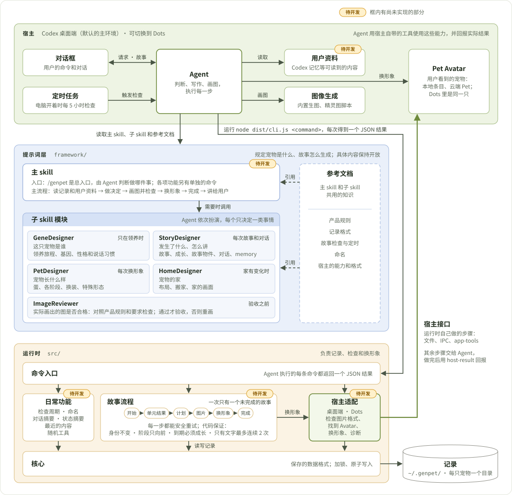
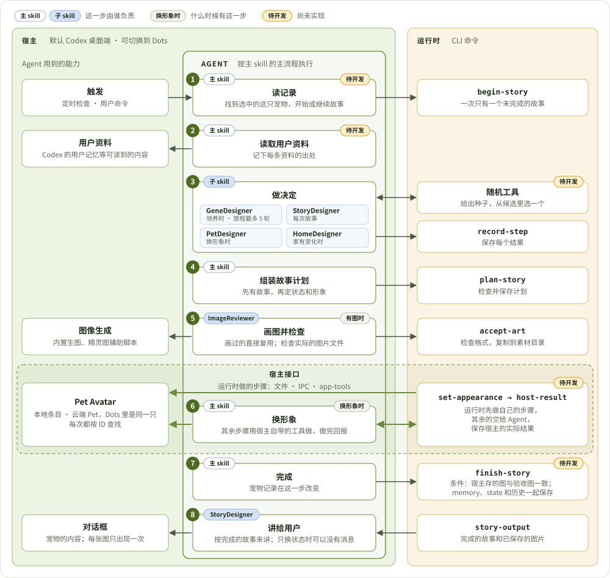
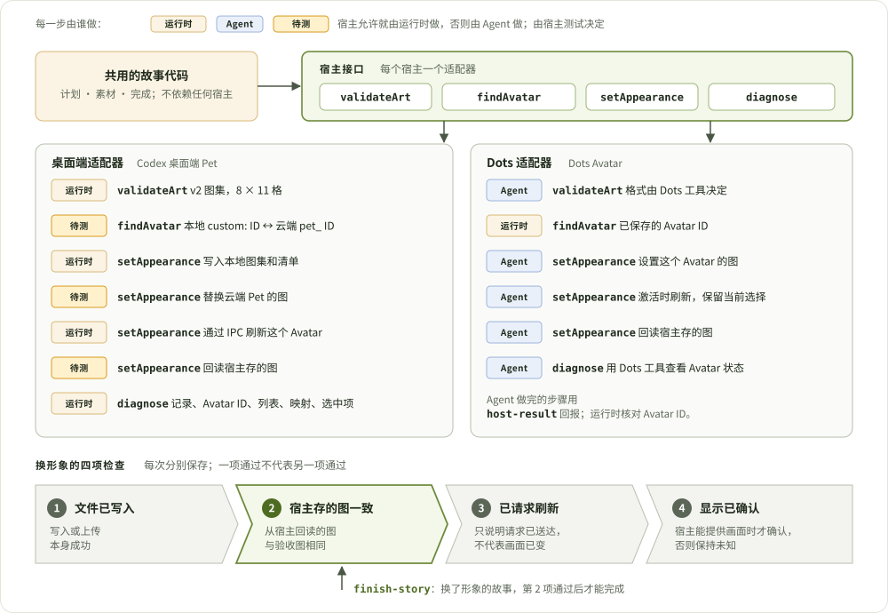
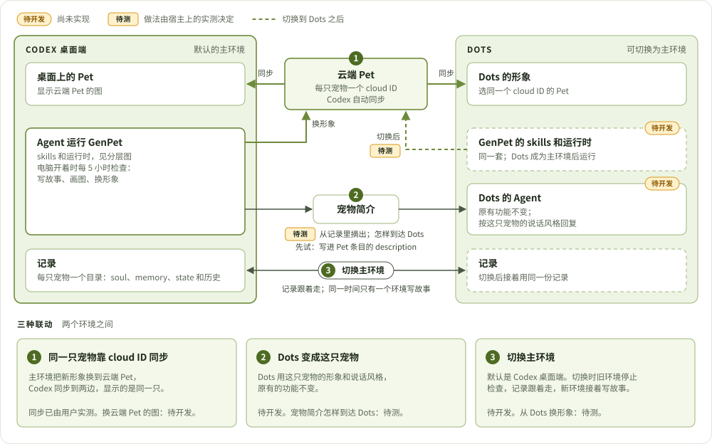

# 架构

[English](ARCHITECTURE.md)

这是 2026-10-10 确认的目标架构，包含同一天确认的桌面端和 Dots 的联动。2026-10-11 按开发计划里之后确认的内容更新了图和正文。大部分内容就是 GenPet 0.9.4 现在的做法；还没做的部分在图里标了「待开发」，并列在[实现状态](#实现状态)里。后续开发按这份文档进行，做完一项就改状态表。

## 原则

1. **Agent 判断，运行时记录。** 创作内容和判断都在提示词层。`src/` 负责身份、保存记录、重试和把新形象换到 Pet Avatar 上。
2. **宿主是架构的一层。** 用户资料、图像生成、定时任务和 Pet Avatar 都由宿主提供。每一项要么由运行时直接调用，要么由 Agent 用宿主自带的工具完成后回报，两种方式走同一套步骤。
3. **换形象要分四项检查。** 文件已写入、宿主存的图一致、已请求刷新、显示已确认。四项分别保存、分别判断。
4. **一条规则只写一处。** 规则写在一个文件里，其他文件只链接过去。
5. **引用方向单一。** 上层引用下层：命令入口 → 故事流程和日常功能 → 宿主适配 → 核心。

## 分层



| 层 | 位置 | 负责什么 |
| --- | --- | --- |
| 宿主 | Codex 桌面端（默认的主环境）、Dots（可切换为主环境） | 提供 Agent 和它用到的能力：用户资料、图像生成、定时任务、Pet Avatar。 |
| 提示词层 | `framework/` | 规定宠物、故事、蛋和 Avatar 必须是什么，以及一次故事怎么生成。具体内容保持开放，由 Agent 在运行时决定。 |
| 运行时 | `src/` | 身份、保存记录、重试、素材文件，以及把新形象换到 Pet Avatar 上。 |

宿主内部以 Agent 为中心。用户的命令和对话通过对话框到达 Agent，定时任务在电脑开着时每 5 小时触发它检查一次。Agent 读取用户资料，用图像生成画图，并把新形象换到 Pet Avatar 上；Pet Avatar 就是用户看到的宠物。运行时也会通过宿主接口操作 Pet Avatar。

这三层在桌面端和 Dots 两个环境里各有一份，其中一个是主环境，见[两个环境](#两个环境)。

三层通过 Agent 相连。Agent 读取提示词层，知道该做什么；Agent 执行运行时的命令，保存和检查每一步。运行时的宿主适配通过宿主接口操作 Pet Avatar。

**Pet Avatar** 指宿主里显示这只宠物的那个条目：Codex 里的 Pet，即 `CODEX_HOME/pets/` 下的本地条目和它对应的云端 Pet。云端 Pet 有一个 cloud ID，Codex 自动同步它；在 Dots 里选同一个 cloud ID，看到的是同一只。它的列表、选中项和刷新都归宿主管。宠物记录和图片文件由 GenPet 保存在 `~/.genpet/` 下。

## 提示词层

提示词层在逻辑上就是 skill：一个主 skill、几个子 skill，加上一组参考文档。它们都由宿主里的 Agent 读取和执行。

**主 skill** 负责基本的事：

- 入口：`/genpet` 是总入口，Agent 按用户说的内容判断做哪件事。各项功能另有单独的命令：开始、对话、新故事、成长、停止、重置和调试器，取舍见 [开发计划的「命令入口」](DEVELOPMENT_PLAN.zh-CN.md#命令入口)。
- 判断这次请求是对话、故事还是诊断，见[三类请求](#三类请求)。
- 主流程：读记录和用户资料 → 做决定 → 画图并检查 → 换形象 → 完成 → 讲给用户。

要具体决定某一类事情时，主 skill 才调用对应的子 skill。

| 子 skill | 决定什么 | 什么时候调用 |
| --- | --- | --- |
| GeneDesigner | 这只宠物是谁，即它的 soul：领养旅程（用户做选择，最多 5 轮）、基因、性格（含说话习惯）。 | 只在领养时 |
| StoryDesigner | 发生了什么、怎么讲：故事、成长变化、故事物件（故事里值得看的一样东西，画成一张图）、对话回复；故事完成时更新它的 memory。 | 每次故事和对话 |
| PetDesigner | 宠物长什么样：蛋、各个阶段、换装、特殊形态。 | 每次换形象 |
| HomeDesigner | 宠物的家：布局、搬家、家的画面。 | 家有变化时 |
| ImageReviewer | 实际画出的图是否合格。 | 验收之前 |

四个 Designer 做决定，ImageReviewer 检查结果。ImageReviewer 看的是实际生成的图片文件（原图和宿主里显示的大小），对照产品规则和 Designer 写下的「必须画出什么」，结论是通过或重画。

子 skill 由同一个 Agent 依次扮演。两种调用顺序：

- **领养**：GeneDesigner → PetDesigner → ImageReviewer。
- **之后的故事**：StoryDesigner → PetDesigner（只在换形象时）→ HomeDesigner（只在家有变化时）→ ImageReviewer（验收之前）。

**参考文档**是主 skill 和子 skill 共用的知识：产品规则、记录格式、故事检查与定时、命名、宿主的能力和格式。谁用到就引用，每条规则在这里写一次。

**现在的实现。** 0.9.4 里这三部分都已经有，文件是这样组织的：入口是 7 个很薄的 skill，共用一份流程文档；子 skill 是 `framework/prompts/` 下的 12 个单元提示词，每个单元只决定一件事，可以用 `unit-request` 和 `verify-unit` 单独测试。

| 子 skill | 现在对应的单元 |
| --- | --- |
| GeneDesigner | `encounter`、`genes`、`personality`（说话习惯待开发，写在性格里） |
| StoryDesigner | `context`、`story`、`evolution`、`carrier`、`chat`、`output`（memory 待开发） |
| PetDesigner | `appearance` |
| HomeDesigner | `home` |
| ImageReviewer | `image-review` |

`context` 两边共用：领养时给 GeneDesigner 提供用户特质，之后给 StoryDesigner 提供用户活动。

文件要不要也按主 skill 和子 skill 重新组织，留到开发阶段决定。各文件的位置见[每条规则写在哪里](#每条规则写在哪里)。

## 一次故事的完整流程



图里每一步左上角的蓝色标签是负责这一步的 skill，右上角的灰色标签是这一步的条件：第 5 步在故事有图时才有，第 6 步在换形象时才有。

1. `begin-story` 只创建一次宠物，并为一个触发 ID 打开唯一的未完成故事。用同一个触发 ID 重试，返回的是同一个故事。**待开发：** 有多只宠物时，先按宿主里选中的 Pet 找到这只宠物。
2. **待开发。** 在 `context` 单元之前，Agent 先读取这个宿主实际允许它读到的用户资料，并记下每条的出处。见[用户资料](#用户资料)。
3. Agent 按主流程调用需要的子 skill 做决定，每个结果用 `record-step` 保存。**待开发：** 故事和基因设计由 Agent 先列出几个候选，随机工具给出种子选出一个；领养时这一步是多轮的领养旅程，每一轮的场景和用户的选择都保存下来。
4. `plan-story` 检查并保存计划，只保存一次。重试画图时沿用同一份计划。
5. 画过的状态直接复用。要画新图时，Agent 画图，由 ImageReviewer 检查实际的图片文件，再用 `accept-art` 把它复制到这只宠物的素材目录，记在当前计划的请求 ID 下。
6. 新形象通过[宿主接口](#宿主接口)换到这只宠物自己的 Pet Avatar 上，按 ID 查找。
7. `finish-story` 把阶段、状态、历史和触发 ID 一起保存；记录分块后是 memory、state 和历史。宠物记录在这一步才改变。
8. `story-output` 返回完成的故事和已保存的图片，由 StoryDesigner 讲给用户。只换了状态的检查可以没有消息；每张图在对话里只出现一次。

平常的检查多数是换装：换的是这只宠物的形象，画过的直接复用。只有文字的故事跳过第 5、6 步，最多连续 2 次。「每次检查都有宠物内容」用的就是这条流程；故事类型见 [开发计划的「故事类型」](DEVELOPMENT_PLAN.zh-CN.md#故事类型)。

## 宿主接口



两个环境之间在宿主上的所有差别都放在一个接口后面，由运行时的宿主适配实现。故事流程只调用这个接口。

| 函数 | 作用 |
| --- | --- |
| `validateArt` | 检查一张图是否符合这个宿主的格式。 |
| `findAvatar` | 找到这只宠物实际对应的 Pet Avatar，包括宿主把本地条目映射到的云端 ID。 |
| `setAppearance` | 把新形象换到 Pet Avatar 上：先做运行时能做的步骤，再返回留给 Agent 的步骤。 |
| `diagnose` | 只读检查：记录、Avatar ID、宿主的 Pet 列表、本地到云端的映射、选中项、刷新通道和定时任务。初始化检查和诊断都用它。 |

**两个环境走同一套步骤，换的是同一个云端 Pet。** `set-appearance`（暂定命令名）调用 `setAppearance`。其余步骤作为清单返回给 Agent，Agent 用宿主自带的工具做完，再用 `host-result` 回报。桌面端的本地条目写入和 IPC 刷新请求由运行时自己完成，其余步骤哪些能由运行时做，取决于[宿主测试](#宿主测试)。Dots 成为主环境时用同一种图集格式，给同一个 cloud ID 换图；它的每一步怎么做，在适配 Dots 时实测。

**换的是哪个 Avatar。** 记录里保存这只宠物的本地 Avatar ID，以及最近一次查到的云端 ID。映射归宿主管，所以 `findAvatar` 每次都重新向宿主查。本地的 `custom:` 条目和它迁移后的 `pet_` ID 是同一只 Pet：新图发到云端 ID，刷新的是云端 Pet 的资源，宿主选中的 ID 与两者任一个相同，就算这只 Pet 正在使用。

**四项检查，以及故事什么时候能完成。** 每次换形象分别保存四个结果：

1. 文件已写入：写入或上传本身成功。
2. 宿主存的图一致：从宿主回读的图与验收通过的图相同。
3. 已请求刷新：请求已送达。
4. 显示已确认：只有宿主能提供实际画面时才确认，否则保持未知。

换了形象的故事，第 2 项通过后才能完成。宿主完全连不上时，故事可以带一条明确的说明完成，文件会在宿主下次加载时生效。宿主连得上但存的图不一致时，故事保持未完成，下次检查时重试。四项检查都通过宿主自己的接口完成：宿主 API、app-tools、IPC 和插件运行时。

## 两个环境



宿主、skills、运行时这一套在 Codex 桌面端和 Dots 各有一份。同一时间只有一个主环境，写故事和换形象都在主环境里做，默认是 Codex 桌面端。两个环境之间有三种联动：

| 联动 | 做什么 | 状态 |
| --- | --- | --- |
| 1. 同一只宠物靠 cloud ID 同步 | 主环境把新形象换到云端 Pet 上，Codex 同步到两边。Dots 里选同一个 cloud ID 的 Pet。每只宠物各有一个 cloud ID。 | 同步已由用户实测；换云端 Pet 的图待开发 |
| 2. Dots 变成这只宠物 | Dots 用这只宠物的形象，按它的说话风格回复，原有的功能不变。每次故事完成后，代码从宠物记录里摘出一份宠物简介：名字、soul、memory 和 state，见[记录](#记录)。 | 待开发；宠物简介怎样到达 Dots（先试写进 Pet 条目的 `description`）、说话风格怎样一直生效，待测 |
| 3. 切换主环境 | 用户可以把主环境切换到 Dots。旧环境停止定时检查，记录跟着走，新环境接着写故事。 | 待开发；从 Dots 给同一个 cloud ID 换形象，待测 |

说话风格来自记录里的两部分：拟声词和基本的说话习惯写在 soul 的性格里，对用户说话的亲疏和语气来自 memory。它用在三处：用户和宠物对话、故事里宠物说的话、Dots 的回复。

Dots 的功能照常。蛋的阶段 Dots 和原来一样，只换了形象；幼年在回复的开头或结尾加一个短的拟声词；少年和成年按性格和它与用户现在的相处来说话。说话风格只用在 Dots 对用户说的话里，Dots 替用户产出的代码、文档和消息保持原样。

开发分两段：先做桌面端和第 1 项，再专门适配 Dots，做第 2、3 项。每项要实测的问题和可以试的做法见 [开发计划的「Dots 联动」](DEVELOPMENT_PLAN.zh-CN.md#dots-联动)。

## 用户资料

读取用户资料是 Agent 在写故事之前做的事。

- 一份宿主参考文档，列出每个宿主经过实测允许 Agent 读到的内容和限制。
- workflow 把读取步骤放在 `context` 单元之前，领养和之后的每次故事都要经过。
- `context` 单元已有的 `inputRefs` 用来记录每条资料的出处。「读不到」和「没有新内容」分开保存。

哪些资料有用、往回看多久，由 Agent 判断。

## 三类请求

**待开发。** `/genpet` 和自然语言请求会进入下面三种处理之一，由 Agent 按用户实际问的内容来选：

| 请求 | 什么时候 | 回复的写法 |
| --- | --- | --- |
| 对话 | 用户用 `/genpet-chat` 和宠物说话。执行 `chat` 单元，可以保存一条对话摘要。 | 宠物的口吻 |
| 故事 | 定时、主动事件或明确的命令触发。执行上面的完整流程。 | 宠物的口吻 |
| 诊断 | 「加载我的宠物」「它没显示」「找不到它」。执行 `diagnose`，按实际查到的问题修复，再检查一次。只处理宿主这一侧，宠物本身保持原样。 | 直接说明 |

## 运行时模块

运行时内部分五部分，和图里的运行时一层对应：

- **命令入口**：Agent 执行的每条命令都从这里进，每次返回一个 JSON 结果。
- **日常功能**：故事检查的周期、命名、对话摘要、状态摘要。待开发：最近的内容（最近几次各是什么类型、哪件事还没做完）和随机工具（给出种子，从 Agent 列的候选里选一个）。
- **故事流程**：开始 → 单元结果 → 计划 → 图片 → 换形象 → 完成。一次只有一个未完成的故事，每一步都能安全重试。身份不变、阶段只能向前、到期必须成长，这三条由代码保证。待开发的第四条：只有文字的故事最多连续 2 次。
- **宿主适配**：桌面端和 Dots 两个环境各一个，负责检查图片格式、找到 Avatar、换形象和诊断。运行时里只有这一部分接触宿主。
- **核心**：保存的数据格式、加锁和原子写入。上面几部分都通过它读写记录。

各部分对应的文件：

| 分组 | 文件 | 做什么 |
| --- | --- | --- |
| 命令表 | `cli.ts` | 共用命令加上当前宿主自己的命令；帮助信息自动生成。 |
| 故事 | `lifecycle.ts` | `begin`、`plan`、`finish`、`cancel`、`reset` 和 `story-output`。 |
| | `growth.ts` | 成长的最晚期限：下一次故事必须包含哪次阶段推进或特殊形态变化。 |
| | `art.ts` | `art-request`（要画什么）和 `accept-art`（检查格式，复制到素材目录）。 |
| | `generation.ts` | `unit-request`、`verify-unit`（只检查字段）和 `record-step`。 |
| 日常功能 | `schedule.ts` | 检查周期、已保存的定时任务引用、距上次故事的时间。 |
| | `naming.ts` | 孵化后邀请命名一次；只保存用户自己给的名字。 |
| | `chat.ts` | 用户对宠物说过的话的简短摘要。 |
| | `status.ts` | Agent 默认读取的简短摘要。 |
| 宿主适配 | `hosts/index.ts` | 宿主接口和适配器列表。 |
| | `hosts/result.ts` | 检查并保存宿主实际做了什么（`host-result`）。 |
| | `hosts/desktop/` | 桌面端 Pet：`atlas` 格式、每只宠物一个条目的 `publish`、通过 IPC 路由的 `refresh`、切换当前显示 Pet 的 `switch`（2026-10-11 用户实测直接切换做不到，开发时复测）、共用的 `frames` 编解码。 |
| | `hosts/dots.ts` | 现有的 Dots 适配器，按 Dots 自己的 Avatar 写：保存 Avatar ID，换形象交给 Dots 的 Agent。第一阶段移除；适配 Dots 时按同一个云端 Pet 重做。 |
| 核心 | `model.ts` | 保存的数据类型和几个小的校验函数。 |
| | `store.ts` | 无副作用的读取（`peek`）、加锁的 `transaction`、原子写入。 |
| | `appearance.ts` | 当前计划的请求 ID，以及计划指向的素材。之后改为 `pending` 模块，见下文。 |
| 支持 | `config.ts`、`image.ts`、`migration.ts` | 路径和提示词文件；纯 JS 的 PNG/WebP 读取；v1 桌面端记录的显式导入。 |
| 调试器 | `debugger.ts`、`debugger-server.ts` | 可选的本地只读记录查看器。 |

**引用规则。** `cli` → 故事和日常功能 → 宿主适配 → 核心，只沿这个方向引用。文件保持平铺，分组表示的是引用规则。

**待开发。** 现在有两个循环引用违反这条规则：`lifecycle → appearance → hosts → dots → lifecycle`，以及 `hosts → desktop/publish → art → hosts`。另外 `art.ts` 直接引用了桌面端的图集检查，`debugger-server.ts` 直接引用了桌面端的切换。改动很小：只读取未完成故事的几个函数（`pendingFor`、请求 ID、计划中的形象）挪到核心里的一个模块，宿主的图片格式作为参数传入；格式检查和 Pet 列表改为通过 `validateArt` 和 `diagnose` 调用。

## 记录

```
~/.genpet/<host>/
  state.json            宠物、未完成的故事、故事列表、素材列表、对话摘要、定时任务
  stories/<story>.json  这个故事的单元结果（待开发；现在放在 state.json 里）
  pets/<pet>/assets/    验收通过的素材
  backups/              重置或导入旧记录之前的完整备份
```

记录保存在主环境里；`GENPET_DATA_DIR` 改的是根目录，各宿主的子目录照旧。切换主环境时记录跟着走（待开发）。每次修改都在一个加锁的事务里完成，并以原子方式写入。单元结果要挪出 `state.json`，因为只有这部分会一直变大，而每条命令都会重写整个文件。已有记录保持可读。各字段的说明在 `framework/references/storage.md`。

**待开发。** `state.json` 里的 `pet` 是这只宠物当前的样子，故事列表是它的历史。`pet` 只在 `finish-story`、命名时改变，分成身份和三块：

```
pet
  id、name、naming、adoptedAt、revision、Avatar ID   身份，由代码管理
  soul    { genes, personality, acquisition }        它是谁
  memory  { text, updatedAt, storyId }               它记得什么
  state   { stage, description, home, special }      它现在的状态
```

| 块 | 内容 | 谁写、什么时候写 |
| --- | --- | --- |
| soul | 基因、性格（含拟声词和说话习惯）、领养的来由 | GeneDesigner，领养时写一次，之后保持不变 |
| memory | 一段短文字：它和用户之间发生过的重要的事，现在怎样和用户相处 | StoryDesigner，故事完成时。有值得记住的真实互动才重写 |
| state | 阶段、当前状态的描述、家、特殊形态 | StoryDesigner 和 HomeDesigner，每次故事完成时 |

memory 记的是它和用户之间的事，是故事和对话摘要的总结；对用户本人的了解优先用宿主已有的用户记忆。现在这些字段平铺在 `pet` 里，没有 memory；改成三块时记录版本升到 3，旧记录保持可读。块名和字段名是暂定的，开发时统一优化。

**待开发：多只宠物。** 用户可以有多只 GenPet，每只一个目录，各有自己的记录、素材、Pet 条目和 cloud ID。同一时间只有一只是激活的，以用户在宿主里选中的 Pet 为准；定时故事和斜杠命令都按这个 ID 找宠物。初始化时先只读地检查既有环境并和用户确认，旧版本留下的东西不影响新的宠物。需求见 [开发计划](DEVELOPMENT_PLAN.zh-CN.md#初始化检查领养新宠物和多只宠物)。

## 每条规则写在哪里

| 规则 | 写在哪里 |
| --- | --- |
| 宠物、蛋、故事和 Avatar 必须是什么；故事多久来一次；用户怎样出现在故事里 | `framework/prompts/meta.md` |
| 一个单元的输入、结果和检查点 | 这个单元的提示词，以及它在 `units.json` 里的条目 |
| 步骤的顺序，以及该执行哪条命令 | `framework/references/workflow.md` |
| 宿主能做什么，以及它的格式 | `framework/references/desktop.md`、`dots.md` |
| 用户能看到什么 | `framework/prompts/output.md` |
| 一条命令什么时候适用，是否需要用户确认 | 对应的 skill，其余内容只链接到上面的文件 |
| 由代码保证的规则：一个身份、一个未完成的故事、阶段只能向前、成长的最晚期限、宠物自己的 Avatar、只有文字的故事最多连续 2 次（待开发） | `src/` |

**待开发。** 现在有些规则写在好几个文件里，比如一次检查什么时候可以不产生故事。每条规则挪到它唯一的文件里，其他文件改为链接。

## 实现状态

| 部分 | 0.9.4 | 到达目标还要做什么 |
| --- | --- | --- |
| 故事流程、唯一的未完成故事、可安全重试、成长的最晚期限 | 已完成 | 无 |
| 生成单元、`record-step`、单个单元的测试 | 已完成 | 无 |
| 提示词层按主 skill、子 skill、参考文档组织 | 内容都已有：7 个薄 skill 共用一份流程文档，12 个单元按角色分组，图像检查叫 `image-review` | 开发阶段决定文件是否照此重新组织；`image-review` 改名为 ImageReviewer |
| 桌面端：本地条目、IPC 刷新、读取和切换选中项 | 已完成；直接切换到指定 ID 的宠物，用户实测做不到 | 成为 `setAppearance` 里由运行时做的部分；设计只依赖给同一个 ID 换形象，切换开发时复测 |
| 现有的 Dots 专用代码：`genpet-dots` 包、`hosts/dots.ts`、`bind-avatar`、`host-request`、`avatar` 格式 | 按 Dots 自己的 Avatar 写；2026-10-03 在 Dots 上实测没有走通 | 第一阶段移除，范围见[开发计划](DEVELOPMENT_PLAN.zh-CN.md#现有的-dots-代码和文档) |
| 宿主接口 | 适配器只有 `appearanceKind`、`artContract`、`commands` | 增加 `validateArt`、`findAvatar`、`setAppearance`、`diagnose` |
| 两个环境走同一套步骤 | 桌面端 `publish`、Dots `host-request`，两条路径 | 统一成 `set-appearance`，返回已完成和剩下的步骤 |
| 靠 cloud ID 同步：把新形象换到云端 Pet | 未处理；只写本地条目，只刷新 `custom-avatars`。Codex 同步云端 Pet、Dots 里选同一个 ID 已由用户实测 | 读取映射，把新图发到云端 ID，刷新云端 Pet 的资源 |
| 完成前检查宿主存的图 | 未记录；`active: false` 或已请求刷新就能完成 | 保存回读结果；`finish-story` 以它为条件 |
| 宠物记录分成 soul、memory 和 state | 字段平铺在 `pet` 里；没有 memory，性格里写着怎样对待用户 | `pet` 分成三块，增加 memory，记录版本升到 3，旧记录保持可读 |
| 多只宠物、初始化检查 | 一个环境只有一只宠物；初始化不检查已有的 Pet 条目、云端 Pet 和定时任务 | 每只宠物一个目录，唯一激活一只，以宿主里选中的 Pet 为准；初始化先检查并和用户确认；清理过程透明 |
| 宠物的说话风格 | 没有保存；说话方式只由阶段规则和性格临时决定 | 性格里增加拟声词和说话习惯，亲疏和语气来自 memory；对话和故事使用它 |
| Dots 变成这只宠物 | 未开始 | 从记录摘出宠物简介、它到达 Dots 的方式、说话风格在 Dots 里一直生效；适配 Dots 时实测 |
| 切换主环境 | 未开始 | 记录跟着走、同一时间只有一个环境写故事、Dots 适配器；适配 Dots 时实测 |
| 读取用户资料 | `context` 单元给什么就用什么，没有读取步骤 | 宿主可读来源的参考文档、workflow 步骤、出处记入 `inputRefs` |
| 领养旅程 | 相遇是一次生成的一段故事 | 多轮旅程，最多 5 轮；每轮的场景和用户的选择都保存，中途离开后可以接着走 |
| 随机工具和最近的内容 | 没有 | 工具给出种子和宠物来源的类型，从 Agent 列的候选里选一个；代码整理最近的内容交给 Agent；只有文字的故事最多连续 2 次 |
| 换装 | 没有触发过 | 身体不变，换穿的、戴的、拿的、姿势等；整套重画，画过的保存在这只宠物名下并复用，见开发计划的「换装」 |
| 三类请求 | `/genpet` 只进入对话 | `/genpet` 成为总入口，对话改用 `/genpet-chat`；增加诊断，基于 `diagnose` |
| 单向引用 | 两个循环引用，两处直接引用宿主 | 把读取未完成故事的函数挪进核心 |
| 单元结果按故事分别保存 | 放在 `state.json` 里 | 每个故事一个文件 |
| 一条规则只写一处 | 部分规则在多个文件里重复 | 每条挪到它唯一的文件 |

### 宿主测试

下面三件事决定一个步骤由运行时做还是由 Agent 做。

1. 插件运行时（一个 Node 进程）能否自己替换云端 Pet 的图，还是只有 Agent 能调用 Pets API？
2. 本地到云端的映射能否通过宿主接口读到，还是只能读客户端自己的存储？
3. 运行时能否回读云端 Pet 存的图，与验收通过的图比较？

适配 Dots 时另外要测的六件事列在 [开发计划的「开发要解决的问题」](DEVELOPMENT_PLAN.zh-CN.md#开发要解决的问题)。

### 待定事项

发布方式。marketplace 在 30 秒限制内完整克隆这个仓库，而仓库历史比当前文件大得多。可选做法是重写历史，或者从一个只包含 `plugins/` 和 marketplace 文件的分支发布。

## 扩展方式

- **改一条产品规则**：改 `meta.md`。只有当某个单元的检查点依赖这条规则时，才去改那个单元的提示词。
- **新增或修改生成单元**：同时改它的提示词和 `units.json` 里的条目。`unit-request` 和 `verify-unit` 会自动识别。
- **新增宿主**：写一个实现宿主接口的适配器，并加上它自己的命令。在 `hosts/index.ts` 里登记，增加 `config/host.json` 和一个插件目录，把包名加到 `scripts/build-plugin.ts`，并把实测到的宿主能力写成它的参考文档。
- **新增命令**：在 `cli.ts` 的命令表里加一项；只有一个宿主需要时，加到那个适配器的 `commands` 里。逻辑留在功能模块里。
- **修改 skill**：共用的 skill 改 `framework/skills/`。只属于某个宿主的 skill 在 `plugins/<package>/skills/`。

## 插件包

`npm run build:plugin` 把 `framework/{prompts,references,debugger-web,skills}` 复制到两个插件包里，并把 `src/` 打包到各自的 `dist/`。第一阶段移除 `genpet-dots` 包之后只剩 `genpet` 一个包；Dots 里怎样安装，适配 Dots 时再定。这些副本是生成的，要改就改源文件。每个包里只手工维护 manifest、`config/host.json`、README、只属于该宿主的 skill 和 `scripts/verify-install.mjs`。桌面端的包另外带有 `vendor/` 下的 `hatch-pet` 精灵图处理脚本。

## 检查

`npm run verify:fast` 执行类型检查、格式检查和单元测试。`npm run verify:release` 另外会构建、把两个包安装到临时的 Codex home，并运行安装后的 CLI 和调试器。这些检查针对代码。故事和图片对不对，用 `tests/agent/README.zh-CN.md` 里由 Codex 执行的那套测试来判断。
