# 五组完整周期 · 实际保存的35篇故事

本文逐篇收录完成分支state中的原始正文，按各组实际保存顺序排列；不以修订候选改写历史。原稿事实越界、流程失败与视觉修订见[报告](REPORT.md)。图片为最终已审素材，恢复复用成年图。各组[state.json](group01/state.json)保留实际上游和输出结果，文件中绝对路径是原测试设备的追溯信息，不要求在其他设备执行。

## 第1组

[独立审核](group01/REVIEW.md) · [原始保存记录](group01/state.json)

### 1 · 蛋 · 安静等待

沿着你周三去看流星雨的山影，我在一座虚构的露水山谷停了下来。谷中萤火虫绕着薄荷叶飞，叶下藏着一颗完整的小蛋；壳上的浅绿纹路夹着几粒金色斑点，像晨露留下的夜空。它轻轻晃了一下，我把它带到窗边，让它听一听清晨。

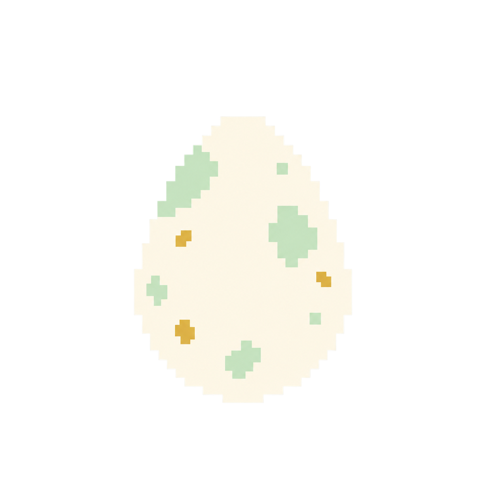

### 2 · 幼年 · 初次出壳，安静试探窗边的新地方

光从你移到窗边的薄荷叶缝里落下来，小蛋等了整个清晨。壳顶终于裂开，薄荷绿的小虫先伸出一只短足，又把另一只放稳，才慢慢挤出软软的身体。两片嫩翅还贴着背，尾端只有米粒大的暖光。它试了三次才爬上低矮的石台，用一片落叶搭起睡窝，把空蛋壳放在门边：这块坡它已经摸清，今晚可以安心住下。

家：窗边石台上的落叶睡窝，门边保留空蛋壳。

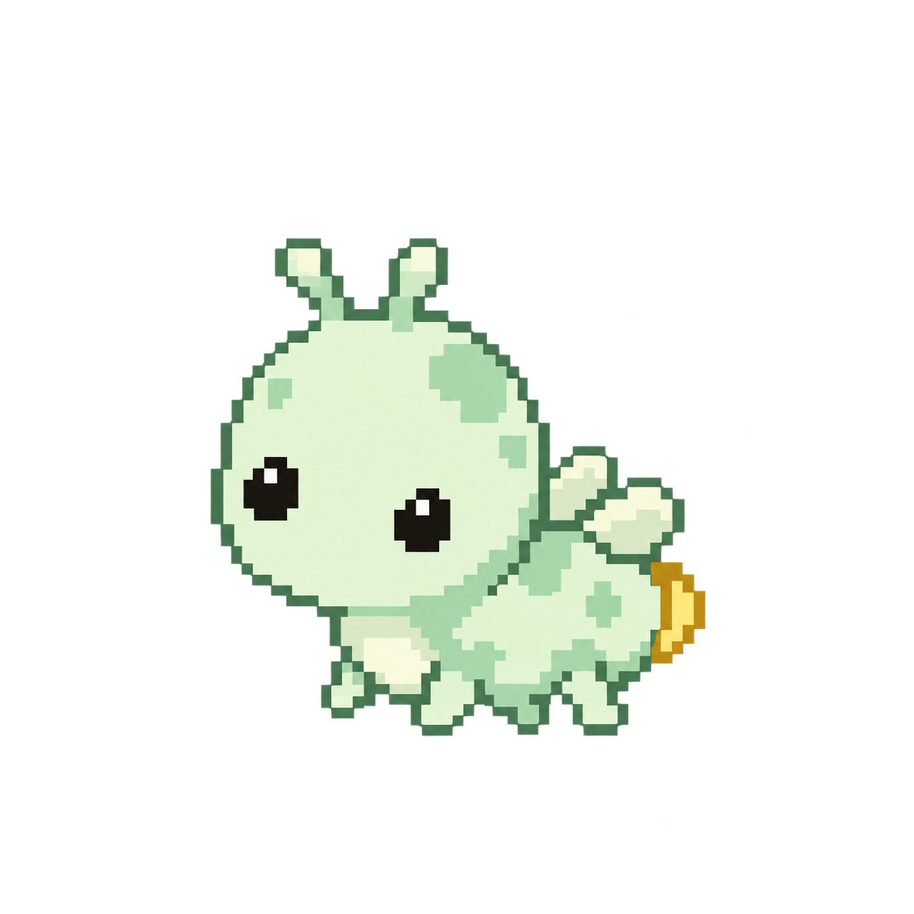

### 3 · 幼年 · 初次出壳，安静试探窗边的新地方

小虫今天只走到石台另一头。它先试了试一块透明小石子的坡面，发现靠近落叶窝最平，便把石子慢慢推回家，放在空蛋壳旁。尾端的小光映在石子里，像多开了一扇小窗。它没有更急着出门，仍安静地摸索新地方；这张家里的照片，留给你看看它发现的那一点亮。

家：窗边石台上的落叶睡窝，门边保留空蛋壳；空蛋壳旁新增一块映着尾光的透明小石子。

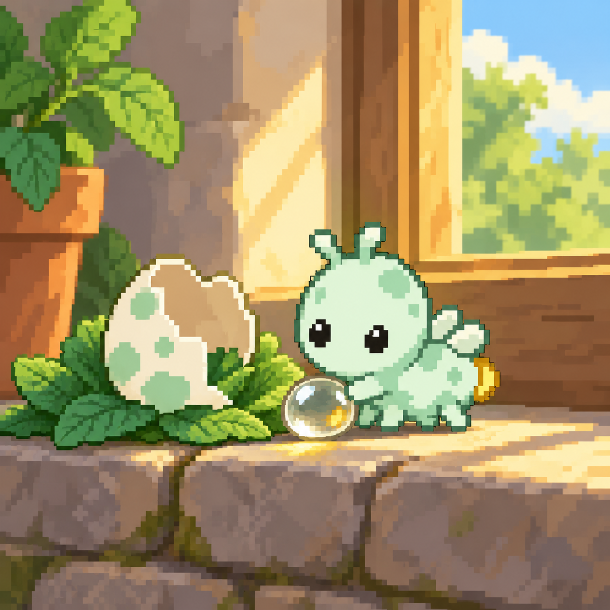

### 4 · 少年 · 有把握尝试短距离探路

这一周，你看薄荷一点点长出新叶，也把项目里安装与常见问题的文档一段段补齐。小虫没有催你；它每天从落叶窝走到透明石子，再多试一小段坡。今天，那两片贴背的嫩翅终于展开成短短的叶形翅，六只足稳稳落在窗沿。它从修下的老枝边捡起一截空心小枝，放到蛋壳与石子旁，打算下回沿着里面的光探路。

家：窗边石台上的落叶睡窝，门边保留空蛋壳，旁边有映着尾光的透明小石子；新增一截空心小枝。

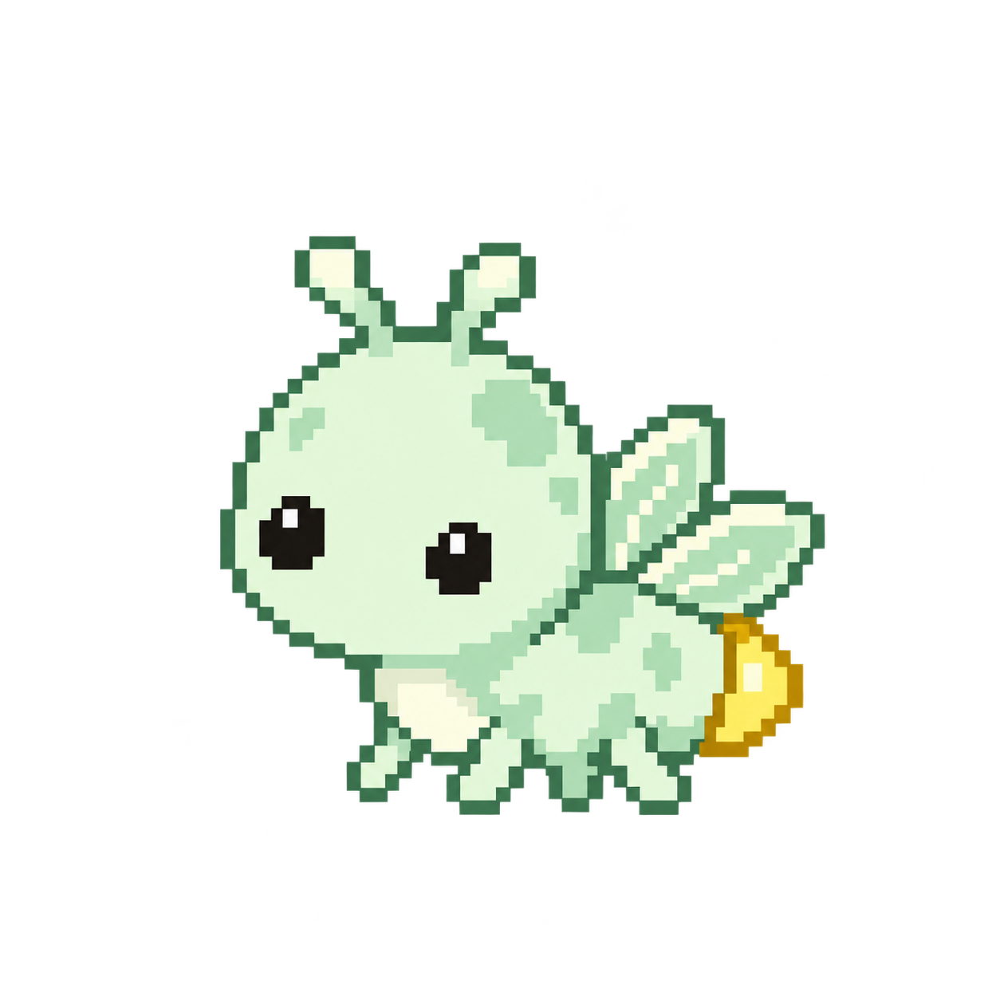

### 5 · 成年 · 能独立远行又稳稳回家的从容

你两次走到河边拍下傍晚倒影，薄荷枝也在杯水里慢慢扎根。小虫从空心枝中望见的光已经不够了：这一周，它每天把短飞的距离多添一点，今天完整的叶形翅终于包得住圆圆的腹部，尾端暖金光也能照亮前方。它沿着宠物世界的小溪飞了一圈，落回来时用六只足把透明石子挪到窗光最足的地方。旧睡窝、空蛋壳与小枝都还在，它只是能去更远处，再自己回来。

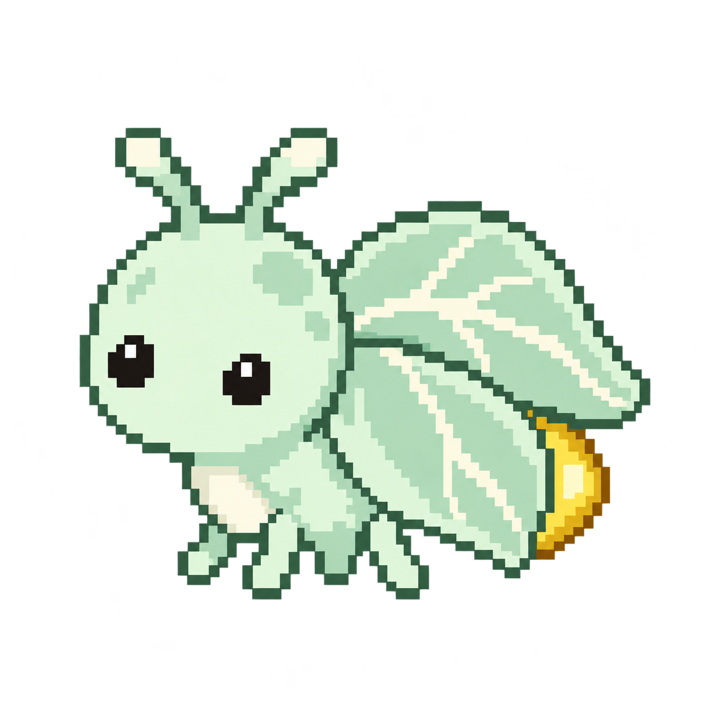

### 6 · 成年 · 夜路探查中专注又安稳

四个深夜，你记录天空亮点的位置，小虫也把自己的夜路拆成一段段。它先去看溪边一颗反光石，再飞到芦苇尽头，没有催你收起记录。夜露一层层挂上叶翅，身体渐渐染成墨蓝，翅脉却仍是熟悉的薄荷绿；暖金尾光涨成一颗明亮的小灯，映出那些它亲自走过的弯。它回到落叶窝，把六只足收稳，黑眼从墨蓝身上亮出来：今天想带给你的，是这一身意外留住的夜色。

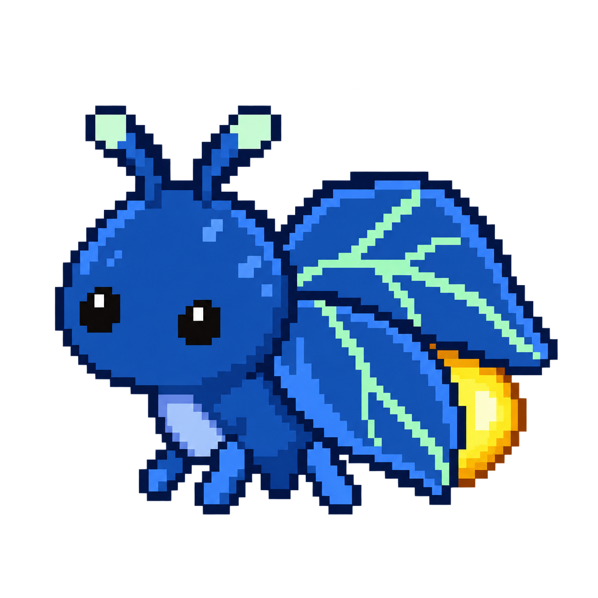

### 7 · 成年 · 回到日间从容的探索

这两晚你没有再记夜空，改在早餐后看看薄荷枝的根。小虫也把夜路暂时放下，在窗边一段一段试着等露水干。两天过去，墨蓝从圆头和叶翅上退开，薄荷绿又透出来，尾端暖光回到原来的大小。它把空心枝转向晨光，透过枝孔看透明石子，把那条自己走过的夜路留在心里。今天它不必带着夜色，也仍认得回落叶窝的方向。

## 第2组

[独立审核](group02/REVIEW.md) · [原始保存记录](group02/state.json)

### 1 · 蛋 · 安静等待

听见你在菜园种向日葵、在陶艺课里尝试第一只杯子的消息，我走进宠物世界的泥塘花圃。向日葵把影子投在湿泥边，泥上是一串小青蛙留下的圆脚印，尽头窝着一颗暖陶色的完整蛋。蛋壳没有裂，几道浅黄弧纹朝着太阳。我用一片宽叶托起它，带离了会积水的泥窝。

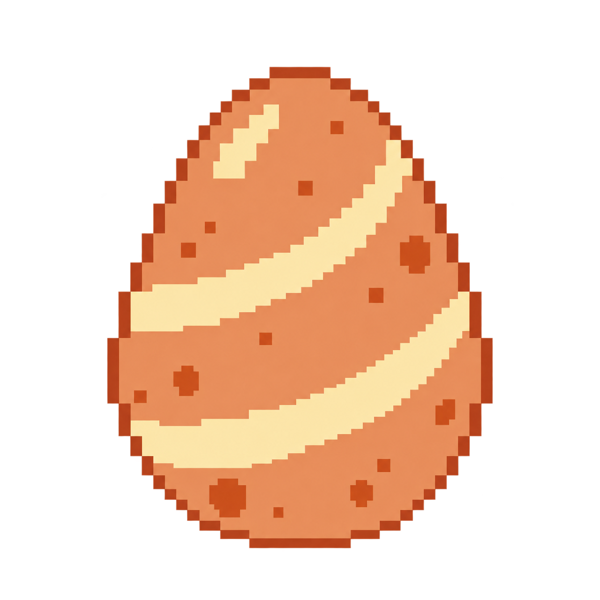

### 2 · 幼年 · 出壳后急于试跳，又愿意改作搭棚

你给番茄苗添了细竹支架，泥塘边的小蛋也顶开了自己的壳。暖橙色小蛙趴在宽叶上，后腿还软，背上只有两片嫩嫩的浅黄皮褶。它一鼓劲想跳，结果只蹭出去半步，索性把壳边的两根细枝搭成低棚，宽叶铺到下面，把自己第一次蹭出的泥印留在门口。没跳远也没关系，它已经有地方睡了。

家：泥塘花圃边，两根细枝搭的低棚，棚下铺着带回的宽叶，门口保留第一次蹭跳的泥印和空蛋壳。

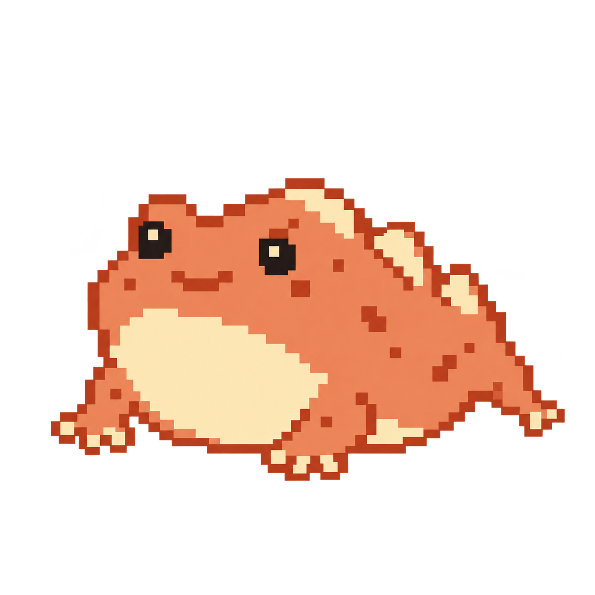

### 3 · 幼年 · 出壳后急于试跳，又愿意改作搭棚

小蛙想给低棚做只碗，推了团湿泥过去，一压却成了扁片。它没有把扁片揉掉，改成了一块泥垫，放在宽叶床旁，印上自己的小脚印。空蛋壳与门口第一道蹭跳痕还在，今天又添了一点歪歪的手艺。它把低棚里的样子画成一张小卡：碗没做成，脚印倒多了一张座位。

家：泥塘花圃边，两根细枝搭的低棚，棚下铺着带回的宽叶，门口保留第一次蹭跳的泥印和空蛋壳；宽叶床旁新增一块带小脚印的扁泥垫。

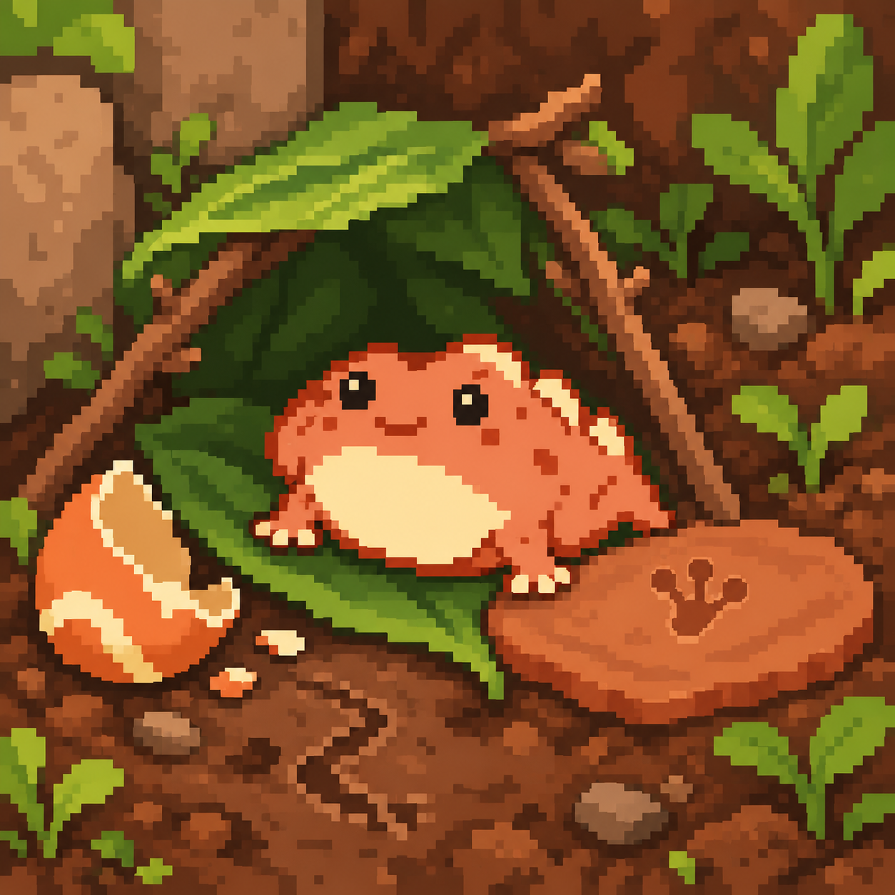

### 4 · 少年 · 愿意继续试做并能跳过小沟

你一周里两次捏陶碗，第二次的碗沿更齐，番茄的新叶也渐渐展开。小蛙把自己的泥垫保留着，却每天另捏一点：今天试边，明天试底，做坏就换个用途。到这一周末，它已能用长开一点的后腿跳过棚前浅沟，背上的嫩皮褶展开了半圈，像几片没完全舒开的浅黄小叶。它把一只歪口小碟搬进棚里，放在脚印泥垫旁：第一件泥垫没有被更好的东西换走。

家：泥塘花圃边，两根细枝搭的低棚，棚下宽叶床，门口有第一次蹭跳泥印和空蛋壳；宽叶床旁保留脚印扁泥垫，旁边新增歪口小碟。

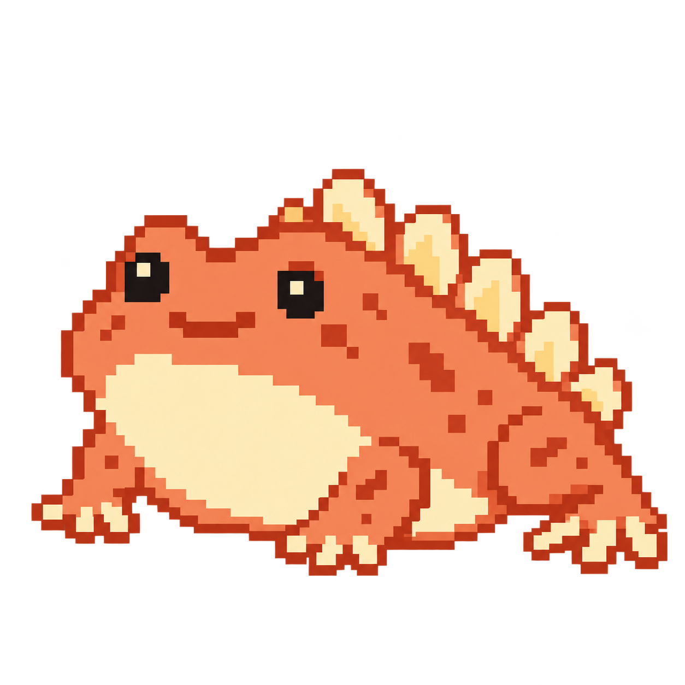

### 5 · 成年 · 能稳稳行动并保留旧尝试的自在

你把能盛水的小杯和第一次裂杯的差异记了下来，菜园里的番茄也绑好了支架。小蛙这一周把歪口小碟放在泥垫旁，一次次试着盛住一滴水；漏出来就用来湿润棚前的泥土。今天，它的后腿已结实，背上浅黄皮褶完整展开成一圈，四只足稳稳托着圆身，终于能跳到花圃另一头取回清水。它往歪口小碟里添了一滴，没有撤走旧泥垫：所有试过的样子，都还住在这个家里。

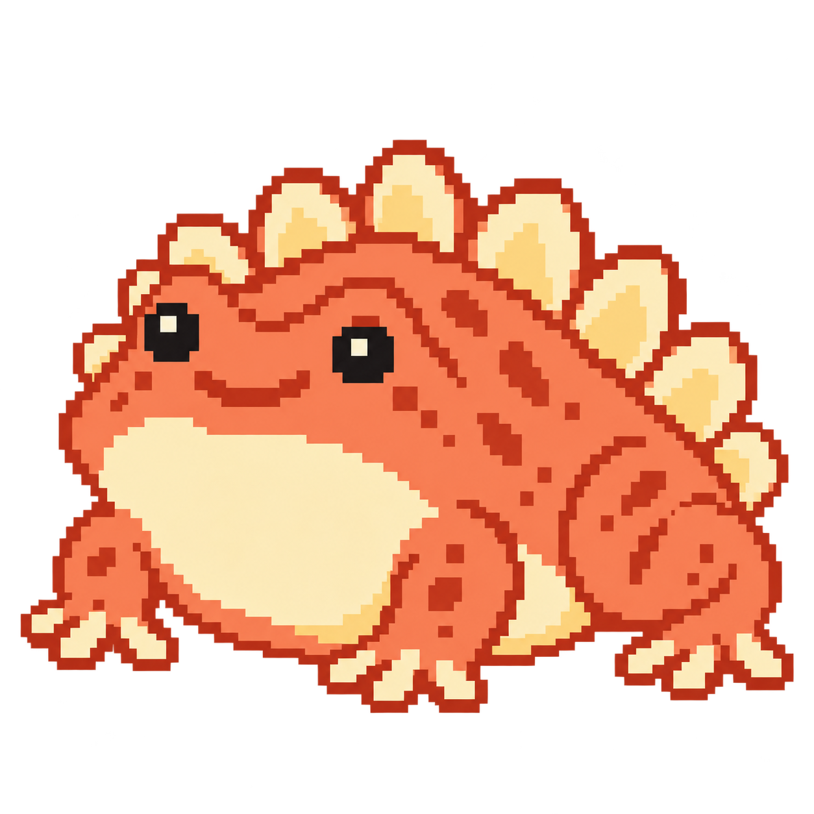

### 6 · 成年 · 试色后对自身鼓泡变化好奇

你这一周把青绿和淡黄釉色试片并排记了三次，小蛙也想亲手看颜色怎么相处。它去宠物世界的泡沫泥塘，一次次把花粉搅进小水洼，没调出一样的色，就留着看看下一次。今天花粉的泡泡忽然贴进了它的皮肤：暖橙圆身透出青绿色，两颊鼓得软软，背上一圈浅黄皮褶也膨成圆润的小褶瓣。它仍用自己的四只足蹲在泥垫旁，先照了照歪碟里的倒影，忍不住把脸往另一边歪：试色倒先试到自己身上了。

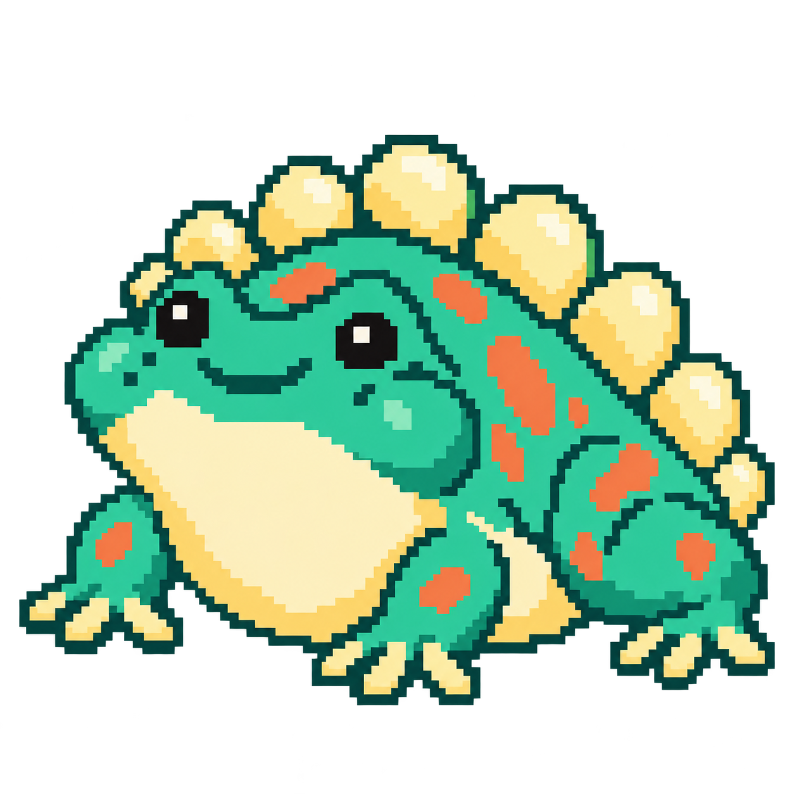

### 7 · 成年 · 洗净花粉后自在地歇在家中

你把青绿和淡黄试片晾好，暂停调色，回菜园看向日葵。小蛙也没有继续往泡沫泥塘里搅花粉。它这两天在低棚下用歪碟盛清水，扑出来就让水流过自己原来的皮褶，做不成浴盆也照样能洗净身上的花粉。第二天末，鼓颊消了，膨圆的浅黄褶瓣回到完整短皮褶圈，暖橙色重新透出。它趴到脚印泥垫旁歇下：还是那张歪碟，只是今天换了个用法。

## 第3组

[独立审核](group03/REVIEW.md) · [原始保存记录](group03/state.json)

### 1 · 蛋 · 安静等待

你说想领养一个宠物。在宠物世界的苔石育幼棚里，一颗乳白的蛋安稳卧在软草中，壳上的浅褐斑像刚落下的种子。看守把草垫连同蛋送来：它还不知道未来会住在哪里，但这一次有人为它留了位置。

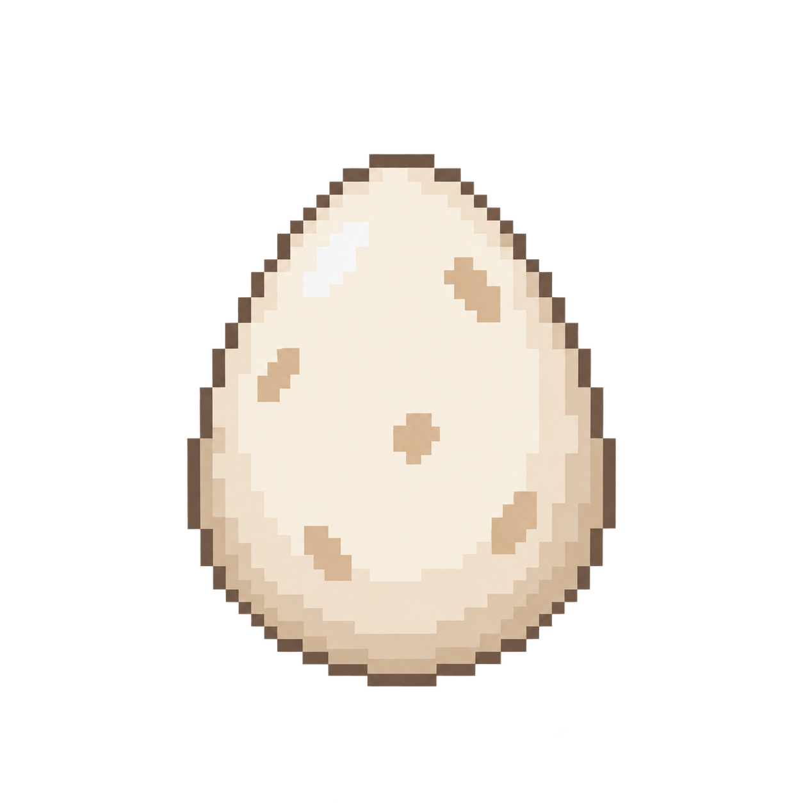

### 2 · 幼年 · 安静等待

草垫里的细响断断续续响了几个小时。最后，蛋壳裂开，露出一只奶白短吻的小生命，暖棕背上的软刺还只是几个绒芽。它先看着空壳，伸出小足碰了碰，才试着跨过去。你为它留的那个位置，如今真住进了一只宠物。它把半片壳靠在苔石边，草垫留作床：从这里开始，门口的一粒种子也算它的发现。

家：苔石边的草垫小窝，半片乳白浅褐斑蛋壳作挡风墙，门口留着一粒种子。

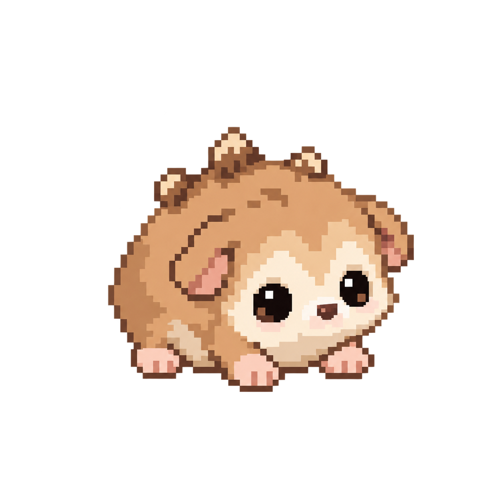

### 3 · 幼年 · 安静等待

小刺猬今天把门口的种子挪了三次。放在草垫上会滚，放在壳边又被风吹走；最后它试着用一片凹叶接住，才安心绕着叶子走了一圈。它把叶子摆在半片蛋壳旁，留下这次小小成功的证据。‘我找到一个不滚走的位置了。’这是它从家里带来的话。

家：苔石边的草垫小窝，半片乳白浅褐斑蛋壳作挡风墙；原来门口的种子现在放进一片凹叶，摆在壳边。

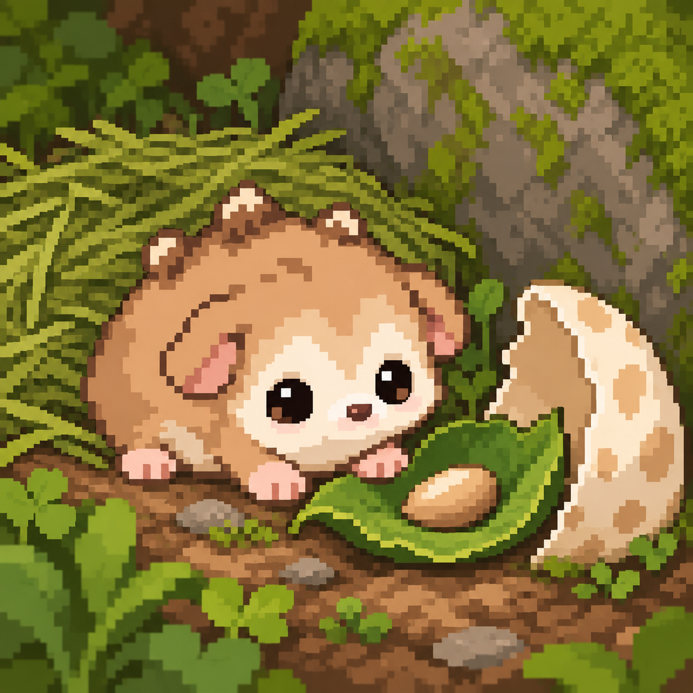

### 4 · 少年 · 安静等待

凹叶里的种子陪小刺猬住满了一周。它每天绕过壳墙去苔石背面，起初要停下来扶住石头，后来四只小足已经能稳稳走完那一段。今天它把原先够不到的干草拉到床边，背上的绒芽也簇成了柔软的小刺。‘这里比我刚来时宽一点了。’它还保留着半片蛋壳，把那粒种子放在最容易看见的位置。

家：苔石边的草垫小窝，半片乳白浅褐斑蛋壳作挡风墙；凹叶里的原种子仍在壳边，床边添了从苔石背面拉回的干草。

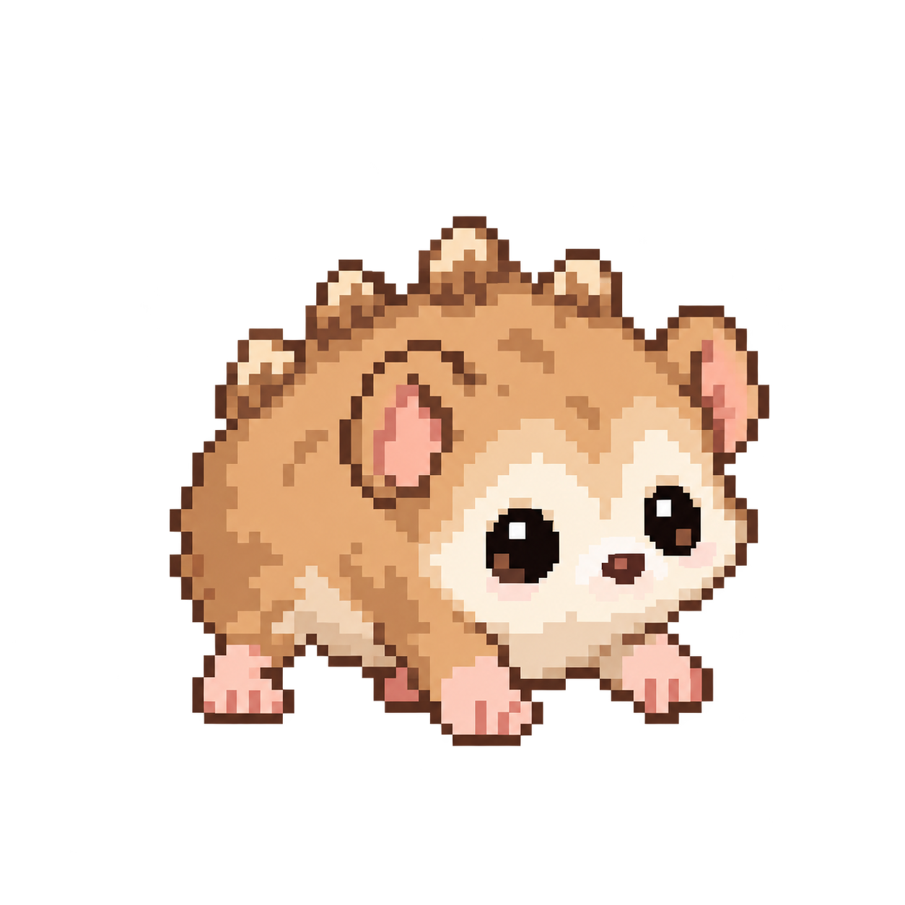

### 5 · 成年 · 安静等待

少年刺猬又沿自己的小路走了一周。它不再只到苔石背面，开始认得坡下长苔的木根，也知道下雨后哪片叶子能遮住草床。今天它把大叶撑在壳墙上，四只脚稳稳承住力气，绕背的软刺簇已经长齐，短吻也更清楚。它从叶檐底下看着旧凹叶里的种子：先前一次次摸索的小东西，正好让它知道怎样修一个住得久的家。

家：苔石边的草垫小窝，半片乳白浅褐斑蛋壳仍挡风，凹叶托着原种子，床边干草保留；壳墙上多了它撑起的一片大叶作雨檐。

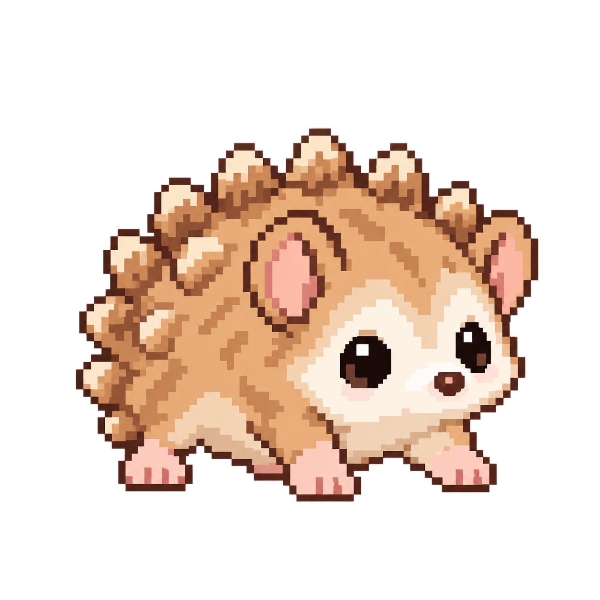

### 6 · 成年 · 安静等待

雨檐搭好后的这一周，刺猬沿着湿木根找新的小路。它总是先观察，再碰一下，连长着淡蓝菌粉的树皮也认真嗅过。今天回家时，暖棕背上的软刺忽然蓬开成扇，罩上一层蓝灰，耳朵困得向两边垂下；奶白短吻仍从中间探出来。它在叶檐下停住，把鼻尖留在空气里：这次不急着再往前，先看看身体会怎样。凹叶种子、草床和旧壳墙都还在。

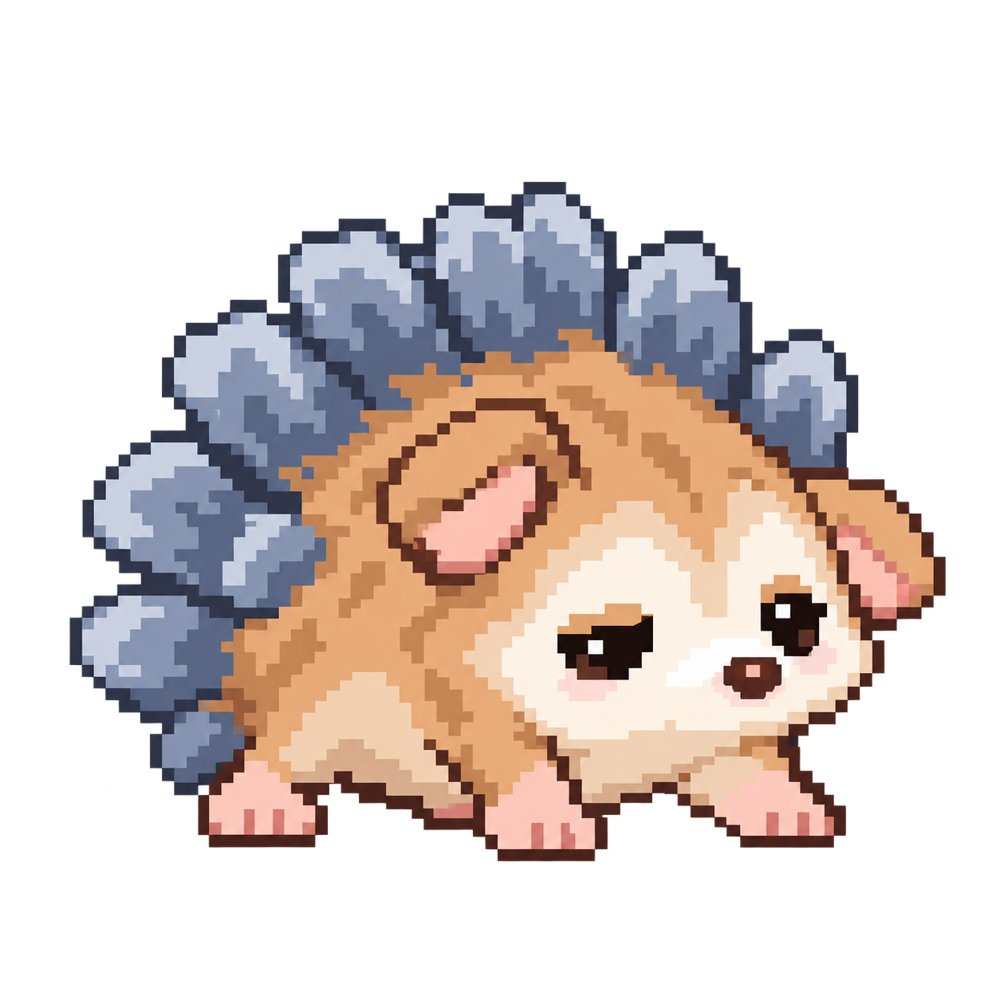

### 7 · 成年 · 安静等待

刺猬在叶檐下歇了两天。第一天，它只闻风；第二天，它慢慢把背靠在干草上，又换到向阳的苔石边。蓝灰的软扇渐渐收回原来的棕色小簇，圆耳立住，眼睛也重新亮起来。它没有重走那段湿木根，先走到凹叶旁碰了一下种子。旧东西仍稳稳放着，它又可以从一点点试起。

## 第4组

[独立审核](group04/REVIEW.md) · [原始保存记录](group04/state.json)

### 1 · 蛋 · 安静等待

你沿河拍过芦苇上的蜻蜓，也在和朋友练习慢节拍。宠物世界的芦苇小渡口仿佛接到了这两条消息：每阵风把苇秆轻敲在一起，一颗浅绿蛋就在敲击之间轻轻晃一下。渡口看守把它送来时说，先不赶路，留一点空隙给下一声。

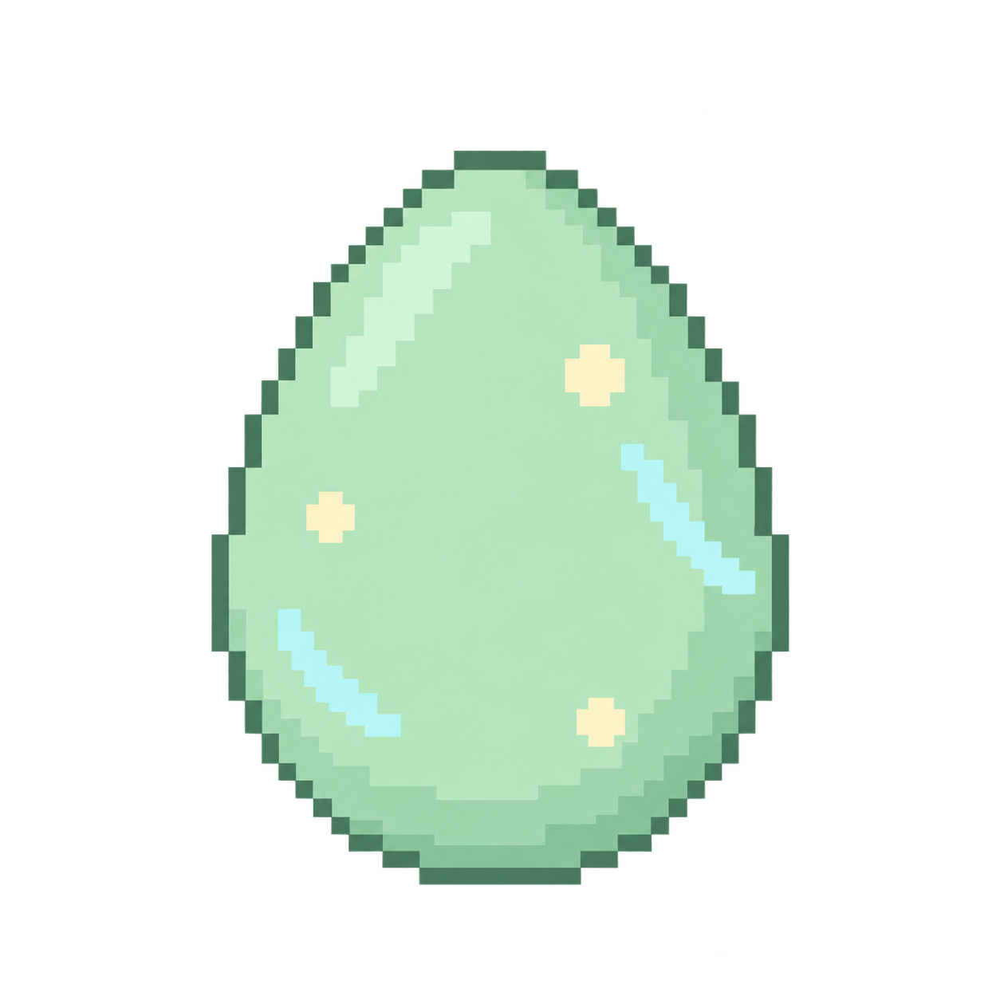

### 2 · 幼年 · 听一会儿再试

你把旅行故事的一句话读给朋友听，慢拍也练到四下就停。蛋里的小生命似乎找到了相同的间隙：壳内轻敲四次，停住，然后一只奶黄脸、薄荷胸的若虫探出来。两对翅芽还紧贴背上，六只短足挪一挪就要歇。它在苇叶下用浅绿半壳搭了个小窝，床边放四粒河砂，空出第五个位置。它不是急着补满那一拍，只想听听水滴。

家：苇叶下的浅绿半壳小窝，软苇絮作床，床边排四粒河砂，第五个位置留空。

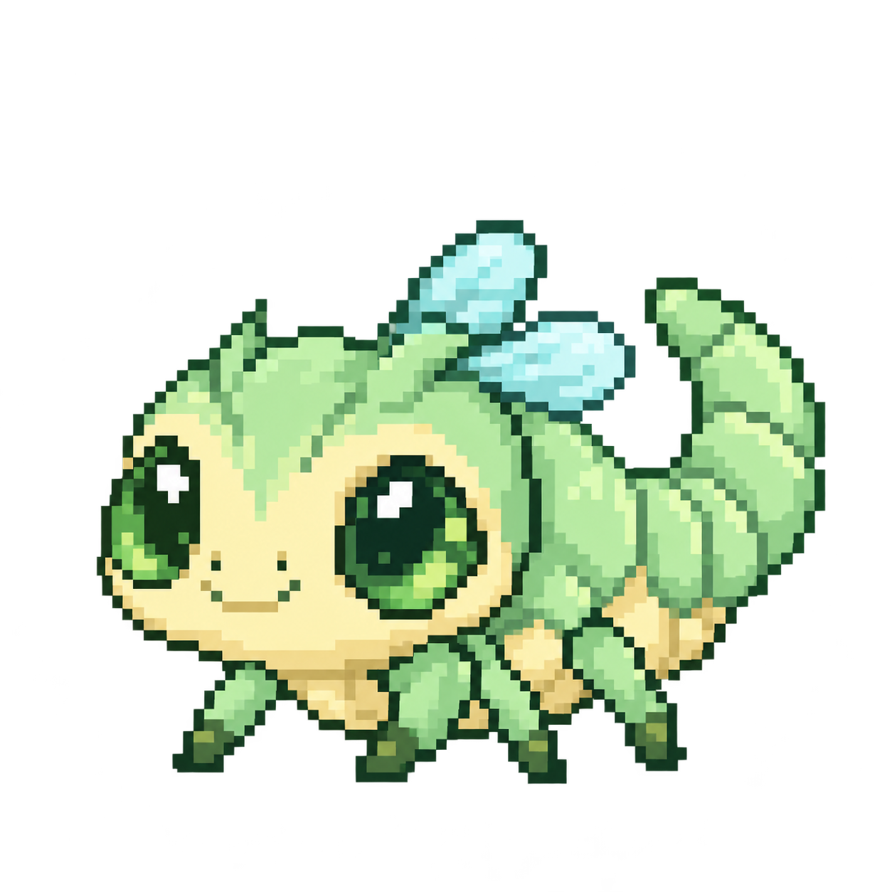

### 3 · 少年 · 想把新声音试一试

这一周，你从一句旅行故事读到一个短段落，也和朋友合上了一小段慢拍。小若虫在苇叶下跟着自己的四粒河砂练了一周，空拍时仍停住，听你录下的河水声。今天它越过半壳边缘，四片短圆翅第一次离开背，六只足已经能撑住三节弯腹。它把脱落的一段苇秆收在四粒河砂后面，敲一声，听水声回答：原来慢慢学，也能走到小窝外面。

家：苇叶下的浅绿半壳小窝，软苇絮作床，床边四粒河砂和第五个空位保留，河砂后多了一段它收回的苇秆。

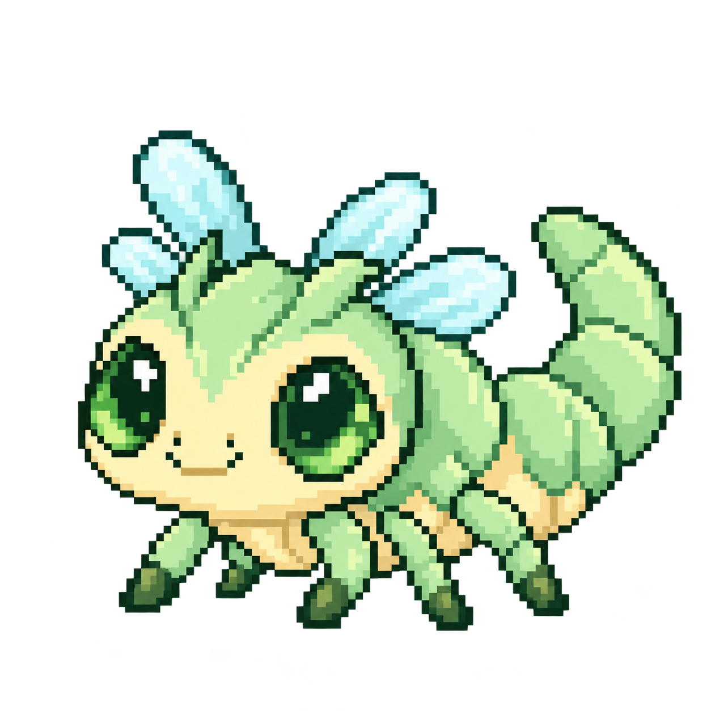

### 4 · 少年 · 听听熟悉声音里的变化

你今天重读了熟悉的法语段落，散步时又看见一圈圈水纹。少年蜻蜓没有添第五粒河砂，它沿旧四拍敲着那段苇秆，敲到熟悉的地方就停，去小水洼看风把圆圈吹歪。回家后，它在半壳外摆了一片圆叶，想把那圈歪歪的水纹记下来。‘旧的声音也会换样子。’它把家的这一角拍给你：四粒砂、空位、苇秆和刚带回来的圆叶。

家：苇叶下的浅绿半壳小窝，软苇絮作床，床边四粒河砂和第五个空位保留，河砂后旧苇秆保留，半壳外添了它带回的一片圆叶。

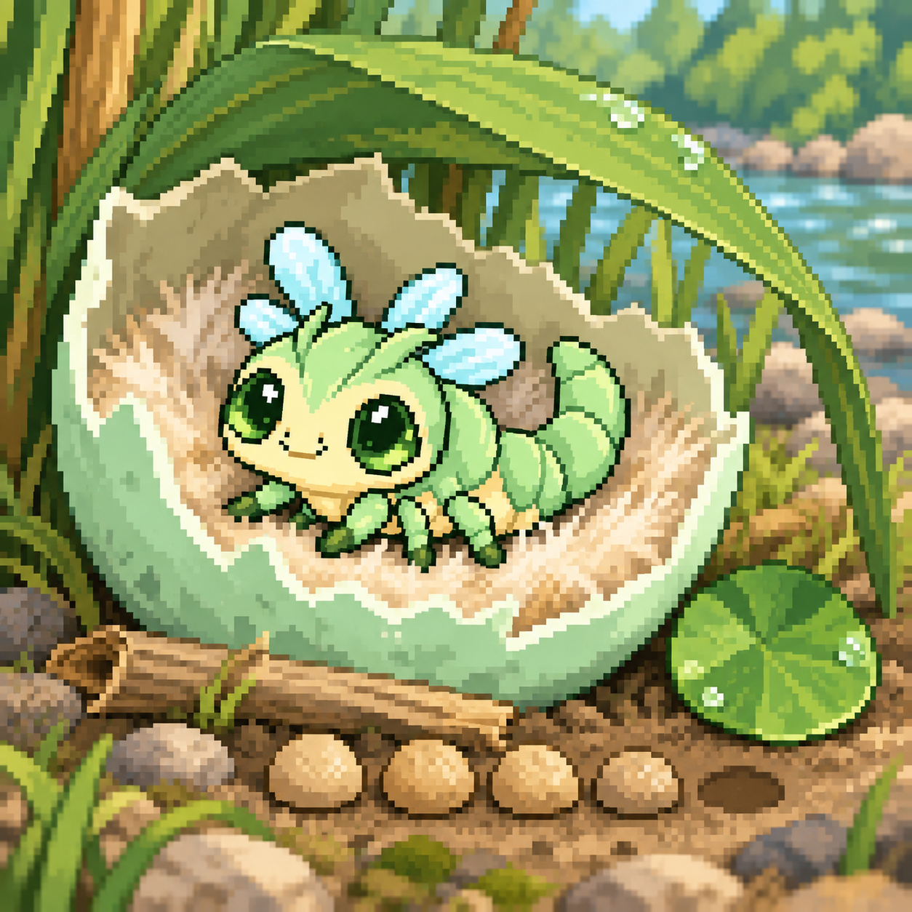

### 5 · 成年 · 愿意离家试一小段再回来

你又读了一周法语，开始写两句短明信片；手鼓的慢拍里也留出了自己的空拍。蜻蜓这一周沿小窝外的苇秆练起落，风压低芦苇时，它就歇在圆叶上，等那根苇秆站回来。今天四片翅终于长开，短厚三节腹稳住身体，六只足从苇秆上松开，它第一次绕着家的叶顶飞了一小圈。它落回四粒河砂旁，用空拍听完水声，写在给你的两行话里：‘我飞出去一点。也知道哪里回来。’

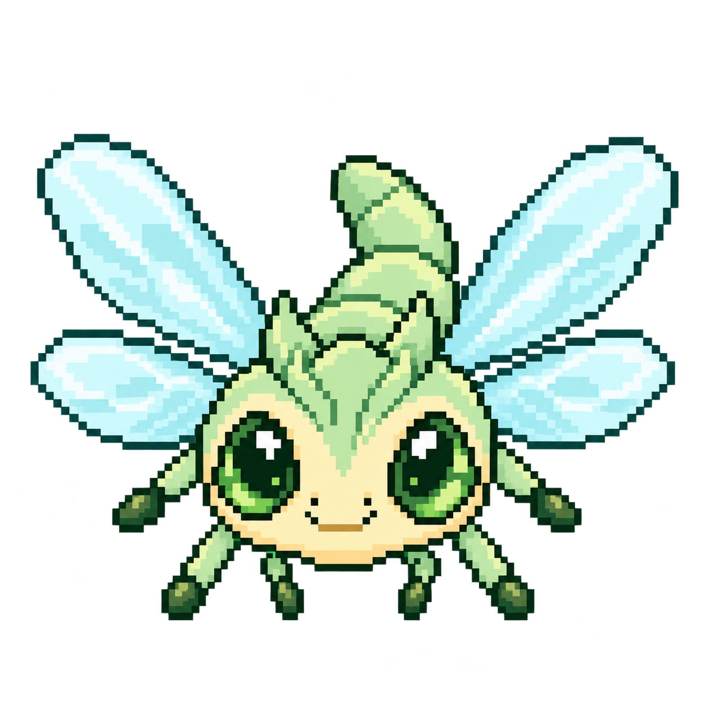

### 6 · 成年 · 想放下重复声听听周围

你这一周夜里把同一段法语读到很晚，手鼓也反复练着同一小段。蜻蜓听熟了它们，却开始在每个空拍里忘记落脚。它试着听一听别的声音，四片翅反而软软卷起，像四片没睡醒的圆叶；薄荷胸的色块沉成蓝绿，短腹紧紧蜷住，六只足笨拙地张开。它停在家外那片圆叶上，盯着水面：‘我好像把空拍留得太大了。’今晚它把旧苇秆挪远一点，想让水声自己进来。

家：苇叶下的浅绿半壳小窝，软苇絮作床，四粒河砂和第五空位保留；旧苇秆从河砂后移到半壳旁，半壳外圆叶保留。

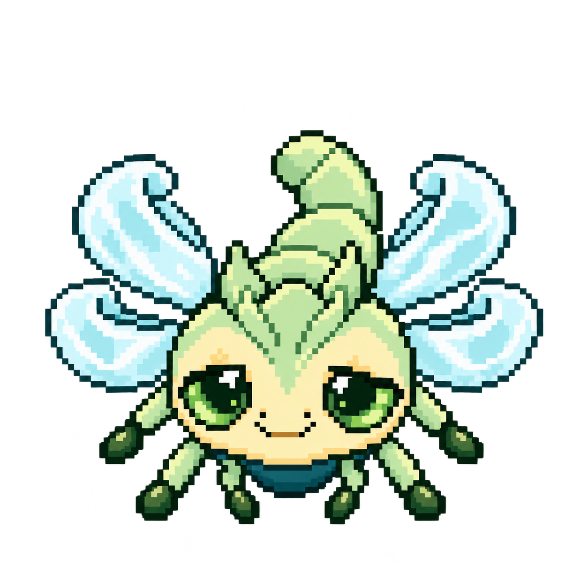

### 7 · 成年 · 自在地听，不急着数

这两个晚上，你在饭后读完一小段法语就收了书；到江边时，也只听水声。蜻蜓把给你的话写成一张极短的便条：‘今天没有数。’它在半壳里睡过两夜，醒来便到圆叶上听水拍岸，听着听着，四片卷杯翅一点点摊开，蓝绿胸重新透出薄荷色，短腹松开，六只足稳稳落住。它没有把旧苇秆搬回原位，四粒河砂旁的第五空位也仍留着——现在那里可以是一个没有长度的停顿。

家：苇叶下的浅绿半壳小窝，软苇絮作床，四粒河砂与第五空位保留；旧苇秆仍在半壳旁，半壳外圆叶保留。

## 第5组

[独立审核](group05/REVIEW.md) · [原始保存记录](group05/state.json)

### 1 · 蛋 · 安静躲在壳里，尚未孵化。

你在海边骑车时，曾停下来细看礁石缝里的小蟹。这个故事从那道缝旁边开始：潮水退走后，一颗完整的奶白色蛋留在浅浅的石窝里，壳上的两道青绿弧纹像水草投下的影子。里面轻轻敲了两下，又安静下来。它还不知道你的小鱼缸，却已经会在一片影子底下躲好自己。

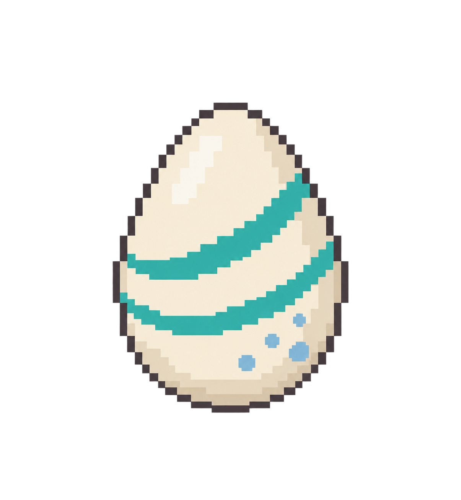

### 2 · 幼年 · 第一次离开壳后谨慎探索，有了可退回的落脚处。

你留下了小虾蜕壳的照片，它的旧壳还在水草边。这边的蛋里也传来了一阵轻响。奶白小蟹先把一只短钳伸出来，缩回去，再用两只钳撑开壳。它没有立刻往外跑，先沿着石窝走了一圈，确认每一处都能退回去。最后它把一块空壳立在石窝口，像一扇小小的遮雨门：“旧的也可以留下。”

家：礁石缝旁的浅石窝，入口立着一块自己的奶白旧蛋壳，窝底留有几颗浅蓝圆石。

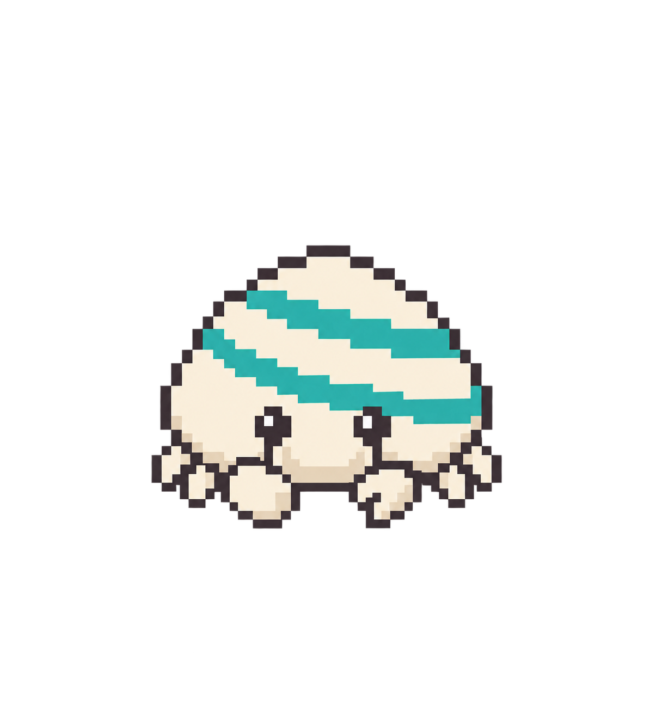

### 3 · 幼年 · 第一次离开壳后谨慎探索，有了可退回的落脚处。

浅石窝里响了一下午的咔哒声。小蟹把三颗浅蓝圆石排到门口，走过去，退回来，又拆掉一颗。它怕门口太满时自己挤不出去。最后只留下两颗，第三颗放进奶白旧壳背后；那里还有足够的地方藏它的短钳。它给石窝留下一张没有字的照片：门开着，一颗圆石探出半边。

家：礁石缝旁的浅石窝；入口仍立着自己的奶白旧蛋壳，两颗浅蓝圆石排在门边，第三颗收进旧壳背后，出口保留空隙。

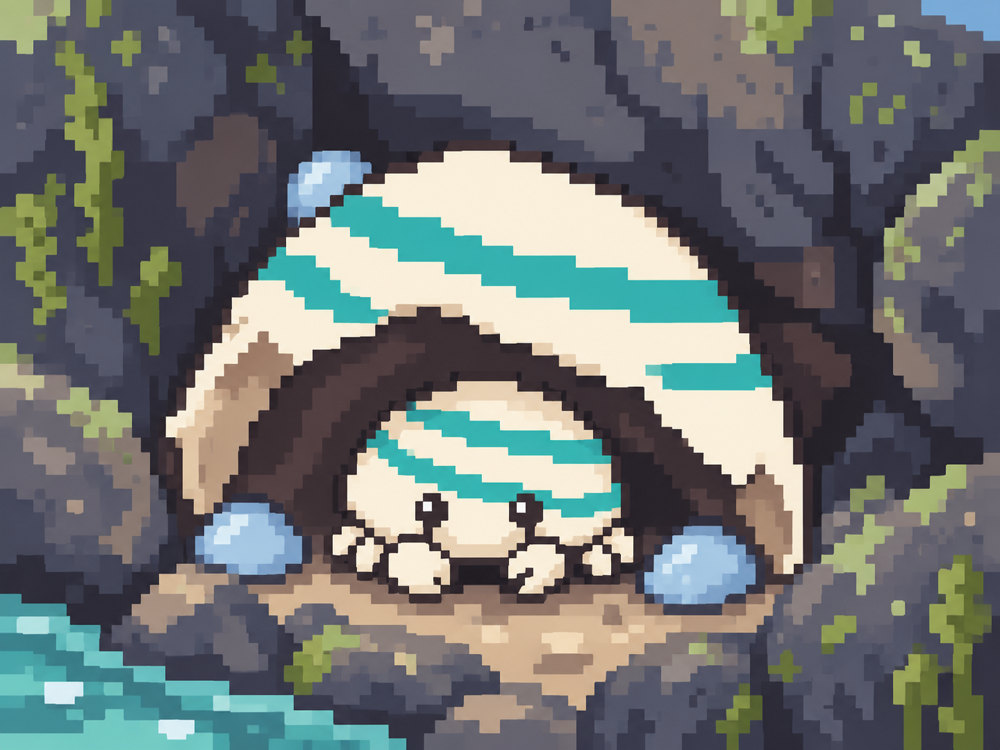

### 4 · 少年 · 一周连续观察带来的谨慎探索逐渐变得稳当，仍给自己留退路。

你这一周三次经过海边，留下了不同潮位的记录，也把水草的新叶一张张存进照片。小蟹把这样的日子记成了自己的脚步：第一天只敢走到壳门，后来能沿石缝往返，今天终于越过了那道曾经跨不过的低坎。它的钳更有力了，四只足撑开一点，背甲的两道青绿弧纹也清楚起来。低坎另一边是一片小沙地。它没有搬走，只带回一小撮细沙，铺在两颗门边圆石之间，试着走了三遍。

家：礁石缝旁的浅石窝；奶白旧蛋壳仍遮着入口，两颗浅蓝圆石守在门边，第三颗收在旧壳背后；两颗门石之间添了一小撮细沙，出口依然畅通。

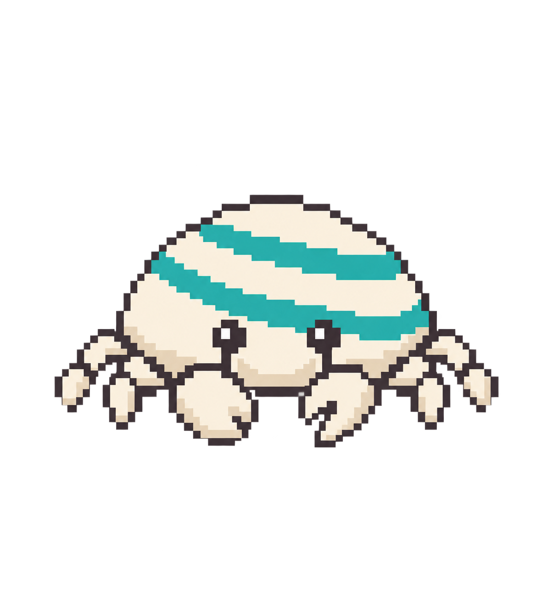

### 5 · 成年 · 两周连续观察和整理回应为稳当而从容，保留谨慎探索的性格。

今天，小蟹没有往外走。你把不同潮位的旧照片整理在一起，它就在自己的窝里整理那些从岸边带回的小东西：旧壳仍挡在门上，三颗圆石各有位置，细沙也留在门口。它用已经长实的两只钳把沙抚平，在里面画出石窝到低坎的路线。那张路线里有一个圈，专门留给没走过的地方。它的背甲变成结实的低圆拱，四只足撑得稳稳的；走得远了，它反而更知道什么时候可以停下。

家：礁石缝旁的浅石窝；自己的奶白旧壳仍遮入口，两颗浅蓝石在门边，第三颗在壳后；门间细沙保留，沙上添了一幅石窝到低坎的路线，出口仍开着。

### 6 · 成年 · 回应连续晚睡的光线时更愿意守着自己的安静角落。

你这一周常常很晚才关灯，还在整理海边的照片。奶白小蟹没有催你，也没有跟着把夜拖长。它往石窝深处挪了一点，用钳把沙上的路线重新描清；画到出口时，它停住了。背甲渐渐浮起深蓝的潮影，原来的两道青绿弧纹在暗里反而更亮，软软的甲缘垂成了起伏的小波浪。它把两只钳收在身体下，像留给自己的一个安静位置：“你忙你的，我先在这里。”

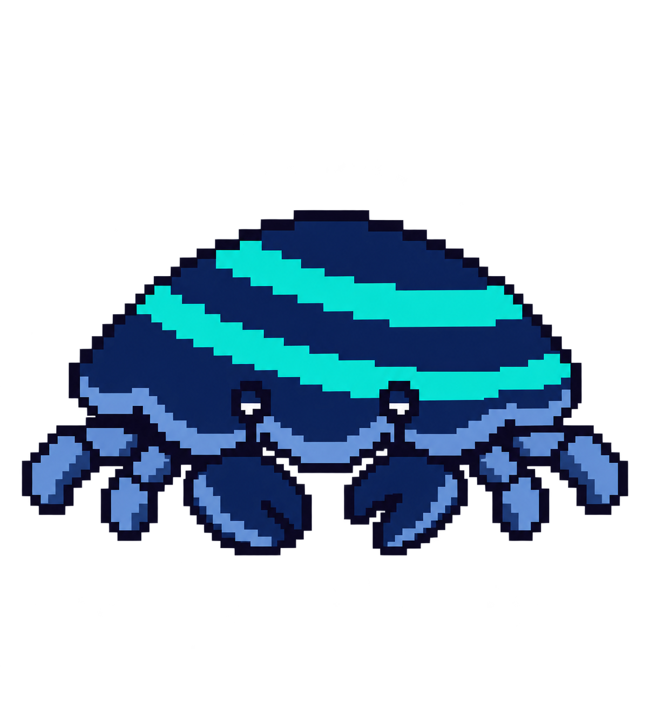

### 7 · 成年 · 回应连续晚睡的光线时更愿意守着自己的安静角落。

石窝的门一直留着。深蓝的小蟹这两天只在那张沙地图上走短短的一圈，走到出口就停下，像给自己的路线也留一拍。今天，它把门边的两颗圆石扶正，旧壳背后的第三颗仍没动。背甲上的潮影渐渐退去，波浪般的软甲缘收回原来的低圆弧，奶白底色又露了出来。青绿的两道纹仍在。它不需要把所有夜晚都装进自己的壳里，沙上的空圈也还可以空着。

