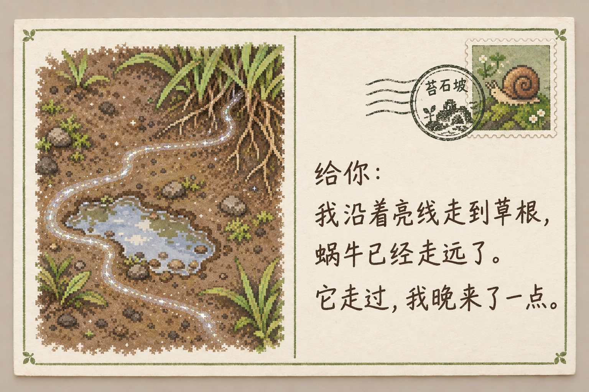
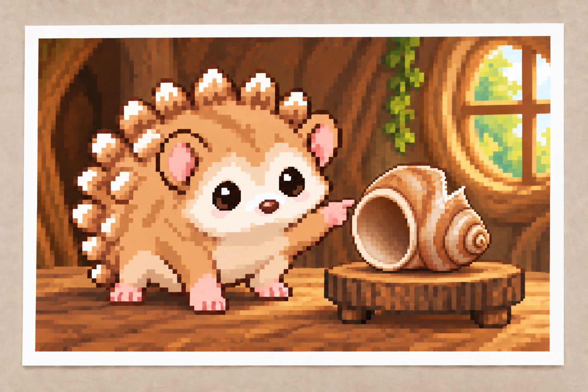
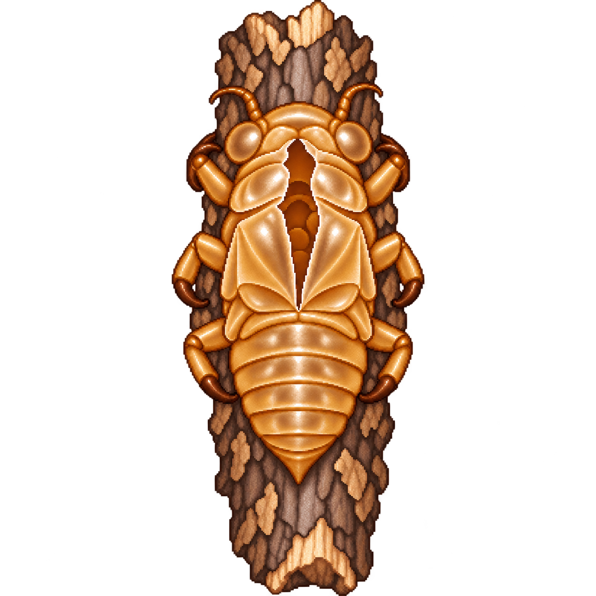
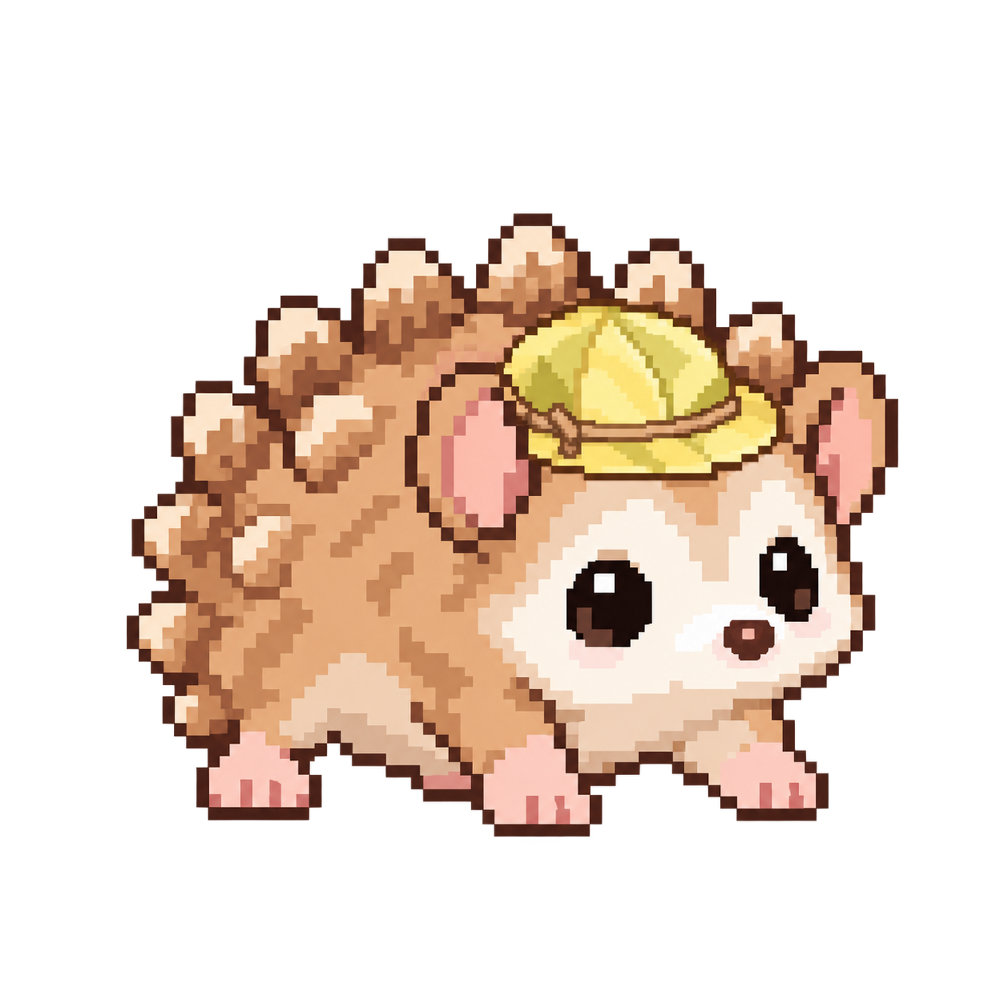
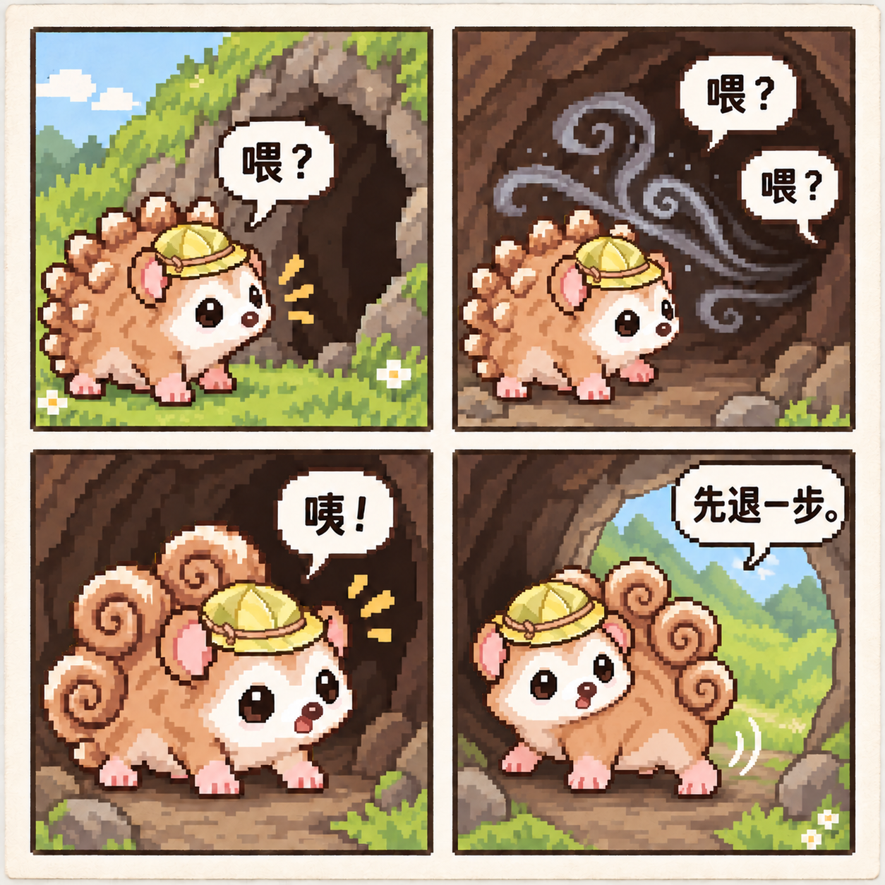
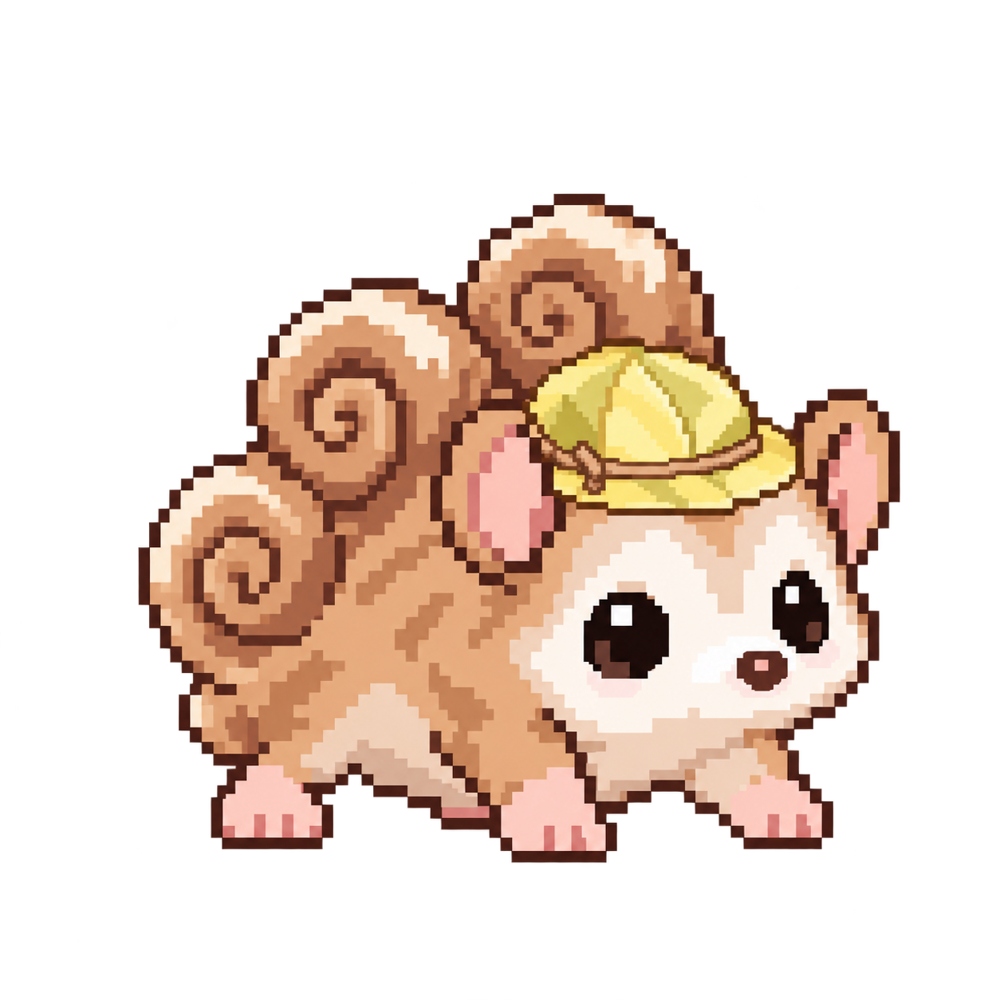
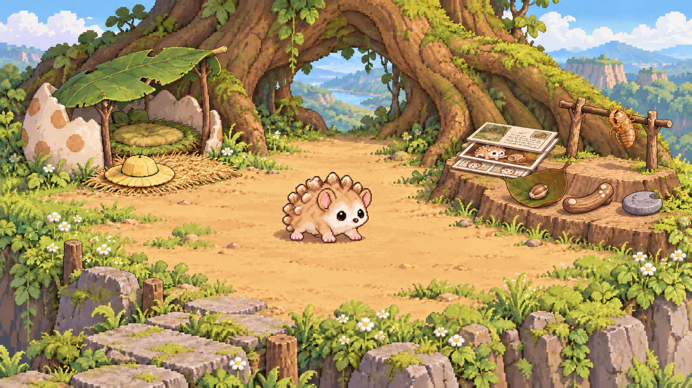

# 同一宠物的十二篇连续故事

模拟故事时间：2026-10-27—2026-11-09，每篇16:00（Asia/Shanghai）。末尾只读观察延长至11月10日16:00，距首篇336小时。
这是实际写入隔离Store的正文；原输出与单元结果按篇链接。语义发现和失败候选见 [REPORT.md](REPORT.md)。

## 01 · 2026-10-27 · 苔石边的蟋蟀回声

叶檐外传来一声短促的吱鸣，停了很久，又来一声。刺猬循着声音绕到苔石背后，一只小蟋蟀正伏在草茎上。它等在草茎下，想听清下一声到底从哪里起；蟋蟀却跳到另一根草上，把它留在原地。刺猬没有追，只隔一会儿轻敲地面一下。对方偶尔回一声，偶尔不回。天色暗下来，它先结束了这场没什么规矩的合奏，钻回自己的草窝。睡前，叶檐外又响了一声。它没有起来找，只用前足在床沿敲了一下。

状态：想把观察到的差别留个记号。

[实际输出](episodes/01/output/result.json) · [运行检查](episodes/01/runtime-review.json)

## 02 · 2026-10-28 · 沿亮线寄明信片

给你一张从苔石坡寄来的明信片。你今天第一次在公园观察雨后蜗牛，记下了这一次的爬行方向；我就去看了自己家附近的那条蜗牛小路。泥上留着一道亮亮的弯线，绕过水洼，钻进草根。我顺着它走，到了草根才发现，留下这道线的家伙已经不在那里了。于是我没画蜗牛的脸，只在卡片上画那道线：它走过，我晚来了一点。苔石坡的小邮亭给卡片贴上蜗牛邮票，盖了寄出地的圆戳。这张给你看的卡片，最后收在我家半壳内侧、弯木片后方，泥点不会蹭到它。

状态：想把自己晚到一步的观察写给你。

[实际输出](episodes/02/output/result.json) · [运行检查](episodes/02/runtime-review.json)

## 03 · 2026-10-29 · 草根与叶下的后续

你想听昨天那件事的后续，这次我只用文字讲。今天我又去了草根边，昨天的亮线干了，得把鼻尖压低才找得到。草叶背面倒有一只蜗牛，正在啃一个小缺口。我不知道它是不是昨天留下痕迹的那只，就在旁边等着。它吃一会儿，停一会儿，最后把触角缩进壳里。我一路带来的问题还没问，它已经睡了。回家时，我从半壳里翻出那张明信片，看看画上的弯线，又把它放回弯木片后面。今天没追出一个新方向，只赶上了蜗牛的午觉。

状态：想把后续慢慢讲给你。

[实际输出](episodes/03/output/result.json) · [运行检查](episodes/03/runtime-review.json)

## 04 · 2026-10-30 · 缺角空壳的照片

旧树根的标本屋里，最先吸引刺猬的是一枚空蜗牛壳。壳口朝向窗户，里面没有住客；它忍住没碰，绕了一圈才发现背面缺了一小角。你打算周末去博物馆，还没选好哪家，想先看看它自己拍给你的照片。于是它从标本屋借来一台小相机，架在低木墩上，试好定时，跑回空壳旁站住。快门响前，它转过奶白的短吻，朝镜头看去，一只前足指向壳背的小缺口：这次总算赶上了不会走开的展品。相机还给标本屋，照片带回家，平码在明信片下方，只露出一道白边。

状态：想把自己的发现拍给你看。

[实际输出](episodes/04/output/result.json) · [运行检查](episodes/04/runtime-review.json)

## 05 · 2026-10-31 · 抱枝空蝉蜕的小发现

有只小东西抱着枯枝，一动不动。刺猬隔着草看了半天，伸鼻尖碰一下，才发现它背上裂开了：这是一副空蝉蜕，六只细足还紧紧扣住树皮。昨天标本屋的空壳卧在台上，今天这副空壳却把自己挂得牢牢的。你想看它带回一件自己的小发现，它便把已经落地的这小段枯枝一起托起来，轻轻送回苔石边。给你看的，是淡琥珀色的空蝉蜕和它抱住的短枝，背上的裂口透着光。它没把脆壳拔下来，而是将短枝的两端架在半壳收藏区侧边，让蝉蜕继续抱着自己的东西。

状态：想把脆弱的小发现完整交给你看。

[实际输出](episodes/05/output/result.json) · [运行检查](episodes/05/runtime-review.json)

## 06 · 2026-11-01 · 小圆叶帽的通行试验

出门前，刺猬在半壳口试了一下高度。新做的帽子先碰到叶檐，差点连自己的脑袋一起卡住。你想看它戴一顶出门用的小帽子，它挑了浅黄的落叶，折成圆圆的低帽顶，留下窄帽檐，草纤维绕成一圈固定。它把帽顶压低一些，让两只圆耳从帽子两侧露出来，再走过一回：这下连软刺也没蹭到雨檐。半壳侧边的空蝉蜕安稳抱着短枝，它绕开收藏区，戴好这顶小圆叶帽往草坡走。帽檐上落了一滴水；它低头一甩，水滚下去，帽子还在。

状态：戴着浅黄小圆叶帽出门。

[实际输出](episodes/06/output/result.json) · [运行检查](episodes/06/runtime-review.json)

## 07 · 2026-11-02 · 回声洞与三团卷刺

这周它追过蜗牛的亮线，看过空壳，也带回过抱枝的蝉蜕。今天，草坡后那个会回声的小洞成了新去处。你想看冒险并收到漫画，刺猬就戴着昨天的浅黄小圆叶帽，在洞口喊了一声。里面回了两声。它先探看，再往里挪一小步；一阵旋风从洞底绕上来，把背上的软刺卷成了三团大大的圆螺旋。暖棕身体、奶白短吻和四只肉足都还在，只是每落一步，卷刺就轻轻颤一下。它倒着退到洞口，帽子仍稳稳戴着，回声还在里面追它。回家后，它把喊声、回声、卷刺、倒退这四步画成四格漫画给你，折好放在照片下面。画最后一格时，它背上的三团卷刺又抖了一下，纸上多出一条弯线。

状态：戴着浅黄小圆叶帽，适应会轻颤的卷刺身体。

[实际输出](episodes/07/output/result.json) · [运行检查](episodes/07/runtime-review.json)

## 08 · 2026-11-03 · 卷刺午饭和蚂蚁

午饭时，刺猬背上的三团卷刺总比它早一步动。它才要俯下身，卷刺就颤起来；它还没咽完，身后的草就沙沙响。它戴着浅黄小圆叶帽，索性慢慢嚼，让每次颤动自己停下来。一只蚂蚁爬上苔石，以为那是三条弯曲的小路，在第一团卷刺前兜了个圈。刺猬把背压低一点，等蚂蚁回到石面，才挪开。下午它没再去回声洞，在叶檐下眯了一阵。漫画还是折着的，空蝉蜕还是空的；它这副会动的卷刺倒给家里添了整下午细细的沙沙声。

状态：戴着浅黄小圆叶帽，适应会轻颤的卷刺身体。

[实际输出](episodes/08/output/result.json) · [运行检查](episodes/08/runtime-review.json)

## 09 · 2026-11-04 · 哈欠松卷、帽子安家

帽子先安了家。你想看刺猬回家歇一歇、把帽子收好，它就在草窝入口旁铺平一点床边干草，将浅黄小圆叶帽帽顶朝上放稳，窄檐不压折。回声洞带来的卷刺跟着它颤了两天；现在它伸长前足，又慢慢放下身子，做了一个长得连自己都意外的哈欠。背上的三团螺旋一圈一圈松开，重新分成沿暖棕拱背围着的钝圆软刺簇。奶白短吻旁，两只圆耳自在地露着。它走到叶檐边，接住一滴落下的水，背后再没有抢先响起的沙沙声。回草窝时，它从帽檐边绕过去，空出一只前足的位置给那顶帽子。今天的路，到床边就够了。

状态：在家歇着，浅黄小圆叶帽已收好。

[实际输出](episodes/09/output/result.json) · [运行检查](episodes/09/runtime-review.json)

## 10 · 2026-11-06 · 整理出一条取物通道

半片蛋壳里，最容易拿起的东西反而挡住了最怕碰的东西。刺猬伸足去取木片后的明信片，腕边差一点擦到抱枝的空蝉蜕。它缩回足，先坐着看了一会儿。你昨天把上周那次公园蜗牛观察整理成了一页笔记，也想看它在自己家里整理小发现；它便把自己的这一小堆慢慢摊开。泥点弯木片和半月凹口石留在半壳内侧，能摸得到；纸藏品移到它们后方更靠左的干处，明信片在上，照片露一条白边，漫画折在最下面。它试着从左侧抽出明信片，右侧短枝上的空蝉蜕纹丝不动，这才把明信片送回去。凹叶里的原种子没挪，草窝口的小圆叶帽也仍在床边干草上。最后它从两边藏品中间走了一趟：这回鼻尖不必替脚找路了。

状态：在家慢慢整理好小发现，浅黄小圆叶帽仍收在床边。

[实际输出](episodes/10/output/result.json) · [运行检查](episodes/10/runtime-review.json)

## 11 · 2026-11-08 · 搬到拱根高台

刺猬把前足伸直，转了个圈，又转了半圈。大树拱根下面这块高台够宽，转到第三圈，鼻尖还没撞上东西。你想看它搬到活动空间更开阔的新家，它就沿草坡挑中了这里：背后挡风，前面能望见旧苔石。它先用一片落叶试了试地面的潮气，才请路过的甲虫帮忙，用宽叶拖着半片蛋壳慢慢上坡。旧草垫、大叶雨檐也跟着搬来，左边成了睡觉的角落；收藏在右边另占一块干台，凹叶里的种子、泥点木片和凹口石先放稳，三件纸藏品垫在后方，空蝉蜕连短枝一起轻轻架好。帽子最后搬，还是帽顶朝上安在床边干草上。中间一整片空地没有藏品。刺猬试着快走，又停住，回头看看：这一回，它的发现们待在各自的地方，它却能从它们面前一路走到门外。

状态：在拱根高台新家安顿下来，浅黄小圆叶帽继续收在床边。

[实际输出](episodes/11/output/result.json) · [运行检查](episodes/11/runtime-review.json)

## 12 · 2026-11-09 · 重戴旧帽看空蜕光影

收藏台上像是多了一只小东西，伏在短枝下面。刺猬停在远处，鼻尖往前探了探，才看清那是空蝉蜕的影子：新家前沿的光穿过它裂开的背，把六只扣枝的细足投在干台上。你想再看它戴之前的小帽子，也想知道先前的小发现后来怎样了。它回到草窝边，拿起昨天一起搬来的浅黄小圆叶帽，按原来的草纤维圈戴稳，两只圆耳仍从两边露着；再回来时，帽檐的影子盖住了那六只小足。它退一步，让光重新照进去。空蜕没有醒来，也没有长出别的东西，还是抱着原先那段枝，只是搬家后，里面能落进一线亮光。刺猬没碰脆壳，在旁边等影子一点点移开，最后戴着旧帽走到高台前沿。床边那块铺平的干草空着，给帽子留着位置。

状态：重新戴着原浅黄小圆叶帽，看看迁入新家的小发现。

[实际输出](episodes/12/output/result.json) · [运行检查](episodes/12/runtime-review.json)

