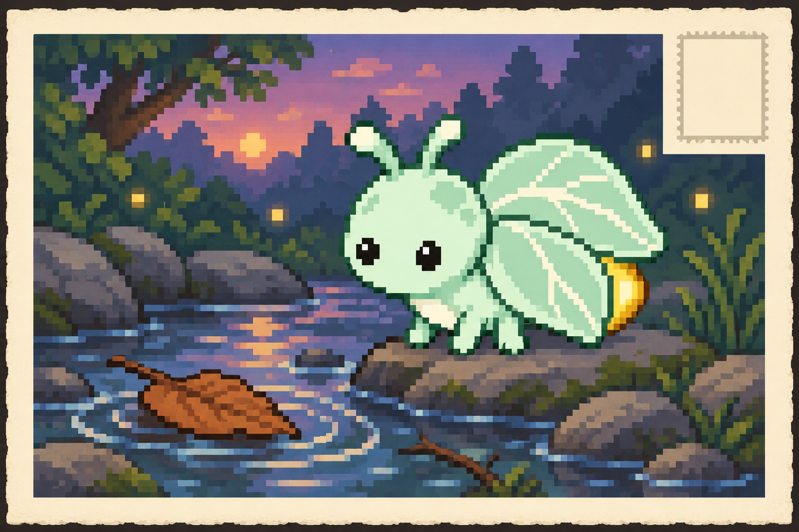
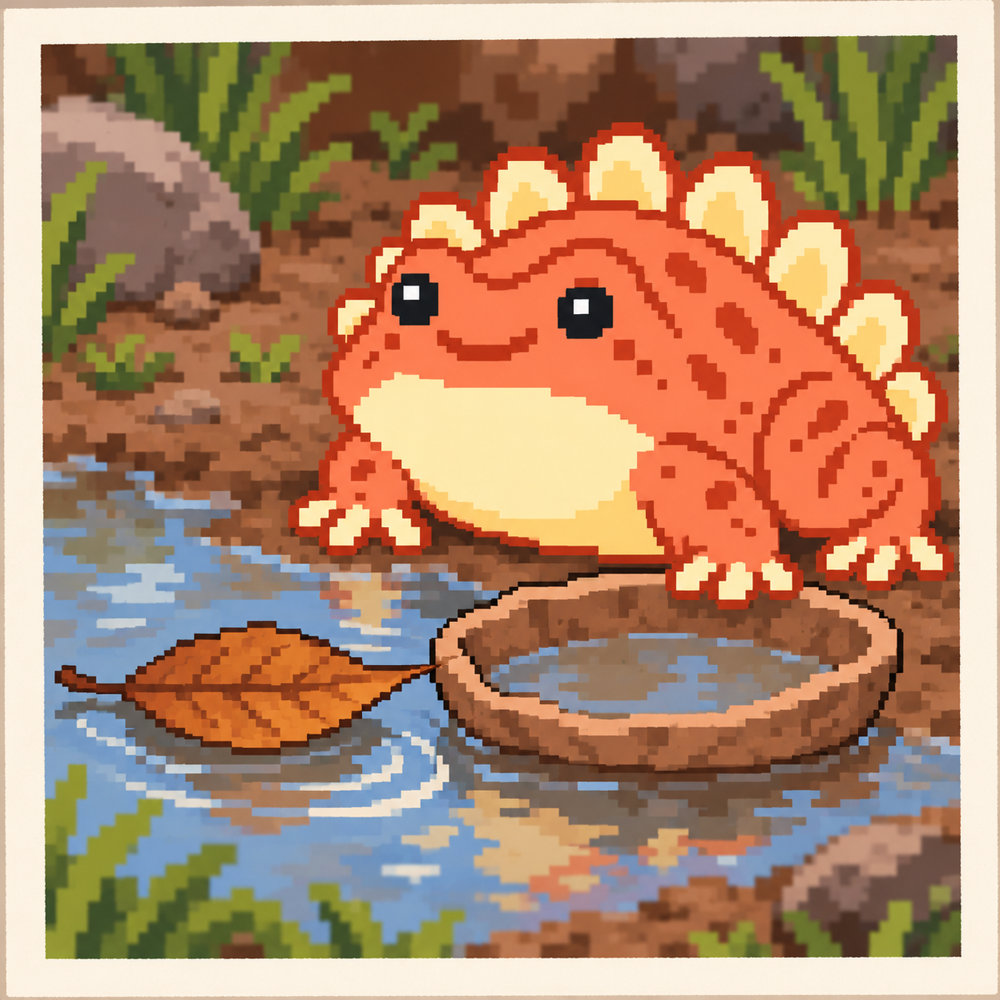
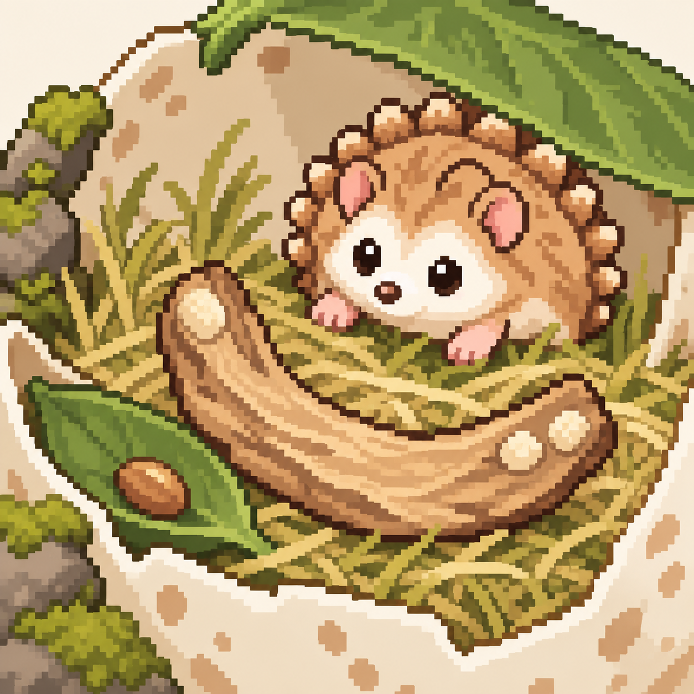
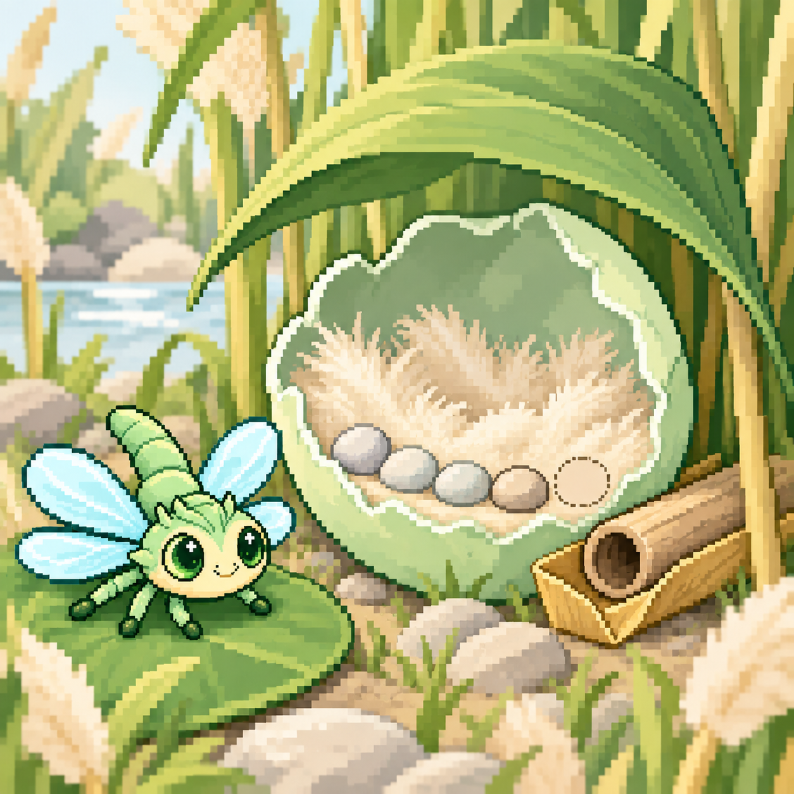
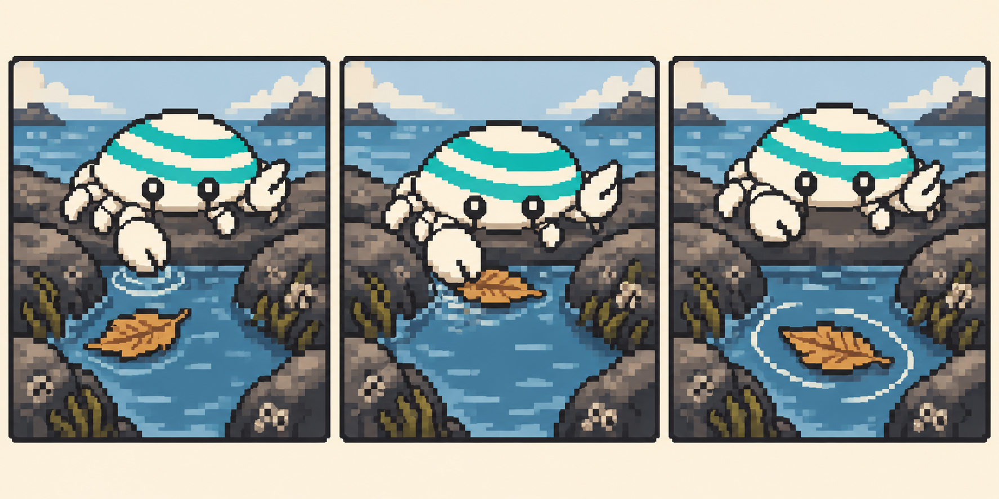

# 五组故事类型样例

2026-10-03 · GenPet 0.8.1 · 全部用户资料为虚构。以下直接收录生成输出，不将报告说明混入故事。第3、4组关联故事展示独立复审通过的修订候选；其实际已完成历史仍保留首稿。第5组展示消除时间措辞歧义的输出候选。

## 1 · 薄荷虫

### 独立生活

空心小枝今天把风声留住了。小虫没急着钻进去，先把一根触角凑到枝口，再绕到另一头听了一会儿。枝孔太窄，它就坐在透明石子边，把六只足一只只收好，等下一阵风。声响有时像细哨，有时只是一声短短的呼气。到了午后，它把小枝放回落叶窝旁，自己出门看石台另一头的细缝。今天没有带回新东西，口袋一样的枝孔却已经够它听很久。

[原始输出](group01/independent/output/result.json)

### 关联用户事件

你连续三天晚饭后散步，今天把河边落叶旋转和三次观察的差异写进笔记。小虫这一回也不赶着把自己的小溪走完。它先站稳岸边的一块平石，只选一片落叶看：叶尖绕了一圈，碰到细枝，停了一会儿，又慢慢转开。它等到那片叶漂出视线才挪到下一块石头。寄给你的明信片上，是它站在小溪旁的这一刻。背面留下短短一句：‘我的这一片，转到这里停过。’回家后，它在空心枝旁收好明信片的副本，留着下回再比。

[原始输出](group01/linked/output/result.json)

### 明确对话

我现在想留在家里，对着小溪那张明信片想一想。下次去的时候，先找一片叶，再看看它会不会在同一根细枝旁停住。今天先把透明石子挪到光里，坐一会儿；走远的事可以明天再说。

[原始输出](group01/dialogue/output/result.json)

## 2 · 暖橙蛙

### 独立生活

小蛙今天在自己的低棚里歇着，忽然觉得宽叶床的一边太翘，就扑上去压了一下。叶角弹起来，把它推回脚印泥垫旁。它没有再压第二下，干脆顺着叶子的弯窝进去：一边当靠背，一边遮住半只足。歪碟还是空的，蛋壳还是门边那一块。它盯着棚缝漏下来的光发了好久的呆，直到肚皮下的叶子暖起来才翻了个身。今日的家没有添东西，只是它发现原来的床还可以这样躺。

[原始输出](group02/independent/output/result.json)

### 关联用户事件

你这三天晚饭后散步，今天看河边落叶打转，记下三次观察的差异。小蛙自己的泥塘边也漂着一片叶。它把家里的歪碟推到浅水里，想让叶子绕着碟沿转，结果碟子一斜，叶片便挤到岸边不动了。它没把歪碟收走，反倒趴下来瞧叶尖碰住碟口的地方。给你带来的照片就停在这里：它低低伏在湿岸，一只前足搭着歪碟，叶尖靠在缺低的碟沿，水上还留着几圈波纹。那不是你的河边，是它自己今天蹦过的泥塘。小蛙把照片的副本夹在宽叶床旁，空碟也带回来了。

[原始输出](group02/linked/output/result.json)

### 明确对话

歪碟先放着。我现在想趴回宽叶床，把那张泥塘照片夹在眼前；那天只顾盯着叶尖，照片里还有几圈水纹没仔细看。等看够了，再去试试空蛋壳能不能当个小枕头。要是硌肚皮，就还是让它待在门边。

[原始输出](group02/dialogue/output/result.json)

## 3 · 刺猬

### 独立生活

今天的小麻烦是一只蜗牛。它横在刺猬常走的苔石缝里，慢得像根本没打算走。刺猬蹲着看了一阵，伸足碰了碰旁边的地面，又把足收回来。它绕到另一头试走，发现那里也被一截枯枝堵着。于是它坐在叶檐下，吃完午饭，再慢慢把枯枝推开。傍晚，蜗牛终于走出了石缝。刺猬从新清出的那边过去，回头看了一眼：两条路，现在都有用了。

[原始输出](group03/independent/output/result.json)

### 关联用户事件

你过去三天饭后散步，今天在河边观察落叶旋转，并把三次观察的差异记进笔记。刺猬给你看的是它从自己河弯带回的一片弯木：它先看木片在水中转，等它搁浅才摸一摸，再晾干，推推两端。一端转得利落，一端总卡住。木片上的一颗、两颗浅泥点，就是它留下的记号。现在它已收在半壳内侧的干草旁，原来的种子仍在凹叶里。

[原始输出](group03/linked/revision-candidate/output/result.json)

### 明确对话

‘我想再试试这片弯木。它已经躺在干草旁了，我想先推一颗泥点那头，再推两颗那头，看刚才卡住的地方是不是还一样。不过先让我把鼻尖上的草屑蹭掉。你看，就是照片里这片。’

[原始输出](group03/dialogue/output/result.json)

## 4 · 蜻蜓

### 独立生活

‘拍的时候别碰我的门口。’这是蜻蜓今天给你带来的家照。它试着挪开压床的旧苇秆，风却总把它送回来；忙了半天，终于用捡来的干苇叶折成浅槽，把苇秆垫稳。四粒河砂和第五个空位留着，圆叶也还在家外。现在风穿过空心苇秆那头，会响很轻的一声。

[原始输出](group04/independent/output/result.json)

### 关联用户事件

叶子没有按蜻蜓想的方向走。你过去三天饭后散步，今天在河边观察落叶旋转，并把三次观察的差异写下来；它也飞到自己的水沟旁，想跟着叶子转弯扇翅。第一回跟早了，第二回又落后。第三回，它停在苇尖，只听叶边碰细草的轻响和滑到沟心后的安静。它讲到这里，停了一小会儿。

‘这就是我想留下的地方。’回家后，新干叶浅槽仍托着旧苇秆，正好容下那一会儿。

[原始输出](group04/linked/revision-candidate/output/result.json)

### 明确对话

‘现在想在门口听一会儿。照片里那根旧苇秆已经被浅槽托住了，我想等下一阵风来，听它从哪一头穿过去。这回我不扇翅，也不抢着接上。要是声音很短，我就把话也说短一点。’

[原始输出](group04/dialogue/output/result.json)

## 5 · 小蟹

### 独立生活

今天石窝里多了一声细细的哨音。小蟹把左钳贴在旧壳门上，声音停了；松开，又响。它没拆门，只挪到壳后的第三颗蓝石旁，等下一阵风。
风钻过壳沿和石头之间的小缝，沙地图上那条路也被吹歪了一点。原来家里藏着一支笛子。
傍晚，它没有把路重新描直，只把出口清开，趴着听那声不太稳的长音。今天这间窝的声音，得留一道缝才听得见。

[原始输出](group05/A-independent/output/result.json)

### 关联用户事件

你过去三天晚饭后散步；今天在河边观察落叶旋转，并把三次观察的差异记进笔记。小蟹在自己的潮水洼边，也想看清一片叶怎样转弯。
它把左钳放在水口当记号，结果叶子停住了。原来挡住水的就是它自己。钳子移开，叶子重新转起来——最后一格，它退在岸上，让叶子自己走。

[原始输出](group05/B-linked/output/result.json)

### 明确对话

我现在想把两只钳都收好，站在岸上看那片叶子自己转完一圈。刚才我一伸钳，反而挡住了它。
这回不替它选方向。等我看够了，再回石窝听听门缝里的风。

[原始输出](group05/C-dialogue/output/result.json)
