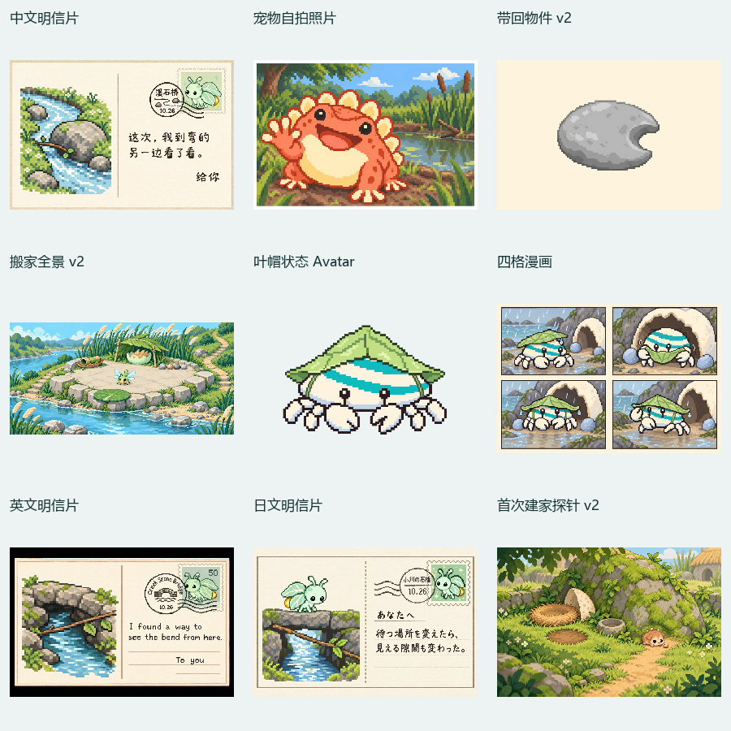
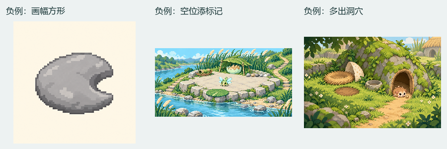

# GenPet 0.9.2 续测报告

2026-10-03。测试代码提交：a90f998d44948dacfbde2512abfae064ed51f571；同步前为5575dc7，fast-forward至0.9.2。最后一次fetch确认origin/main仍为a90f998。

## 结论与范围

本轮工程测试75通过、0失败、1项Windows平台跳过，Python14/14通过。工作区verify:fast和同提交LF隔离检出的verify:release通过。原先“延迟初始化后移蛋的五小时期限”的失败用例现在通过。

继续使用[五组原周期](../2026-10-03-run2/REPORT.md)与[故事类型补测](../2026-10-03-story-types/REPORT.md)的真实隔离记录：每组从成年、9篇故事、7份素材开始，保留同一Pet ID、基因、性格及已保存历史。不是重新生成五组领养或把旧周期当作0.9.2新生成。最新代码另实际执行五组工程周期，共40篇合成工程故事。

新生成12份故事正文：五组主续篇、英文/日文分支、纯文字分支、脱帽/重戴两篇、带note/无note两篇。7篇经实际begin→record→plan→accept或reuse→finish完成；另外5篇是单元候选，没有伪写完成历史。正文及交付见[STORIES.md](STORIES.md)。

按tests/agent/README.zh-CN.md分开创作与检查：三个创作子代理只用真实unit-request的prompt生成上游，再冻结供下游使用；root独立读取结果、原图和192×208等比图后作判断。合同校验不替代语义、视觉审查。此处“通过”为独立代理观察，用户最终结论留空。

## 五组实际续篇与保存

| 组 | 本轮主故事 | 故事数 | 素材数 | 观察 | 用户结论 |
| --- | --- | --- | --- | --- | --- |
| 01 薄荷虫 | 溪弯观察→中文明信片 | 9→10 | 7→8 | 卡面正文、邮票、寄出地邮戳齐全；家中并存旧卡 | |
| 02 小蛙 | 延时自拍 | 9→10 | 7→8 | 面向镜头摆姿势、前景自拍及白照片框；家中保留旧照片 | |
| 03 刺猬 | 带回半月凹口石 | 9→10 | 7→8 | 最终图仅物件；原种子和弯木片保留 | |
| 04 蜻蜓 | 搬到开阔新家 | 9→10 | 7→8 | 新全景包括周围、休息、听声和起落分区，四粒砂与第五空位 | |
| 05 小蟹 | 试雨帽、四格漫画→脱帽→重戴 | 9→10→11→12 | 7→9→9→9 | 同一身体的穿戴变化；后两篇分别复用普通成年及原帽图 | |

[主续篇保存结果](PERSISTENCE-RESULTS.json)、[最终状态](FINAL-STATES.json)、[帽子复用](HAT-REUSE-RESULTS.json)。所有新完成故事pending均为空。五组身份、基因、性格与命名记录保持；前9篇历史未改写。第05组帽Avatar先实际accept为art-c3e3bf89b897c12687a03747，脱帽复用art-5ec13139970d88fb509a0cdd，再戴回原帽ID；复用后素材仍9份。

第05组缺少宿主确认时，实际finish-story拒绝并保持故事未完成，见[拒绝记录](group05/missing-host-rejection.json)。三个穿戴步骤之后仅使用模拟inactive宿主确认，绑定同一隔离Avatar ID。没有验证真实桌面刷新。

五组主续篇output与脱帽/重戴output，共7份实际交付经独立复核：保留用户联系、性格动作，只引用已保存的当次媒体/复用Avatar，不再邀请命名，不虚报真实宿主更新。详见[交付评审](DELIVERY-REVIEW.json)及各组delivery结果。

## 载体、家与可见状态

| 用例 | 判断 | 具体观察 | 原图 |
| --- | --- | --- | --- |
| 中文明信片 | 通过 | 完整3:2卡；“这次，我到弯的另一边看了看。”、“给你”、“溪石桥”、10.26逐字核对，邮戳覆盖邮票 | [图](media/01-postcard-zh.png) |
| 英文分支 | 通过 | 英文正文、To you、Creek Stone Bridge及日期与请求一致 | [图](media/07-postcard-en.png) |
| 日文分支 | 通过 | 日文正文、あなたへ、小川の石橋及日期与请求一致 | [图](media/08-postcard-ja.png) |
| 宠物照片 | 通过 | 知道镜头在拍、抬足张嘴，印相框与溪弯背景；不只是第三人称场景 | [图](media/02-self-photo.png) |
| 带回物件 | 修订后通过 | 单颗浅灰扁石、半月凹口，无Pet或背景场景；v2为3:2 | [图](media/03-stone-v2.png) |
| 多格漫画 | 通过 | 平叶滴眼→折檐→测排水→举圆左钳；四格因果清楚，身体与帽连续 | [图](media/06-comic.png) |
| 无新事实/最近三篇有图 | 通过 | 实际context/story→carrier=null；家中休息的纯文字生活，不造新用户事实 | [结果](text-only/carrier.json) |
| 家：添置 | 通过 | 01–03延续原布局，新增卡/照片/石的存放；home.visual=null，未重复画全景 | 各组units/home.json |
| 家：搬家 | 修订后通过 | 宽幅完整新家及周围，Pet只占小部分；四粒砂后的空位为普通地面 | [图](media/04-moved-home-v2.png) |
| 家：首次建立探针 | 修订后通过 | 孵化历史提供原物件；设fixture pet.home=null，仅测设计单元；开放路径、床、半壳、裸土、空石凹、种子和周围完整 | [图](media/09-first-home-v2.png) |
| 可见状态 | 通过静态范围 | 同一成年蟹体新增叶帽，透明背景，小尺寸帽子/双弧纹/钳足可读；脱帽、重戴复用原ID | [图](media/05-hat-avatar.png) |

本轮内置imagegen实际产生12张候选图：9张最终独立接受、3张首图需修正。最终的9张中6张被主续篇实际保存为素材；语言分支两张及首次建家探针一张只留作单元结果。数量不是模型成功率。小图用于辨认卡片、身体、载体和布局，细邮戳文字按原尺寸逐字核对，不声称192×208也能读清全部文字。

首次建家是从旧真实孵化快照派生的反事实home为空探针，没有重新领养、改写真Store或跑一次新的完整孵化。状态变体只生成静态PNG，没有整套动画、手持/坐具变体的视觉测试。

### 负例与修订

- 物件首图为方形，未兑现规划的3:2横幅；补明确画幅请求后生成v2。物件主体原已正确。
- 搬家首图把第五“空位”画成白圆标记；真实编辑移除标记，v2保留四粒砂。
- 首次建家首图多出黑暗洞穴和门框，违反开放草地、非封闭洞穴要求；真实编辑恢复普通苔石与开放路径。

三张原图、原参数与独立否决保留；不是先接受再将原图覆盖。[逐图评审](MEDIA-REVIEW.json)及[generation-parameters](generation-parameters/)。

另发现测试夹具把旧故事中所有有图记录误标为postcard，没有实际历史carrier单元支持。原输入保留本地；修订后的六个carrier候选改用真实旧正文或显式illustrated探针。五个有图案的carrier设计逐项完全不变，因而现有图可用；无新资料案仍null。见[夹具修订复核](corrected-history-review.json)。这是测试输入错误，不计为产品运行时故障。

## 对话与记忆

42个chat单元均独立通过：五组×五阶段的同题25案、寒暄/愿望/计划/空Pet/英文/日文7案，以及五组蛋的问候/鼓励10案。蛋三种输入只有壳动作/细响，无人话或提前孵化；幼年只有动作或类型拟声；少年/成年及特殊形态延续性格与体态。帽子/长大愿望记入note，没有当场兑现或承诺日期。寒暄note=null；“下周搬家”为未来计划，不变成已发生或补目的地。

[42项原始结果](CHAT-SAMPLES.json)、[独立评审](CHAT-REVIEW.md)。实际note-chat只在原7篇周期种子的另一个隔离克隆保存1条note；去掉chats后与原种子全记录相同。有note/无note的两条context→story候选分别使用明确来源的搬家计划或正常独立生活，不提交故事/外观变化。

## 精简status与工程校验

五组分别实际执行生成运行包CLI的status和status --full。主续篇均10篇，默认返回最近5篇，完整返回全部；当前Pet与pending一致，默认删去旧生成步骤/宿主结果及素材出处，总数正确，完整历史保留。默认UTF-8结果约11–13KB，完整约60–75KB。见[CLI核对](CLI-STATUS-CHECKS.json)、[状态不变检查](RUNTIME-CHECKS.json)及各组cli-status文件；这些是第10篇完成时的对照，第05组最后又保存两篇复用故事，最终为12篇。

| 校验 | 结果 | 证据 |
| --- | --- | --- |
| npm test | 76项：75通过、0失败、1跳过 | [日志](engineering/npm-test.txt) |
| Python artwork_pipeline | 14/14 | [日志](engineering/python-artwork.txt) |
| 最新工程五组周期 | 7测试通过，五组各8篇=40篇合成故事 | [日志](engineering/five-cycle.txt)、[五组状态](engineering/cycle-evidence/) |
| 工作区verify:fast | 最终通过；含类型、格式、同一76项Node测试 | [最终日志](engineering/verify-fast-final.txt) |
| LF隔离检出verify:release | 类型/格式/单元、构建、origin/main版本门槛、隔离安装/哈希、CLI/调试器均通过 | [完整日志](engineering/lf-verify-release.txt) |

跳过项为Windows不适用的POSIX“IPC rejects writable-by-others directories”。五组40篇是工程合成故事，不能与本轮12份创作故事混计；focused周期检查为同一套测试重跑留快照，不额外算新增覆盖。

第一次工作区verify:fast被46个历史CRLF检出文件阻断；使用同提交LF隔离检出验证后，将工作区对齐HEAD的LF内容，逐文件比较、刷新索引，源码diff为空，最终verify:fast通过。[换行记录](engineering/local-lf-refresh.json)和首次失败日志保留。隔离release首次使用指向原node_modules的junction，造成构建标签中的相对路径差异，版本门槛正确拒绝；改成隔离实体依赖后通过，未改比较基准或绕过版本门槛。[隔离夹具负例](engineering/lf-release-shared-deps-negative.txt)。

安装校验的marketplace提交均为a90f998d44948dacfbde2512abfae064ed51f571，版本均0.9.2；genpet实际校验76个文件，genpet-dots44个，文件哈希对照刷新源。

- genpet检验时安装路径：C:\Users\geyat\AppData\Local\Temp\genpet-release-check-ylyXh8\codex-home\plugins\cache\genpet\genpet\0.9.2
- genpet-dots检验时安装路径：C:\Users\geyat\AppData\Local\Temp\genpet-release-check-ylyXh8\codex-home\plugins\cache\genpet\genpet-dots\0.9.2

均为隔离临时CODEX_HOME，校验结束已清理；没有升级用户真实安装。

## 缺项与归档

真实宿主可见刷新、真实定时触发、/genpet与叫名字的真实入口/误触发，以及完整动画未测。领养/阶段形象来自上一轮已保存记录，本轮未重新生成。小样本不代表普遍生成质量，用户最终判断尚未填写。

按用户“测试结果也要提交”的要求，报告、12份正文、42份对话结果、7份实际完成记录、关键快照、独立评审、12张本轮原图与1张历史复用参照、图像请求参数和工程日志纳入此目录。完整input/request、临时驱动与未选逐步记录继续留本地output/agent-tests/2026-10-03-v0.9.2。未改运行时代码、技能、插件交付物或版本，未读写真实Pet、Obsidian或定时任务。
