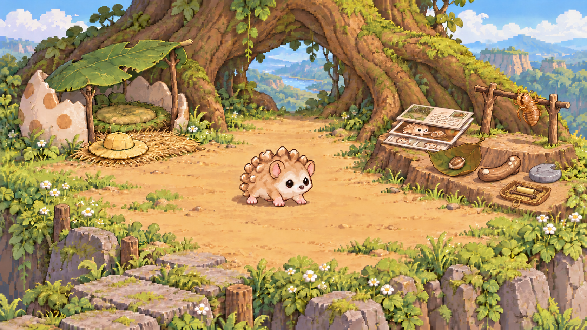
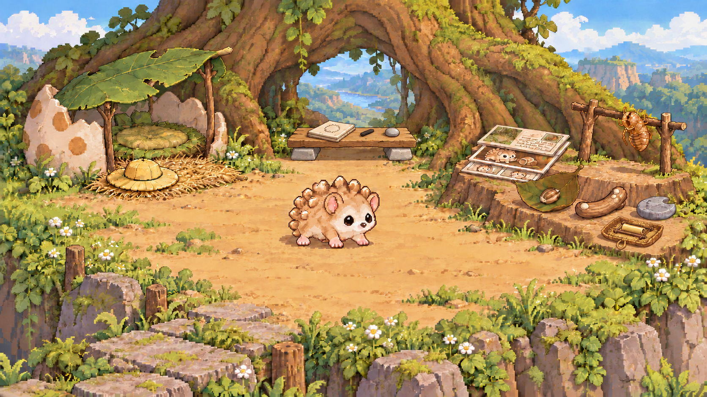
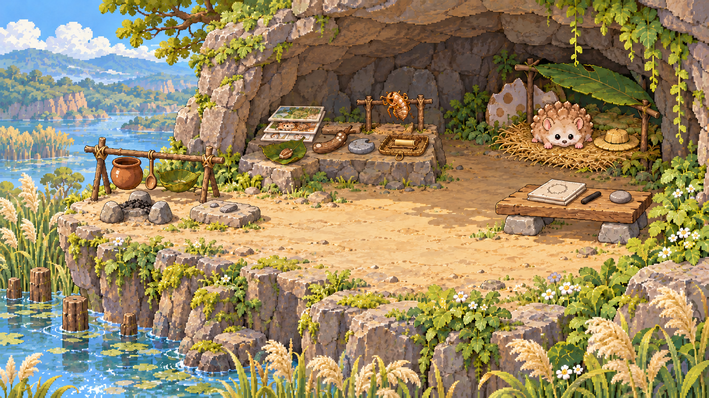

# 五篇连续故事原文与家图

同一 Pet，模拟时间；原文来自实际已完成 Store，图片仅列独立审图后入库的版本。

## 01 睡觉休息与局部调整

2026-11-09T23:00:00Z（UTC）

奶白肚皮才落到草垫上，刺猬又把自己抬了起来。它刚把浅黄小圆叶帽收在床边干草上，伸过前足，准备在家睡一觉；垫里却有一根硬草梗，正好戳在身子下面。你想看看它睡觉、休息，也想看它调整一处影响睡觉的小地方，它便先把那一角按平。躺下，草梗又顶起来。它停了一会儿，顺着草梗摸到翘起的末端，把末端弯回草垫边，再用床边一根软干草编扣固定。没有添床，也没有搬动右侧的小发现。它重新落下肚皮，慢慢侧过身，鼻尖贴在前足旁，这次睡到自己醒来。醒了也没急着出门，只在窝里舒展两只前足，听叶檐外的细响。帽子帽顶朝上待在老位置，窄檐没有压折。

状态：在调平的旧草垫上歇着，浅黄小圆叶帽已收在床边

[实际入库结果](episodes/01/runtime-review.json) · [用户输出](episodes/01/output/result.json)

## 02 带回发现与存放设施

2026-11-10T04:00:00Z（UTC）

草坡下有一截淡金色的小管，两个口都透着光。刺猬先凑近看，确定里面空空的，才轻轻推了一下：这截掉落的短芦苇筒滚过两片草叶，停在它足边。你想看它从外面带回自己的发现、放进家里，并为日后取用添个实用设施；它便托着芦苇筒回到拱根高台。刚放到收藏干台前侧，小管又滚起来。它先用前足挡住，再找来一块自然卷边的落地树皮，铺薄干草，把两根小枝固定成低挡条，做成浅取物托盘。前端系个草纤维拉环，芦苇筒横放在两挡条之间。托盘安在收藏台前右的空处，与抱枝的空蝉蜕隔开。它勾住拉环把托盘拉近，取出芦苇筒看一眼，再放回去；这一回小管没有滚到旧纸藏品下面。床边帽子仍收着，修平的草垫也安稳待着。

状态：在家安放带回的短芦苇筒，浅黄小圆叶帽仍收在床边

[实际入库结果](episodes/02/runtime-review.json) · [用户输出](episodes/02/output/result.json)

## 03 居家工作与原址改造

2026-11-10T08:00:00Z（UTC）

芦苇筒的口明明是圆的，刺猬画出的圈却长得像一颗歪豆子。它把炭枝搁下，看了看那张空白折纸：放在凹凸的根面上，连纸都站不稳。你想看它在家做自己的工作、让工作和休息各有空间，它就开始给小发现做一本轮廓册。它在拱根后中那条空处放一块平木板，用两块新平石垫稳，台高正好够前足落上去；草窝仍在左边，带拉环的取物托盘仍在右边。它把纸铺平，用一颗小卵石压住纸角，再从托盘取芦苇筒，对着两个开口慢慢画。第二个圈闭合了。它又画了凹口石的弯边，待炭迹不蹭足，把芦苇筒和原凹口石各放回原位。折好的新轮廓册、炭枝和压纸小卵石留在木台上。做完这两页，它退到中央空地伸伸前足，走回睡觉的草窝歇一阵；工作台上那颗圆圈不会被它的肚皮压扁了。

状态：在家做完两页收藏轮廓记录后休息，浅黄小圆叶帽仍收在床边

[实际入库结果](episodes/03/runtime-review.json) · [用户输出](episodes/03/output/result.json)

## 04 搬家与做饭

2026-11-10T13:00:00Z（UTC）

新门口照进来的光里，芦苇影子轻轻晃着。你想看刺猬搬到不同的地方、带上旧东西，并在新家做一顿饭；它挑中芦苇湾高岸的一处浅石洞，洞前有干燥石坪，往下才是水。半蛋壳、叶檐、修好的草窝、床边帽子和整套收藏一件件搬来，芦苇筒连取物托盘一起迁入，木工作台与轮廓册、炭枝、压纸石也带来了。它把睡觉的角落安排到洞内右后，收藏放左侧干台，工作台安在右前；门外左边空石坪留作做饭处。它洗净一颗新小黄薯，在小石砧上切成丁，又剥出几粒新鲜豆子，倒进小陶锅，加水放上三石小灶。豆子还硬时它差点先舀一勺，停下来尝看，便继续慢煮；等薯丁和豆子都软了，它把灶火灭掉，用木勺盛到新叶碗里，坐在门前一口口吃完。原种子仍在收藏凹叶里，没下锅。它把薯皮豆壳埋到岸边土里，冲洗锅、勺和叶碗，将它们放在灶旁小枝架上晾着，再擦净石砧。收拾完，它回洞里看了一眼抱枝的空蝉蜕，闻着留下的一点薯香，在原草窝旁歇下来。

状态：在芦苇湾高岸石洞新家做完饭、收拾后休息，浅黄小圆叶帽仍收在床边

[实际入库结果](episodes/04/runtime-review.json) · [用户输出](episodes/04/output/result.json)

## 05 迁后睡眠休息与使用调整

2026-11-10T23:00:00Z（UTC）

先亮起来的是鼻尖。刺猬在芦苇湾的新家睡过一夜，原草垫上的编扣没有松；早晨一束光从叶檐前缘的空隙斜斜落进来，正好照到它的脸。它醒了，在窝里闭着眼歇了一阵，才起身看那道缝。你想让它先住一阵，睡觉休息后看看哪里要调整，也看看带回的小发现，它这次没有往别处搬。它把原大叶檐的前缘向门口挪一点，重新搭稳在半蛋壳上，阴影便覆盖了卧处，侧面的空隙仍能通气。床边叶帽待在原干草上。它随后走到洞内左侧，勾住托盘拉环，拉近一点就停住，托盘仍完整落在干台上。短芦苇筒横在两根挡条之间，搬过家也没有滚进纸藏品里。它取出这一截旧发现，朝洞口举起：两个空口仍然通透，低处水面反来的光在筒里一闪，又一闪。它没有往里面塞东西，把筒放回草底，轻推托盘归位。叶檐调整后的影子停在右后草窝，原筒留在左侧托盘；洞口正中还是一条可以走过去的路。

状态：在芦苇湾石洞睡醒休息后调好原叶檐、查看并归还原芦苇筒，浅黄小圆叶帽仍收在床边

[实际入库结果](episodes/05/runtime-review.json) · [用户输出](episodes/05/output/result.json)
